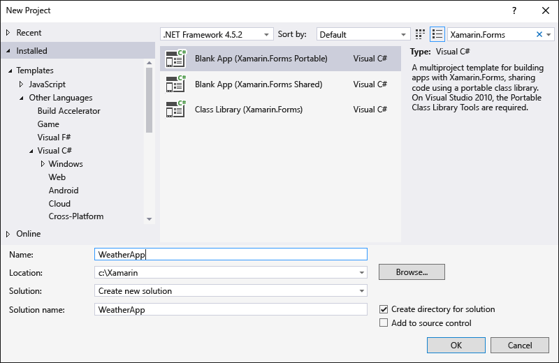
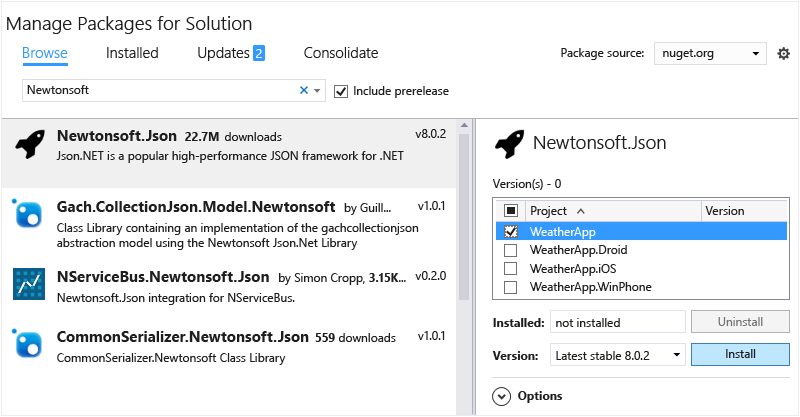
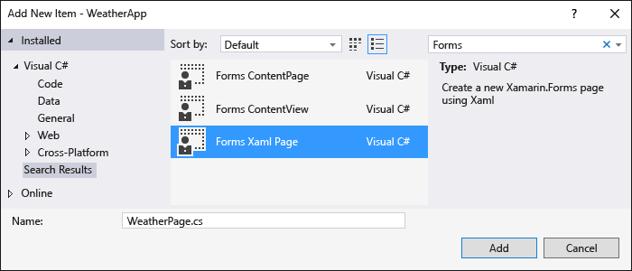
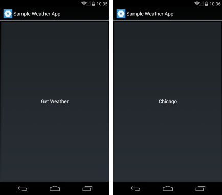

# <a name="learn-app-building-basics-with-xamarinforms-in-visual-studio"></a>Nozioni di base sulla compilazione di app con Xamarin.Forms in Visual Studio

Dopo aver eseguito i passaggi [Setup and install](../cross-platform/setup-and-install.md) e [Verify your Xamarin environment](../cross-platform/verify-your-xamarin-environment.md), questa procedura dettagliata illustra come compilare un'app di base (mostrata sotto) con Xamarin.Forms. Con Xamarin.Forms tutto il codice dell'interfaccia utente viene scritto una sola volta in una libreria di classi .NET Standard. Xamarin esegue quindi il rendering automatico dei controlli dell'interfaccia utente nativi per le piattaforme iOS, Android e UWP. Questo approccio è consigliato rispetto a un progetto condiviso, perché la libreria .NET Standard include solo le API .NET supportate in tutte le piattaforme di destinazione e perché Xamarin.Forms consente di condividere il codice dell'interfaccia utente tra le piattaforme.  
  
  
  
Verranno eseguite queste operazioni per la creazione dell'app:  
  
-   [Configurare la soluzione](#solution)  
  
-   [Scrivere un codice di servizio dati condiviso](#dataservice)  
  
-   [Iniziare a scrivere il codice dell'interfaccia utente condiviso](#uicode)  
  
-   [Testare l'app usando Visual Studio Emulator for Android](#test)  
  
-   [Terminare l'interfaccia utente con un aspetto nativo tra le piattaforme](#finish)  
  
> [!TIP]
> È possibile trovare il codice sorgente completo per questo progetto nella finestra di [archivio degli esempi di Xamarin-Forms in GitHub](https://github.com/xamarin/xamarin-forms-samples/tree/master/Weather).  
  
##  <a name="solution"></a> Configurare la soluzione  

Questi passaggi consentono di creare una soluzione Xamarin.Forms che contiene una libreria di classi .NET Standard per il codice condiviso e due pacchetti NuGet aggiunti.  
  
1.  In Visual Studio creare una nuova soluzione **App multipiattaforma (Xamarin.Forms)** e denominarla **WeatherApp**. Cercare il modello selezionando **Visual C#** e **Multipiattaforma** nell'elenco a sinistra.  
  
     Se non è elencato, potrebbe essere necessario installare Xamarin o abilitare la funzionalità di Visual Studio 2017. Vedere [Configurazione e installazione](../cross-platform/setup-and-install.md).  
  
     

2.  Dopo aver fatto clic su OK sarà possibile selezionare alcune opzioni. Selezionare **App vuota**, **Xamarin.Forms** e **.NET Standard**:

     
  
3.  Dopo aver fatto clic su OK per creare la soluzione, verranno visualizzati diversi progetti singoli:  
  
    -   **WeatherApp**: la libreria .NET Standard in cui verrà scritto il codice condiviso tra le piattaforme, inclusa la logica di business comune e il codice dell'interfaccia utente con Xamarin.Forms.  
  
    -   **WeatherApp.Android**: il progetto che contiene il codice Android nativo. Viene impostato come progetto di avvio predefinito.  
  
    -   **WeatherApp.iOS**: il progetto che contiene il codice iOS nativo.  
  
    -   **WeatherApp.UWP**: progetto che contiene il codice UWP di Windows 10.  
  
    > [!NOTE]
    >  È possibile eliminare qualsiasi progetto presente in piattaforme a cui non si fa riferimento.   
  
     In ogni progetto nativo si ha accesso alla finestra di progettazione nativa per la piattaforma corrispondente e si possono implementare schermate e funzionalità specifiche della piattaforma secondo necessità.  
  
4.  Aggiornare il pacchetto NuGet di Xamarin.Forms nella soluzione all'ultima versione stabile come descritto di seguito. Si consiglia di eseguire questa operazione ogni volta che si crea una nuova soluzione Xamarin:  
  
    -   Selezionare **Strumenti > Gestione pacchetti NuGet > Gestisci pacchetti NuGet per la soluzione**.  
  
    -   Nella scheda **Aggiornamenti** selezionare il pacchetto **Xamarin.Forms** e selezionare l'aggiornamento di tutti i progetti nella soluzione. Nota: lasciare deselezionati gli aggiornamenti per Xamarin.Android.Support.  
  
    -   Aggiornare il campo **Versione** all' **Ultima versione stabile** disponibile.  
  
    -   Fare clic su **Installa**.  
  
           
  
5.  Aggiungere il pacchetto NuGet **Newtonsoft.Json** al progetto **WeatherApp**, che verrà usato per elaborare le informazioni recuperate da un servizio di dati meteo:  
  
    -   In Gestione pacchetti NuGet (aperto dal passaggio 4) selezionare la scheda **Sfoglia** e cercare **Newtonsoft**.  
  
    -   Selezionare **Newtonsoft.Json**.  
  
    -   Selezionare il progetto **WeatherApp** , che rappresenta l'unico progetto in cui è necessario installare il pacchetto.  
  
    -   Verificare che il campo **Versione** sia impostato su **Ultima versione stabile** .  
  
    -   Fare clic su **Installa**.  
  
      
  
6.  Ripetere il passaggio 5 per trovare e installare il pacchetto **Microsoft.Net.Http**.  
  
7.  Compilare la soluzione e verificare che non ci siano errori di compilazione.  
  
##  <a name="dataservice"></a> Scrivere un codice di servizio dati condiviso  

**WeatherApp** è il progetto di destinazione del codice per la libreria .NET Standard condivisa tra tutte le piattaforme. Questa libreria viene inclusa automaticamente nei pacchetti di app compilati dai progetti iOS, Android e Windows.  
  
Per eseguire questo esempio, è innanzitutto necessario iscriversi per una chiave API gratuita all'indirizzo [http://openweathermap.org/appid](http://openweathermap.org/appid).  
  
Nei passaggi seguenti viene aggiunto codice alla libreria .NET Standard per accedere e archiviare i dati dal servizio meteo:  
  
1.  Fare clic con il pulsante destro del mouse sul progetto **WeatherApp** e selezionare **Aggiungi > Classe**. Nella finestra di dialogo **Aggiungi nuovo elemento** denominare il file **Weather.cs**. Questa classe verrà usata per archiviare i dati dal servizio di dati meteo.  
  
2.  Sostituire tutto il contenuto di **Weather.cs** con:  
  
    ```csharp  
    namespace WeatherApp
    {
        public class Weather
        {
            // Because labels bind to these values, set them to an empty string to
            // ensure that the label appears on all platforms by default.
            public string Title { get; set; } = " ";
            public string Temperature { get; set; } = " ";
            public string Wind { get; set; } = " ";
            public string Humidity { get; set; } = " ";
            public string Visibility { get; set; } = " ";
            public string Sunrise { get; set; } = " ";
            public string Sunset { get; set; } = " ";
        }
    }
    ```  
  
3.  Aggiungere un'altra classe al progetto **WeatherApp** denominato **DataService.cs** che verrà usato per elaborare i dati JSON dal servizio di dati meteo.  
  
4.  Sostituire tutto il contenuto di **DataService.cs** con il codice seguente:  
  
    ```csharp  
    using System.Net.Http;  
    using System.Threading.Tasks;  
    using Newtonsoft.Json;  
    
    namespace WeatherApp  
    {  
        public class DataService  
        {  
            public static async Task<dynamic> getDataFromService(string queryString)  
            {  
                HttpClient client = new HttpClient();  
                var response = await client.GetAsync(queryString);  
  
                dynamic data = null;  
                if (response != null)  
                {  
                    string json = response.Content.ReadAsStringAsync().Result;  
                    data = JsonConvert.DeserializeObject(json);  
                }  
  
                return data;  
            }  
        }  
    }  
    ```  
  
5.  Aggiungere una terza classe al progetto **WeatherApp** denominato **Core** in cui verrà inserita la logica di business condivisa. Questo codice forma una stringa di query usando il codice postale (ZIP code), chiama il servizio meteo e quindi popola un'istanza della classe **Weather**.  
  
6.  Sostituire il contenuto di **Core.cs** con:  
  
    ```csharp  
    using System;  
    using System.Threading.Tasks;  
  
    namespace WeatherApp  
    {  
        public class Core  
        {  
            public static async Task<Weather> GetWeather(string zipCode)  
            {  
                //Sign up for a free API key at http://openweathermap.org/appid  
                string key = "YOUR KEY HERE";  
                string queryString = "http://api.openweathermap.org/data/2.5/weather?zip="  
                    + zipCode + ",us&appid=" + key + "&units=imperial";  
  
                dynamic results = await DataService.getDataFromService(queryString).ConfigureAwait(false);  
  
                if (results["weather"] != null)  
                {  
                    Weather weather = new Weather();  
                    weather.Title = (string)results["name"];                  
                    weather.Temperature = (string)results["main"]["temp"] + " F";  
                    weather.Wind = (string)results["wind"]["speed"] + " mph";                  
                    weather.Humidity = (string)results["main"]["humidity"] + " %";  
                    weather.Visibility = (string)results["weather"][0]["main"];  
  
                    DateTime time = new System.DateTime(1970, 1, 1, 0, 0, 0, 0);  
                    DateTime sunrise = time.AddSeconds((double)results["sys"]["sunrise"]);  
                    DateTime sunset = time.AddSeconds((double)results["sys"]["sunset"]);  
                    weather.Sunrise = sunrise.ToString() + " UTC";  
                    weather.Sunset = sunset.ToString() + " UTC";  
                    return weather;  
                }  
                else  
                {  
                    return null;  
                }  
            }  
        }  
    }  
    ```  
  
7.  Compilare il progetto di libreria **WeatherApp** per verificare che il codice sia corretto.  
  
##  <a name="uicode"></a> Iniziare a scrivere il codice dell'interfaccia utente condiviso  

Xamarin.Forms consente di implementare il codice dell'interfaccia utente condiviso nella libreria .NET Standard. In questi passaggi verrà aggiunta una pagina al progetto con un pulsante che aggiorna il testo con i dati restituiti dal codice del servizio di dati meteo aggiunto nella sezione precedente:  
  
1.  Aggiungere una **Pagina contenuto** denominata **WeatherPage.cs** facendo clic con il pulsante destro del mouse sul progetto **WeatherApp** e scegliendo **Aggiungi > Nuovo elemento**. Nella finestra di dialogo **Aggiungi nuovo elemento** selezionare **Pagina contenuto**. Prestare attenzione a non selezionare **Pagina contenuto (C#)** o **Visualizzazione contenuto**. Assegnare il nome **WeatherPage.cs**.  
  
       
  
     Xamarin.Forms è basato su XAML, quindi questo passaggio crea un file **WeatherPage.xaml** e un file code-behind annidato **WeatherPage.xaml.cs**. Ciò consente di generare l'interfaccia utente tramite XAML o il codice. In questa procedura dettagliata verranno eseguite operazioni relative a entrambi i casi.  
  
2.  Per aggiungere un pulsante alla schermata WeatherPage, sostituire i contenuti di **WeatherPage.xaml** con:  
  
    ```xaml  
    <?xml version="1.0" encoding="utf-8" ?>  
    <ContentPage xmlns="http://xamarin.com/schemas/2014/forms"  
           xmlns:x="http://schemas.microsoft.com/winfx/2009/xaml"  
           x:Class="WeatherApp.WeatherPage"
           Title="Sample Weather App">  
      <Button x:Name="getWeatherBtn" 
              Text="Get Weather"
              Clicked="GetWeatherBtn_Clicked" />  
    </ContentPage>  
    ```  
  
     Il nome del pulsante deve essere definito usando l'attributo **x:Name** , in modo che si possa fare riferimento al pulsante tramite il nome all'interno del file code-behind.  
  
3.  Per aggiungere un gestore eventi per l'evento **Clicked** del pulsante per aggiornarne il testo, sostituire il contenuto di **WeatherPage.xaml.cs** con il codice seguente. Il codice postale "60601" può essere liberamente sostituito da un altro codice.  
  
    ```csharp  
    using System;  
    using Xamarin.Forms;  
  
    namespace WeatherApp  
    {  
        public partial class WeatherPage: ContentPage  
        {  
            public WeatherPage()  
            {  
                InitializeComponent();  
  
                //Set the default binding to a default object for now  
                BindingContext = new Weather();  
            }  
  
            private async void GetWeatherBtn_Clicked(object sender, EventArgs e)  
            {  
                Weather weather = await Core.GetWeather("60601");  
                getWeatherBtn.Text = weather.Title;  
            }  
        }  
    }  
    ```  
  
4.  Per aprire **WeatherPage** come prima schermata quando viene avviata l'app, sostituire il costruttore predefinito in **App.cs** con il codice seguente:  
  
    ```csharp  
    public App()  
    {
        InitializeComponent();

        MainPage = new NavigationPage(new WeatherPage());  
    }  
    ```  
  
5.  Compilare il progetto **WeatherApp** per verificare che il codice sia corretto.  
  
##  <a name="test"></a> Testare l'app usando Visual Studio Emulator for Android  

È ora possibile eseguire l'app. Eseguire prima solo la versione Android per verificare che l'app stia ottenendo i dati dal servizio meteo. In un secondo momento verranno eseguite anche le versioni iOS e UWP dopo aver aggiunto altri elementi di interfaccia utente.   
  
1.  Impostare il progetto **WeatherApp.Android** come progetto di avvio facendo clic con il pulsante destro del mouse su di esso e scegliendo **Imposta come progetto di avvio**.  
  
2.  Nella barra degli strumenti di Visual Studio viene visualizzato **WeatherApp.Android** come progetto di destinazione. Selezionare uno degli emulatori di Android per il debug e premere **F5**. Si consiglia di usare una delle opzioni dell'emulatore di **Visual Studio**, che eseguirà l'app in Visual Studio Emulator for Android.  
  
       
  
3.  Quando l'app viene avviata nell'emulatore, fare clic sul pulsante **Get Weather** . Il testo del pulsante verrà aggiornato in **Chicago**, che è la proprietà *Title* dei dati recuperati dal servizio meteo.  
  
       
  
##  <a name="finish"></a> Terminare l'interfaccia utente con un aspetto nativo tra le piattaforme  

Xamarin.Forms esegue il rendering dei controlli dell'interfaccia utente nativi per ciascuna piattaforma, in modo da conferire un aspetto nativo all'app. Per maggiore chiarezza, completare l'interfaccia utente con un campo di input per il codice postale, quindi visualizzare i dati meteo restituiti dal servizio.  
  
1.  Sostituire il contenuto di **WeatherPage.xaml** con il codice seguente. È possibile fare riferimento dal codice agli elementi denominati con l'attributo **x:Name** come descritto in precedenza. Xamarin.Forms include anche varie [opzioni di layout](http://developer.xamarin.com/guides/xamarin-forms/controls/layouts/) (xamarin.com). In questo caso, WeatherPage usa [Grid](http://developer.xamarin.com/api/type/Xamarin.Forms.Grid/) (xamarin.com) e [StackLayout](http://developer.xamarin.com/api/type/Xamarin.Forms.StackLayout/) (xamarin.com).  
  
    ```xaml  
    <?xml version="1.0" encoding="utf-8" ?>
    <ContentPage xmlns="http://xamarin.com/schemas/2014/forms"  
                 xmlns:x="http://schemas.microsoft.com/winfx/2009/xaml"  
                 x:Class="WeatherApp.WeatherPage"
                 Title="Sample Weather App">

        <ContentPage.Resources>
            <ResourceDictionary>
                <Style x:Key="labelStyle" TargetType="Label">
                    <Setter Property="FontSize" Value="Small" />
                    <Setter Property="TextColor" Value="#404040" />
                </Style>
                <Style x:Key="fieldStyle" TargetType="Label">
                    <Setter Property="FontSize" Value="Medium" />
                    <Setter Property="Margin" Value="10,0,0,0" />
                </Style>
            </ResourceDictionary>
        </ContentPage.Resources>

        <StackLayout>
            <Grid BackgroundColor="#545454" Padding="10, 10, 10, 10">
                <Grid.RowDefinitions>
                    <RowDefinition Height="Auto" />
                    <RowDefinition Height="Auto" />
                </Grid.RowDefinitions>

                <Grid.ColumnDefinitions>
                    <ColumnDefinition Width="Auto" />
                    <ColumnDefinition Width="*" />
                    <ColumnDefinition Width="Auto" />
                </Grid.ColumnDefinitions>
            
                <Label Text="Search by Zip Code" 
                       Grid.Row="0" Grid.Column="0" Grid.ColumnSpan="3"
                       HorizontalOptions="Center"
                       TextColor="White" FontAttributes="Bold" FontSize="Medium" />
            
                <Label x:Name="zipCodeLabel" Text="Zip Code:" 
                       Grid.Row="1" Grid.Column="0"
                       VerticalOptions="Center"
                       Style="{StaticResource labelStyle}"
                       TextColor="#C0C0C0" />
            
                <Entry x:Name="zipCodeEntry"
                       Grid.Row="1" Grid.Column="1"
                       VerticalOptions="Center"
                       Margin="5,0"
                       BackgroundColor="DarkGray"
                       TextColor="White" />
            
                <Button x:Name="getWeatherBtn" Text="Get Weather" 
                        Grid.Row="1" Grid.Column="2"
                        HorizontalOptions="Center"
                        VerticalOptions="Center"
                        BorderWidth="1"
                        BorderColor="White"
                        BackgroundColor="DarkGray"
                        TextColor="White"
                        Clicked="GetWeatherBtn_Clicked" />
            </Grid>

            <ScrollView VerticalOptions="FillAndExpand">
                <StackLayout Padding="10,10,10,10" HorizontalOptions="Start">
                    <Label Text="Location" Style="{StaticResource labelStyle}" />
                    <Label Text="{Binding Title}" Style="{StaticResource fieldStyle}" />
                
                    <Label Text="Temperature" Style="{StaticResource labelStyle}" />
                    <Label Text="{Binding Temperature}" Style="{StaticResource fieldStyle}" />
                
                    <Label Text="Wind Speed" Style="{StaticResource labelStyle}" />
                    <Label Text="{Binding Wind}" Style="{StaticResource fieldStyle}" />
                
                    <Label Text="Humidity" Style="{StaticResource labelStyle}" />
                    <Label Text="{Binding Humidity}" Style="{StaticResource fieldStyle}" />
                
                    <Label Text="Visibility" Style="{StaticResource labelStyle}" />
                    <Label Text="{Binding Visibility}" Style="{StaticResource fieldStyle}" />
                
                    <Label Text="Time of Sunrise" Style="{StaticResource labelStyle}" />
                    <Label Text="{Binding Sunrise}" Style="{StaticResource fieldStyle}" />
                
                    <Label Text="Time of Sunset" Style="{StaticResource labelStyle}" />
                    <Label Text="{Binding Sunset}" Style="{StaticResource fieldStyle}" />
                </StackLayout>
            </ScrollView>
        </StackLayout>
    </ContentPage>  
     ```  
  
     Anche se non è incluso in questo esempio, è possibile usare il tag **OnPlatform** in Xamarin.Forms per selezionare un valore della proprietà specifico per la piattaforma corrente in cui è in esecuzione l'app. Vedere [Essential XAML Syntax](http://developer.xamarin.com/guides/xamarin-forms/user-interface/xaml-basics/essential_xaml_syntax/) (Sintassi XAML essenziale) nel sito xamarin.com. Nel file code-behind è possibile usare [Device.OnPlatform API](http://developer.xamarin.com/guides/xamarin-forms/platform-features/device/) per lo stesso scopo.  
  
2.  In **WeatherPage.xaml.cs**sostituire il gestore eventi **GetWeatherBtn_Clicked** con il codice seguente. Questo codice verifica che sia presente un codice postale nel campo di immissione, recupera i dati da tale codice postale, imposta il contesto di associazione dell'intera schermata sull'istanza **Weather** risultante, quindi imposta il testo del pulsante su "Search Again" (Cerca di nuovo). Si noti che ogni etichetta nell'interfaccia utente viene associata a una proprietà della classe **Weather**, quindi, quando si imposta il contesto di associazione della schermata su un'istanza di **Weather**, le etichette vengono aggiornate automaticamente.  
  
    ```csharp  
    private async void GetWeatherBtn_Clicked(object sender, EventArgs e)  
    {  
        if (!String.IsNullOrEmpty(zipCodeEntry.Text))  
        {  
            Weather weather = await Core.GetWeather(zipCodeEntry.Text);  
            BindingContext = weather;  
            getWeatherBtn.Text = "Search Again";  
        }  
    }  
    ```  
  
3.  Eseguire l'app in tutte e tre le piattaforme, Android, iOS e Windows, facendo clic con il pulsante destro del mouse sul progetto appropriato, selezionando **Imposta come progetto di avvio** e avviando l'app in un dispositivo o in un emulatore o simulatore. Immettere un codice postale di cinque cifre degli Stati Uniti valido e premere il pulsante **Get Weather** per visualizzare i dati meteo per l'area, come mostrato di seguito. Visual Studio deve essere connesso a un computer Mac OS X nella rete per il progetto iOS.  
  
       
  
Il codice sorgente completo per questo progetto si trova in [archivio degli esempi di Xamarin-Forms in GitHub](https://github.com/xamarin/xamarin-forms-samples/tree/master/Weather).