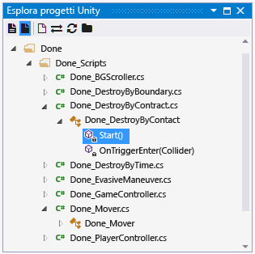
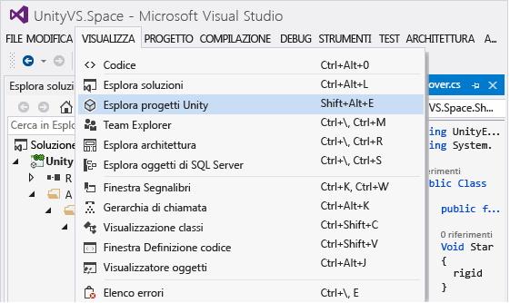
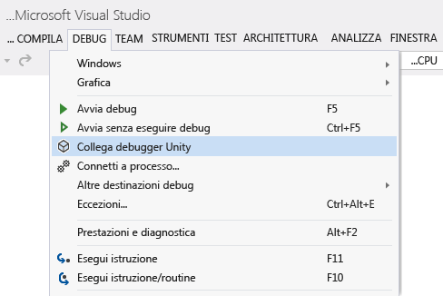
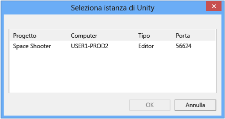
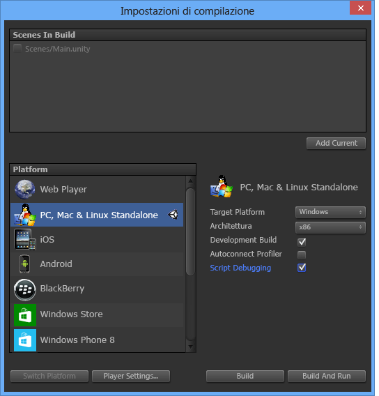

# Uso di Visual Studio Tools per Unity
In questa sezione verrà illustrato come usare le funzionalità per l'integrazione e la produttività di Visual Studio Tools per Unity e come usare il debugger di Visual Studio per lo sviluppo di Unity.  

## Funzionalità per l'integrazione e la produttività di Unity  
 Grazie all'integrazione con l'editor di Unity, Visual Studio Tools per Unity consente di incrementare la produttività. Queste funzionalità per l'incremento della produttività permettono infatti di automatizzare attività comuni di scripting e trasferire le informazioni da Unity a Visual Studio senza dover passare all'editor di Unity per individuarle.  

### Accesso della documentazione di Unity  
 È possibile accedere rapidamente alla documentazione di Unity da Visual Studio. Se Visual Studio Tools per Unity non trova la documentazione dell'API in locale, proverà a individuarla online.  

##### Per accedere alla documentazione di Unity  

-   In Visual Studio evidenziare o posizionare il cursore sull'API di Unity su cui visualizzare maggiori informazioni e quindi premere **CTRL+ALT+M, CTRL+H**  

### Procedura guidata MonoBehaviour di Unity per la creazione di script  
 In Unity la maggior parte degli script implementati deriva dalla classe MonoBehaviour di cui viene eseguito l'override di alcuni metodi. È possibile usare la procedura guidata MonoBehaviour per creare rapidamente definizioni vuote dei metodi MonoBehaviour di cui eseguire l'overload. Tramite questa procedura guidata è possibile specificare uno o più metodi di cui eseguire l'overload dall'elenco dei metodi disponibili, scegliere dove verranno inseriti nel codice e decidere se includere commenti relativi alla modalità di utilizzo.  

   

##### Per creare definizioni vuote di metodi MonoBehaviour con la procedura guidata MonoBehaviour  

1.  In Visual Studio posizionare il cursore nel punto in cui si vogliono inserire i metodi e quindi premere **CTRL+MAIUSC+M** per avviare la procedura guidata MonoBehaviour. Se invece si vogliono inserire i nuovi metodi dopo che ne è già stato implementato uno, è possibile specificarlo in un secondo momento. In tal caso, è sufficiente premere **CTRL+MAIUSC+M**.  

2.  Selezionare i metodi di cui eseguire l'overload. In **Selezionare i metodi da creare** nella finestra **Create script methods** (Crea metodi script) selezionare la casella di controllo accanto al nome dei singoli metodi di cui eseguire l'overload.  

3.  Verificare che la versione del framework visualizzata nell'elenco a discesa **Versione framework** corrisponda a quella usata. Se è diversa, modificare il valore dell'elenco a discesa selezionando la versione da usare.  

4.  Scegliere dove verranno inseriti i metodi. Per impostazione predefinita, i metodi vengono inseriti in corrispondenza della posizione del cursore. Per inserirli in un punto diverso, è possibile scegliere di inserirli dopo tutti gli eventuali metodi implementati nella classe. Per scegliere una di queste posizioni, modificare il valore dell'elenco a discesa **Punto di inserimento** specificando la posizione voluta.  

5.  Se si vuole che la procedura guidata generi commenti per i metodi selezionati, selezionare la casella di controllo **Genera commenti del metodo**. Questi commenti vengono usati per facilitare l'individuazione del punto in cui viene chiamato il metodo e chiarirne le responsabilità generali.  

6.  Fare clic su **OK** per chiudere la procedura guidata e inserire i metodi nel codice.  

 La procedura guidata MonoBehaviour è particolarmente utile se non si conoscono ancora bene le API di Unity oppure se è necessario eseguire l'overload di un metodo poco noto. Una volta acquisita familiarità con le API di Unity, è possibile usare la procedura guidata MonoBehaviour rapidi per creare rapidamente metodi già noti.  

#### Procedura guidata MonoBehaviour rapidi di Unity per la creazione di script  
 Una volta acquisita familiarità con le API di Unity, è possibile usare la procedura guidata MonoBehaviour rapidi per implementare metodi di overload ancor più rapidamente. Tramite questa procedura guidata è possibile specificare un unico metodo che viene inserito senza commenti in corrispondenza della posizione del cursore.  

   

###### Per creare una definizione vuota di metodi MonoBehaviour con la procedura guidata MonoBehaviour rapidi  

1.  In Visual Studio posizionare il cursore nel punto in cui si vogliono inserire i metodi, quindi premere **CTRL+MAIUSC+Q** per avviare la procedura guidata MonoBehaviour rapidi. A differenza dell'altra procedura guidata MonoBehaviour, con questa procedura guidata è necessario posizionare il cursore intenzionalmente perché è in tale punto che viene sempre inserito il nuovo metodo.  

2.  Verificare che la versione del framework visualizzata nell'angolo in alto a destra della finestra **Create script method** (Crea metodo script) corrisponda a quella usata. Se è diversa, modificare il valore dell'elenco a discesa selezionando la versione da usare.  

3.  Individuare il metodo di cui eseguire l'overload. Nella finestra Crea metodo script iniziare a digitare il nome del metodo nella casella di testo. Verrà visualizzato un elenco di metodi il cui nome corrisponde a quello immesso.  

4.  Scegliere il metodo di cui eseguire l'overload. Quando il metodo voluto viene visualizzato nell'elenco, selezionarlo con il mouse o i tasti freccia e quindi premere **Invio**. Se è l'unico metodo presente nell'elenco, è sufficiente premere **Invio**. Il metodo verrà inserito nel codice.  

### Esplora progetti Unity  
 È possibile usare Esplora progetti Unity per spostarsi nel progetto Unity all'interno di Visual Studio.  

   

##### Per visualizzare Esplora progetti Unity  

-   Nel menu principale di Visual Studio scegliere **Visualizza**, **Esplora progetti Unity**. Tastiera: **ALT+MAIUSC+E**  

       

 Esplora progetti Unity consente di visualizzare tutti i file e tutte le directory di un progetto Unity in modo analogo all'editor di Unity. Si tratta di una funzione diversa rispetto all'esplorazione degli script Unity con Esplora soluzioni, in cui sono presenti solo i file di script che vengono visualizzati in base all'organizzazione definita nei progetti e nella soluzione generata da Strumenti di Visual Studio per Unity. Particolarmente nei progetti di grandi dimensioni è spesso più facile individuare lo script da modificare con Esplora progetti Unity, che consente inoltre di modificare altri tipi di file, ad esempio file di configurazione basati su testo, in Visual Studio senza aggiungerli a uno dei progetti nella soluzione Visual Studio.  

### Elenco errori di Unity  
 È possibile visualizzare i messaggi della console Unity all'interno di Visual Studio quando questo è connesso a un'istanza di Unity. Sono inclusi anche errori e avvisi di Unity. I messaggi vengono visualizzati nella finestra **Elenco errori** di Visual Studio; in particolare, i messaggi di errore di Unity vengono visualizzati nella scheda **Errori**, i messaggi di avviso nella scheda **Avvisi** e gli altri messaggi, ad esempio quelli inviati tramite l'API Debug.Log di Unity, nella scheda **Messaggi**.  

 Per visualizzare i messaggi, il progetto Unity deve [eseguire il debug in un lettore Unity](#debugging-your-project-in-a-unity-player) in modo da supportare il debug di script e da importare il pacchetto Strumenti di Visual Studio per Unity corretto per la versione di Visual Studio in uso. È anche necessario che [Visual Studio sia connesso a Unity](#connecting-visual-studio-to-unity).  

 Se non si vogliono visualizzare errori, avvisi e messaggi di Unity nella finestra **Elenco errori** di Visual Studio, è possibile disabilitarli nel menu Configurazione.  

### Scelte rapide da tastiera  
 Per accedere rapidamente alle funzionalità degli strumenti Unity per Visual Studio, è possibile usare i tasti di scelta rapida elencati di seguito.  

|Comando|Collegamento|Nome del comando associato al tasto di scelta rapida|  
|-------------|--------------|---------------------------|  
|Apri procedura guidata MonoBehaviour|**CTRL+MAIUSC+M**|**EditorContextMenus.CodeWindow.ImplementMonoBehaviours**|  
|Apri procedura guidata MonoBehaviour rapidi|**CTRL+MAIUSC+Q**|**EditorContextMenus.CodeWindow.QuickMonoBehaviours**|  
|Apri Esplora progetti Unity|**ALT+MAIUSC+E**|**View.UnityProjectExplorer**|  
|Accedi alla documentazione di Unity|**CTRL+ALT+M, CTRL+H**|**Help.UnityAPIReference**|  
|Connetti al debugger Unity (lettore o editor)|***Non sono previsti valori predefiniti***|**Debug.AttachUnityDebugger**|  

 Se si preferisce non usarle, è possibile modificare le combinazioni di tasti di scelta rapida predefinite. Per informazioni su come modificarle, vedere [Identificazione e personalizzazione dei tasti di scelta rapida in Visual Studio](https://msdn.microsoft.com/en-us/library/5zwses53.aspx).  

## Debug di Unity  
 Visual Studio Tools per Unity consente di eseguire il debug di script dell'editor e di gioco del progetto Unity usando il potente debugger di Visual Studio.  

###   Connessione di Visual Studio a Unity  
 Visual Studio Tools per Unity comunica con Unity tramite una connessione UDP. Questo significa che è possibile connettersi in modo analogo a un'istanza di Unity in esecuzione in locale o in qualsiasi punto della rete. Per connettersi a una qualsiasi istanza di Unity visualizzata in rete, è possibile usare la finestra di dialogo **Seleziona istanza di Unity**.  

##### Per aprire la finestra di dialogo Seleziona istanza di Unity  

-   Nel menu principale di Visual Studio scegliere **Debug**, **Collega debugger Unity**.  

       

-   *In alternativa*, sulla barra di stato di Visual Studio fare clic sull'icona della spina nell'angolo inferiore destro di Visual Studio.  

       

> [!TIP]
>  Se accanto all'icona della spina è visualizzato un segno di spunta, la connessione a un'istanza di Unity è già attiva.  

 Nella finestra di dialogo **Seleziona istanza di Unity** sono visualizzate alcune informazioni sulle singole istanze di Unity a cui è possibile connettersi.  

   

 **Progetto**  
 Nome del progetto Unity in esecuzione in questa istanza di Unity.  

 **Computer**  
 Nome del computer o del dispositivo in cui è in esecuzione questa istanza di Unity.  

 **Type**  
 **Editor** se questa istanza di Unity viene eseguita nell'editor di Unity; **Lettore** se questa istanza di Unity è un lettore autonomo.  

 **Porta**  
 Numero di porta del socket UDP usata da questa istanza di Unity per comunicare.  

> [!IMPORTANT]
>  Dal momento che Visual Studio Tools per Unity e l'istanza di Unity comunicano tramite un socket di rete UDP, è possibile che il firewall non lo riconosca. In tal caso, è necessario autorizzare la connessione per consentire a VSTU e Unity di comunicare.  

###   Debug del progetto in un lettore Unity  
 È possibile connettere Visual Studio Tools per Unity direttamente all'app Unity in esecuzione in un lettore autonomo quando non è in esecuzione l'editor di Unity oppure per eseguire il debug di problemi specifici della piattaforma.  

##### Per abilitare il debug di script in un lettore Unity  

-   Verificare che per la build di sviluppo in fase di creazione sia abilitato il debug degli script. Nelle impostazioni di compilazione del progetto Unity selezionare le caselle di controllo **Development Build** (Build di sviluppo) e **Script Debugging** (Debug di script).  

   

 In più, per eseguire il debug di un'app Unity in esecuzione nel **lettore Web Unity**, è anche necessario configurarlo per l'uso del **canale della versione di sviluppo**.  

##### Per configurare il canale della versione di sviluppo nel lettore Web Unity  

-   Nel menu di scelta rapida del lettore Web Unity scegliere **Release Channel** (Canale versione) e verificare che l'opzione **Development** (Sviluppo) sia abilitata.  

    > [!IMPORTANT]
    >  In Unity 4.2 e versioni successive la voce di menu contestuale **Release Channel** (Canale versione) è disponibile solo nel menu contestuale del lettore Web quando si apre il menu tenendo premuto **ALT**. Se il lettore Web viene eseguito in Mac OS X, premere invece **Opzione**.  

 Verificare infine di essere connessi all'istanza di Unity di cui eseguire il debug. Per informazioni su come eseguire questa operazione, vedere la sezione [Connessione di Visual Studio a Unity](#connecting-visual-studio-to-unity).  

### Debug di una DLL nel progetto Unity  
 Molti sviluppatori Unity scrivono componenti di codice sotto forma di DLL esterne in modo da facilitare la condivisione della funzionalità sviluppata con altri progetti. Visual Studio Tools per Unity semplifica il debug del codice in queste DLL con altro codice del progetto Unity.  

> [!NOTE]
>  Al momento Visual Studio Tools per Unity supporta solo le DLL gestite. Non è invece supportato il debug di DLL di codice nativo, ad esempio quelle scritte in C++.  

 Lo scenario descritto in questo articolo presuppone che l'utente sia proprietario del codice sorgente disponibile, ovvero che si stia sviluppando o riutilizzando il proprio codice oppure che il codice sorgente sia inserito in una libreria di terze parti e si intenda distribuirlo nel progetto Unity sotto forma di DLL. Lo scenario non illustra il debug di una DLL di cui l'utente non è proprietario del codice sorgente.  

##### Per eseguire il debug di un progetto di DLL gestita usato nel progetto Unity  

1.  Aggiungere il progetto di DLL esistente alla soluzione di Visual Studio generata da Visual Studio Tools per Unity. Può capitare meno frequentemente di avviare un nuovo progetto di DLL gestita per contenere i componenti di codice nel progetto Unity. In questo caso, è possibile aggiungere un nuovo progetto di DLL gestita alla soluzione Visual Studio. Per altre informazioni sull'aggiunta di un progetto nuovo o esistente a una soluzione, vedere [Procedura: Aggiungere progetti a una soluzione](https://msdn.microsoft.com/en-us/library/vstudio/ff460187.aspx).  

     ![Aggiungere il progetto esistente per una DLL alla soluzione.] (../cross-platform/media/vstu_debugging_dll_add_existing.png "vstu_debugging_dll_add_existing")  

     In entrambi i casi, Visual Studio Tools per Unity mantiene il riferimento al progetto, anche se deve rigenerare nuovamente i file di progetto e soluzione, di conseguenza è necessario eseguire questi passaggi una sola volta.  

2.  Fare riferimento al profilo del framework Unity corretto nel progetto di DLL. Nelle proprietà del progetto di DLL in Visual Studio impostare la proprietà **Framework di destinazione** sulla versione del framework Unity usata. Si tratta della libreria di classi base Unity corrispondente alla compatibilità API di destinazione del progetto, ad esempio le librerie di classi base complete, micro o Web di Unity. In questo modo la DLL non potrà chiamare metodi del framework esistenti in  altri framework o livelli di compatibilità ma che potrebbero non esistere nella versione del framework Unity usata.  

     ![Impostare il framework di destinazione della DLL sul framework Unity.] (../cross-platform/media/vstu_debugging_dll_target_framework.png "vstu_debugging_dll_target_framework")  

3.  Copiare la DLL nella cartella Assets del progetto Unity. In Unity gli asset sono file che vengono inseriti nel pacchetto dell'app Unity e distribuiti con questa per consentirne il caricamento al runtime. Dal momento che le DLL vengono collegate al runtime, devono essere distribuite come asset. Per distribuire le DLL come asset, l'editor di Unity richiede che vengano inserite nella cartella Assets del progetto Unity. Questa operazione può essere eseguita nei due modi seguenti:  

    -   Modificare le impostazioni di compilazione del progetto di DLL in modo da includere un'attività di post-compilazione che copi la DLL di output e i file PDB dalla cartella di output alla cartella **Assets** (Asset) del progetto Unity.  

    -   Modificare le impostazioni di compilazione del progetto di DLL in modo da impostare come cartella di output la cartella **Assets** (Asset) del progetto Unity. La DLL e i file PDB verranno entrambi inseriti nella cartella **Assets** (Asset).  

     I file PDB sono necessari per il debug perché contengono i simboli di debug della DLL e consentono di eseguire il mapping del codice della DLL al formato del relativo codice sorgente. Visual Studio Tools per Unity userà le informazioni della DLL e dei file PDB per creare un file DLL.MDB, che corrisponde al formato dei simboli di debug usato dal motore di scripting di Unity.  

4.  Eseguire il debug del codice. È ora possibile eseguire il debug del codice sorgente della DLL con il codice sorgente del progetto Unity e usare tutte le funzionalità di debug a cui si è abituati, ad esempio punti di interruzione ed esecuzione del codice un'istruzione alla volta.
