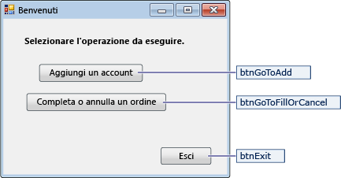
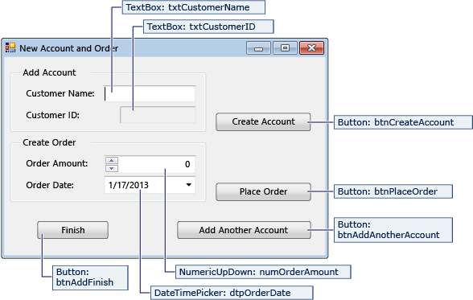

# <a name="create-a-simple-data-application-by-using-adonet"></a>Creare un'applicazione dati semplice tramite ADO.NET

Quando si crea un'applicazione che modifica i dati in un database, eseguire le attività di base, ad esempio si definiscono le stringhe di connessione, l'inserimento di dati e l'esecuzione di stored procedure. Seguendo questo argomento, è possibile scoprire come interagire con un database dall'interno di una semplice applicazione di Windows Form "form su dati" utilizzando Visual c# o Visual Basic e ADO.NET.  Tutte le tecnologie di dati .NET, inclusi i set di dati, LINQ to SQL ed Entity Framework, infine eseguire i passaggi che sono molto simili a quelli illustrati in questo articolo.

 In questo articolo viene illustrato un modo semplice per ottenere dati da un database in modo molto rapido. Se l'applicazione deve modificare i dati in modi non semplice e aggiornare il database, è consigliabile l'utilizzo di Entity Framework e utilizzando un'associazione dati a controlli dell'interfaccia utente per le modifiche nei dati sottostanti sono sincronizzati automaticamente.

> [!IMPORTANT]
> Per semplificare il codice, non include la gestione delle eccezioni di ambiente di produzione.

## <a name="prerequisites"></a>Prerequisiti

Per creare l'applicazione, è necessario disporre di:

-   Visual Studio.

-   SQL Server Express LocalDB. Se non si dispone di SQL Server Express LocalDB, è possibile installarlo dal [pagina di download di SQL Server Express](https://www.microsoft.com/sql-server/sql-server-editions-express).

In questo argomento si presuppone che si ha familiarità con la funzionalità di base dell'IDE di Visual Studio e può creare un'applicazione Windows Form, aggiungere form al progetto, inserire i pulsanti e altri controlli nel form, impostare le proprietà di controlli e semplici eventi di codice. Se non si ha familiarità con queste attività, si consiglia di completare il [Guida introduttiva a Visual c# e Visual Basic](../ide/getting-started-with-visual-csharp-and-visual-basic.md) argomento prima di iniziare questa procedura dettagliata.

## <a name="set-up-the-sample-database"></a>Impostare il database di esempio

Creare il database di esempio attenendosi alla procedura seguente:

1. In Visual Studio, aprire il **Esplora Server** finestra.

2. Fare clic su **connessioni dati** e scegliere * * Crea nuovo Database SQL Server... ".

3. Nel **nome Server** testo immettere **(localdb) \mssqllocaldb**.

4. Nel **nome nuovo database** testo immettere **Sales**, quindi scegliere **OK**.

     Vuoto **Sales** database viene creato e aggiunto al nodo Connessioni di dati in Esplora Server.

5. Fare clic su di **Sales** connessione dati e selezionare **nuova Query**.

     Verrà visualizzata una finestra dell'editor di query.

6. Copia il [script Transact-SQL Sales](https://github.com/MicrosoftDocs/visualstudio-docs/raw/master/docs/data-tools/samples/sales.sql) negli Appunti.

7. Incollare lo script T-SQL nell'editor di query e quindi scegliere il **Execute** pulsante.

     Dopo un breve periodo di tempo, la query viene completata l'esecuzione e vengono creati gli oggetti di database. Il database contiene due tabelle: Customer e Orders. Queste tabelle inizialmente non contengono dati, ma è possibile aggiungere dati quando si esegue l'applicazione che verrà creato. Il database contiene inoltre quattro stored procedure semplici.

## <a name="create-the-forms-and-add-controls"></a>Creare i form e aggiungere i controlli

1.  Creare un progetto per un'applicazione Windows Form e denominarlo SimpleDataApp.

     Visual Studio crea il progetto e diversi file, tra cui un form Windows vuoto denominato Form1.

2.  Aggiungere due form Windows al progetto in modo che disponga di tre form e assegnare i nomi seguenti:

    -   Navigazione

    -   NewCustomer

    -   FillOrCancel

3.  Per ogni form, aggiungere caselle di testo, pulsanti e altri controlli come illustrato nelle figure seguenti. Per ciascun controllo, impostare le proprietà descritte nelle tabelle.

    > [!NOTE]
    >  La casella di gruppo e i controlli Label migliorano la leggibilità, ma non vengono usati nel codice.

 **Form navigazione**

 

|Controlli per il form Navigazione|Proprietà|
|--------------------------------------|----------------|
|Button|Name = btnGoToAdd|
|Button|Name = btnGoToFillOrCancel|
|Button|Name = btnExit|

 **Form NewCustomer**

 

|Controlli per il form NewCustomer|Proprietà|
|---------------------------------------|----------------|
|TextBox|Name = txtCustomerName|
|TextBox|Name = txtCustomerID<br /><br /> Readonly = True|
|Button|Name = btnCreateAccount|
|NumericUpdown|DecimalPlaces = 0<br /><br /> Maximum = 5000<br /><br /> Name = numOrderAmount|
|DateTimePicker|Format = Short<br /><br /> Nome = dtpOrderDate|
|Button|Name = btnPlaceOrder|
|Button|Name = btnAddAnotherAccount|
|Button|Name = btnAddFinish|

 **Form FillOrCancel**

 

|Controlli del form FillOrCancel|Proprietà|
|----------------------------------------|----------------|
|TextBox|Name = txtOrderID|
|Pulsante|Name = btnFindByOrderID|
|DateTimePicker|Format = Short<br /><br /> Name = dtpFillDate|
|DataGridView|Name = dgvCustomerOrders<br /><br /> Readonly = True<br /><br /> RowHeadersVisible = False|
|Button|Name = btnCancelOrder|
|Button|Name = btnFillOrder|
|Button|Name = btnFinishUpdates|

## <a name="store-the-connection-string"></a>Archiviare la stringa di connessione
 Quando l'applicazione tenta di aprire una connessione al database, l'applicazione deve disporre dell'accesso alla stringa di connessione. Per evitare di immettere manualmente la stringa in ogni form, archiviare la stringa nel file app. config nel progetto e creare un metodo che restituisce la stringa quando il metodo viene chiamato da qualsiasi form nell'applicazione.

 È possibile trovare la stringa di connessione facendo clic su di **Sales** connessione dati in **Esplora Server** e scegliendo **proprietà**. Individuare il **ConnectionString** proprietà, quindi utilizzare Ctrl + E, Ctrl + C per selezionare e copiare la stringa negli Appunti.

1.  Se si utilizza c#, **Esplora**, espandere il **proprietà** nodo sotto il progetto e quindi aprire il **Settings** file.
    Se si utilizza Visual Basic, in **Esplora**, fare clic su **Mostra tutti i file**, espandere il **progetto** nodo e quindi aprire il **Settings.Settings** file.

2.  Nel **nome** colonna, immettere `connString`.

3.  Nel **tipo** elenco, selezionare **(stringa di connessione)**.

4.  Nel **ambito** elenco, selezionare **applicazione**.

5.  Nel **valore** colonna, immettere la stringa di connessione (senza alcuna all'esterno di virgolette doppie) e quindi salvare le modifiche.

> [!NOTE]
> In un'applicazione reale, è consigliabile archiviare la stringa di connessione in modo sicuro, come descritto in [stringhe di connessione e i file di configurazione](/dotnet/framework/data/adonet/connection-strings-and-configuration-files).

##  <a name="write-the-code-for-the-forms"></a>Scrivere il codice per i form

In questa sezione contiene brevi descrizioni delle funzionalità di ogni modulo. Fornisce inoltre il codice che definisce la logica sottostante quando si sceglie un pulsante nel form.

### <a name="navigation-form"></a>Form Navigazione

Quando si esegue l'applicazione, verrà visualizzato il form Navigazione. Il **aggiungere un account** apre il form NewCustomer. Il **completare o annullare gli ordini** apre il form FillOrCancel. Il **uscita** pulsante chiude l'applicazione.

#### <a name="make-the-navigation-form-the-startup-form"></a>Impostare il form Navigazione come form di avvio

Se si usa c#, in **Esplora soluzioni**, aprire Program.cs e modificare il `Application.Run` riga al seguente: `Application.Run(new Navigation());`

Se si utilizza Visual Basic, in **Esplora**, aprire il **proprietà** finestra, seleziona il **applicazione** scheda e quindi selezionare  **Simpledataapp. Navigation** nel **form di avvio** elenco.

#### <a name="create-auto-generated-event-handlers"></a>Creare i gestori eventi generato automaticamente

Fare doppio clic su tre pulsanti nel form di navigazione per creare i metodi del gestore eventi vuoto. Fare doppio clic sul pulsante aggiunge anche il codice generato automaticamente nel file di codice di progettazione che consente a un clic del pulsante generare un evento.

#### <a name="add-code-for-the-navigation-form-logic"></a>Aggiungere il codice per la logica di form navigazione

Nella tabella codici per il form navigazione, completa i corpi di metodo per il pulsante tre gestori di eventi click come illustrato nel codice seguente.

[!code-csharp[Navigation#1](../data-tools/codesnippet/CSharp/SimpleDataApp/Navigation.cs#1)]
[!code-vb[Navigation#1](../data-tools/codesnippet/VisualBasic/SimpleDataApp/Navigation.vb#1)]

### <a name="newcustomer-form"></a>Form NewCustomer

Quando si immettere un nome di cliente e quindi selezionare il **crea Account** pulsante, il form NewCustomer crea un account cliente e SQL Server restituisce un valore IDENTITY come nuovo ID cliente. È quindi possibile inserire un ordine per il nuovo account specificando una quantità e data dell'ordine e selezionando il **effettuare l'ordine** pulsante.

#### <a name="create-auto-generated-event-handlers"></a>Creare i gestori eventi generato automaticamente

Creare un vuota fare clic su gestore eventi per ogni pulsante nel form NewCustomer facendo doppio clic su ognuno dei quattro pulsanti. Fare doppio clic sul pulsante aggiunge anche il codice generato automaticamente nel file di codice di progettazione che consente a un clic del pulsante generare un evento.

#### <a name="add-code-for-the-newcustomer-form-logic"></a>Aggiungere il codice per la logica di form NewCustomer

Per completare la logica di form NewCustomer, seguire questi passaggi.

1. Portare il `System.Data.SqlClient` dello spazio dei nomi nell'ambito in modo che non è completamente necessario qualificare i nomi dei relativi membri.

     ```csharp
     using System.Data.SqlClient;
     ```
     ```vb
     Imports System.Data.SqlClient
     ```

2. Aggiungere alcuni metodi helper e le variabili alla classe, come illustrato nel codice seguente.

     [!code-csharp[NewCustomer#1](../data-tools/codesnippet/CSharp/SimpleDataApp/NewCustomer.cs#1)]
     [!code-vb[NewCustomer#1](../data-tools/codesnippet/VisualBasic/SimpleDataApp/NewCustomer.vb#1)]

3. Completa il corpo del metodo per il pulsante quattro gestori dell'evento click come illustrato nel codice seguente.

     [!code-csharp[NewCustomer#2](../data-tools/codesnippet/CSharp/SimpleDataApp/NewCustomer.cs#2)]
     [!code-vb[NewCustomer#2](../data-tools/codesnippet/VisualBasic/SimpleDataApp/NewCustomer.vb#2)]

### <a name="fillorcancel-form"></a>Form FillOrCancel

Il form FillOrCancel esegue una query per restituire un ordine quando si immette un ID ordine e quindi fare clic su di **Find Order** pulsante. La riga restituita viene visualizzata in una griglia di dati di sola lettura. È possibile contrassegnare l'ordine come annullato (X) se si seleziona il **Cancel Order** pulsante oppure è possibile contrassegnarlo come evaso (F) se si seleziona il **Fill Order** pulsante. Se si seleziona il **Find Order** nuovamente clic sul pulsante, viene visualizzata la riga aggiornata.

#### <a name="create-auto-generated-event-handlers"></a>Creare i gestori eventi generato automaticamente

Creare vuota fare clic sui gestori eventi per i quattro pulsanti nel form FillOrCancel facendo doppio clic sul pulsante. Fare doppio clic sul pulsante aggiunge anche il codice generato automaticamente nel file di codice di progettazione che consente a un clic del pulsante generare un evento.

#### <a name="add-code-for-the-fillorcancel-form-logic"></a>Aggiungere il codice per la logica del form FillOrCancel

Per completare la logica del form FillOrCancel, seguire questi passaggi.

1. Portare i seguenti due spazi dei nomi nell'ambito in modo che non è necessario qualificare completamente i nomi dei relativi membri.

     ```csharp
     using System.Data.SqlClient;
     using System.Text.RegularExpressions;
     ```
     ```vb
     Imports System.Data.SqlClient
     Imports System.Text.RegularExpressions
     ```

2. Aggiungere un variabile e metodo di supporto alla classe, come illustrato nel codice seguente.

     [!code-csharp[FillOrCancel#1](../data-tools/codesnippet/CSharp/SimpleDataApp/FillOrCancel.cs#1)]
     [!code-vb[FillOrCancel#1](../data-tools/codesnippet/VisualBasic/SimpleDataApp/FillOrCancel.vb#1)]

3. Completa il corpo del metodo per il pulsante quattro gestori dell'evento click come illustrato nel codice seguente.

     [!code-csharp[FillOrCancel#2](../data-tools/codesnippet/CSharp/SimpleDataApp/FillOrCancel.cs#2)]
     [!code-vb[FillOrCancel#2](../data-tools/codesnippet/VisualBasic/SimpleDataApp/FillOrCancel.vb#2)]

## <a name="test-your-application"></a>Eseguire il test dell'applicazione

Selezionare il **F5** chiave per compilare e testare l'applicazione dopo che codice ogni gestore dell'evento Click e quindi dopo la generazione di codice di fine.

## <a name="see-also"></a>Vedere anche

- [Visual Studio Data Tools per .NET](../data-tools/visual-studio-data-tools-for-dotnet.md)
