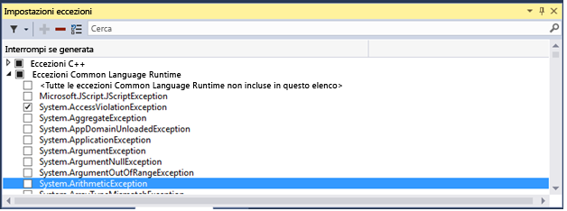
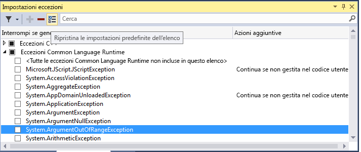
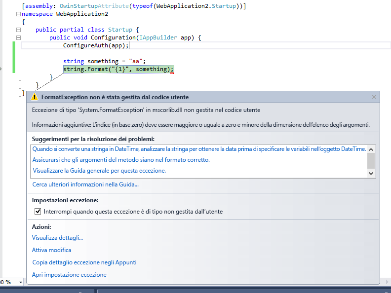
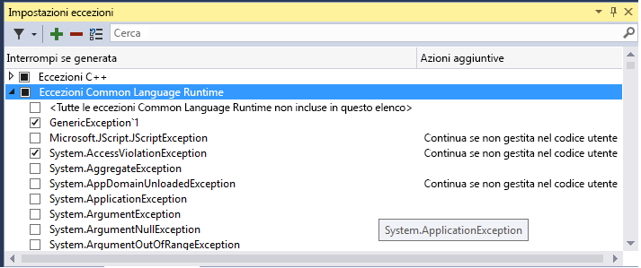

# <a name="manage-exceptions-with-the-debugger-in-visual-studio"></a>Gestire le eccezioni con il debugger di Visual Studio

Un'eccezione è un'indicazione di uno stato di errore che si verifica durante l’esecuzione di un programma. È possibile impostare il debugger, eccezioni (o set di eccezioni) a cui interrompere l'esecuzione e in quale punto si verificherà l'interruzione del debugger (quando il debugger si interrompe, viene indicato dove è stata generata l'eccezione). È anche possibile aggiungere o eliminare le eccezioni. Con una soluzione aperta in Visual Studio, usare **Debug > Windows > Impostazioni eccezioni** per aprire la **impostazioni eccezioni** finestra. 

È possibile e consigliabile fornire gestori che rispondono alle eccezioni più importanti, ma è importante sapere come configurare il debugger per interrompere sempre l'esecuzione per alcune eccezioni.
  
Quando si verifica un'eccezione, il debugger scrive un messaggio di eccezione nella finestra di Output. Il debugger può interrompere l'esecuzione nei casi seguenti:  
  
-   quando un'eccezione viene generata e non viene gestita.  
  
-   Quando il debugger è configurato per l'esecuzione si interrompe prima che venga richiamato qualsiasi gestore.  
  
-   Se è stata impostata [Just My Code](../debugger/just-my-code.md), ed è configurato il debugger per interrompere qualsiasi eccezione non gestita nel codice utente.  
  
> [!NOTE]
>  ASP.NET dispone di un gestore di eccezioni di livello superiore che mostra le pagine di errore in un browser. Questo gestore non interrompe l'esecuzione a meno che **Just My Code** non sia attivato. Per un esempio, vedere [Setting the debugger to continue on user-unhandled exceptions](../debugger/managing-exceptions-with-the-debugger.md#BKMK_UserUnhandled) di seguito.  
  
> [!NOTE]
>  In un'applicazione Visual Basic, il debugger gestisce tutti gli errori come eccezioni, anche se si utilizza sui gestori di errori di stile di errore.    
  
## <a name="tell-the-debugger-to-break-when-an-exception-is-thrown"></a>Impostare il debugger per interrompere l'esecuzione quando viene generata un'eccezione  
È possibile impostare il debugger in modo da interrompere l'esecuzione quando si verifica un'eccezione e poter quindi esaminare l'eccezione prima che venga richiamato un gestore.  
  
Nel **impostazioni eccezioni** finestra (**Debug > Windows > Impostazioni eccezioni**), espandere il nodo per una categoria di eccezioni (ad esempio, **eccezioni Common Language Runtime**, vale a dire eccezioni .NET) e selezionare la casella di controllo per un'eccezione specifica all'interno di tale categoria (ad esempio **System. AccessViolationException**). È inoltre possibile selezionare un'intera categoria di eccezioni.  
  
  

> [!TIP]
> È possibile trovare eccezioni specifiche dalla finestra **Cerca** nella barra degli strumenti **Impostazioni eccezioni** o utilizzare la ricerca per filtrare per spazi dei nomi specifici (ad esempio **System.IO**).
  
Se si seleziona un'eccezione nel **impostazioni eccezioni** finestra, l'esecuzione del debugger viene interrotta ogni volta che viene generata l'eccezione, indipendentemente dal fatto viene gestito o non gestita. A questo punto, l'eccezione viene chiamata eccezione first-chance. Di seguito vengono riportati un paio di scenari di esempio:  
  
*  Nell'applicazione console C# seguente, il metodo Main genera un'eccezione **AccessViolationException** all'interno di un blocco `try/catch` :  
  
    ```CSharp  
    static void Main(string[] args)  
    {  
        try  
        {  
            throw new AccessViolationException();  
            Console.WriteLine("here");  
        }  
        catch (Exception e)  
        {  
            Console.WriteLine("caught exception");  
        }  
        Console.WriteLine("goodbye");  
    }  
    ```  
  
     Se l'eccezione **AccessViolationException** è selezionata in **Impostazioni eccezioni**, quando si esegue questo codice nel debugger, l'esecuzione si interrompe alla riga `throw` . È quindi possibile continuare l'esecuzione. Nella console dovrebbero essere visualizzate entrambe le righe:  
  
    ```  
    caught exception  
    goodbye  
    ```  
  
     ma non viene visualizzata la riga `here` .  
  
*  Un'applicazione console c# fa riferimento a una libreria di classi con una classe che dispone di due metodi, un metodo che genera un'eccezione e la gestisce e un secondo metodo che genera la stessa eccezione e non gestita:  
  
    ```csharp 
    public class Class1  
    {  
        public void ThrowHandledException()  
        {  
            try  
            {  
                throw new AccessViolationException();  
            }  
            catch (AccessViolationException ave)  
            {  
                Console.WriteLine("caught exception" + ave.Message);  
            }  
        }  
  
        public void ThrowUnhandledException()  
        {  
            throw new AccessViolationException();  
        }  
    }  
    ```  
  
     Ecco il metodo Main () dell'applicazione console:  
  
    ```CSharp  
    static void Main(string[] args)  
    {  
        Class1 class1 = new Class1();  
        class1.ThrowHandledException();  
        class1.ThrowUnhandledException();  
    }  
    ```  
  
     Se l'eccezione **AccessViolationException** è selezionata in **Impostazioni eccezioni**, quando si esegue questo codice nel debugger, l'esecuzione si interrompe alla riga `throw` in **ThrowHandledException()** e **ThrowUnhandledException()**.  
  
 Se si desidera ripristinare le impostazioni di eccezioni sulle impostazioni predefinite, è possibile scegliere il pulsante **Ripristina** nella barra degli strumenti:  
  
   
  
##  <a name="BKMK_UserUnhandled"></a>Impostare il debugger per continuare a eccezioni non gestite dall'utente  
 Se si esegue il debug del codice .NET o JavaScript con [Just My Code](../debugger/just-my-code.md), è possibile impostare il debugger in modo da non interrompere l'esecuzione in corrispondenza di eccezioni non gestite nel codice utente, ma gestite in un'altra posizione.  
  
1.  Nella finestra **Impostazioni eccezioni** , aprire il menu di scelta rapida facendo clic con il pulsante destro del mouse nella finestra e selezionando **Mostra colonne**. (Se **Just My Code**è stato disattivato, questo comando non verrà visualizzato).  
  
2.  Dovrebbe essere visualizzata una seconda colonna denominata **Azioni aggiuntive**. In questa colonna viene visualizzato **Continua se non gestita dal codice utente** per eccezioni specifiche, vale a dire che il debugger non interrompe l’esecuzione se l'eccezione non viene gestita nel codice utente ma viene gestita nel codice esterno.  
  
3.  È possibile modificare questa impostazione per una determinata eccezione (selezionare l'eccezione, fare clic con il pulsante destro del mouse e selezionare/deselezionare **Continua se non gestita nel codice utente**) o per un'intera categoria di eccezioni (ad esempio, tutte le eccezioni Common Language Runtime).  
  
 Ad esempio, le applicazioni Web ASP.NET gestiscono le eccezioni convertendole in un codice di stato HTTP 500 ([Gestione delle eccezioni nell'API ASP.NET](http://www.asp.net/web-api/overview/error-handling/exception-handling)), che potrebbe non aiutare a determinare l'origine dell'eccezione. Nell'esempio seguente, il codice utente effettua una chiamata a `String.Format()` che genera un’eccezione <xref:System.FormatException>. L'esecuzione si interrompe come segue:  
  
   
  
## <a name="add-and-delete-exceptions"></a>Aggiungere ed eliminare le eccezioni  
 È possibile aggiungere ed eliminare le eccezioni. È possibile eliminare qualsiasi tipo di eccezione da qualsiasi categoria selezionando l'eccezione e facendo clic sul pulsante **Elimina** (il segno meno) nella barra degli strumenti **Impostazioni eccezioni** o facendo clic con il pulsante destro del mouse sull'eccezione e selezionando **Elimina** dal menu di scelta rapida. L'eliminazione di un'eccezione ha lo stesso effetto di un’eccezione non selezionata, vale a dire che il debugger non interrompe l’esecuzione quando l’eccezione viene generata.  
  
 Per aggiungere un'eccezione: nella finestra **Impostazioni eccezioni** selezionare una delle categorie di eccezioni (ad esempio, **Common Language Runtime**) e fare clic sul pulsante **Aggiungi** . Digitare il nome dell'eccezione (ad esempio **System.UriTemplateMatchException**). L'eccezione viene aggiunta all'elenco (in ordine alfabetico) e viene selezionata automaticamente.  
  
 Se si desidera aggiungere un'eccezione alle eccezioni di accesso alla memoria GPU, alle eccezioni di runtime JavaScript o alle categorie di eccezioni Win32, è necessario includere il codice di errore, nonché la descrizione.  
  
> [!TIP]
>  Controllare l’ortografia. Il **impostazioni eccezioni** finestra non verifica l'esistenza di un'eccezione aggiunta. Pertanto, se si digita **Sytem**, si otterrà una voce per tale eccezione (e non per **uritemplatematchexception**).  
  
 Le impostazioni di eccezioni sono persistenti nel file con estensione suo della soluzione, per cui si applicano a una particolare soluzione. Tra le soluzioni non è possibile riutilizzare impostazioni di eccezioni specifiche. A questo punto, vengono mantenute solo le eccezioni aggiunte e non le eccezioni eliminate. In altre parole, è possibile aggiungere un'eccezione, chiudere e riaprire la soluzione e l'eccezione sarà ancora disponibile. Ma se si elimina un'eccezione e si chiude e si riapre la soluzione, l'eccezione viene visualizzata nuovamente.  
  
 La finestra **Impostazioni eccezioni** supporta tipi di eccezioni generiche in C#, ma non in Visual Basic. Per interrompere l’esecuzione in corrispondenza di eccezioni come `MyNamespace.GenericException<T>`, è necessario aggiungere l'eccezione come **MyNamespace.GenericException'1**. Vale a dire, se è stata creata un'eccezione simile alla seguente:  
  
```CSharp  
public class GenericException<T> : Exception  
{  
    public GenericException() : base("This is a generic exception.")  
    {  
    }  
}  
```  
  
 È possibile aggiungere l'eccezione a **Impostazioni eccezioni** come segue:  
  
   

## <a name="add-conditions-to-an-exception"></a>Aggiungere condizioni di eccezione

È possibile impostare le condizioni per le eccezioni nel **impostazioni eccezioni** la finestra di dialogo. Le condizioni attualmente supportate includono i nomi di modulo da includere o escludere per l'eccezione. Impostando i nomi di modulo come condizioni, è possibile scegliere di interrompere per l'eccezione solo nei moduli di codice specifico oppure è possibile evitare l'interruzione in moduli specifici.

> [!NOTE]
> Aggiunta di condizioni per un'eccezione è stata introdotta in[!include[vs_dev15](../misc/includes/vs_dev15_md.md)]

Per aggiungere le eccezioni condizionale, scegliere il **modifica condizione** icona nella finestra di dialogo Impostazioni di eccezione o l'eccezione di mouse e scegliere **modificare condizioni**.


  
## <a name="see-also"></a>Vedere anche  
 [Continuazione dell'esecuzione dopo un'eccezione](../debugger/continuing-execution-after-an-exception.md)   
 [Procedura: esaminare il codice di sistema dopo un'eccezione](../debugger/how-to-examine-system-code-after-an-exception.md)   
 [Procedura: utilizzare controlli runtime nativi](../debugger/how-to-use-native-run-time-checks.md)   
 [Utilizzo in fase di esecuzione dei controlli senza la libreria di runtime C](../debugger/using-run-time-checks-without-the-c-run-time-library.md)   
 [Debugger Basics](../debugger/debugger-basics.md) (Nozioni di base sul debugger)