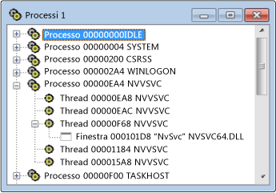

# Processes View
[!INCLUDE[vs2017banner](../code-quality/includes/vs2017banner.md)]

La visualizzazione processi consente di visualizzare una struttura ad albero di tutti i processi attivi sul sistema.  Vengono visualizzati l'ID del processo e il nome del modulo.  Utilizzare la visualizzazione processi se si desidera esaminare un processo di sistema specifico che generalmente corrisponde a un programma in esecuzione.  I processi vengono identificati tramite i nomi dei moduli oppure vengono definiti "processi di sistema".  
  
 In Microsoft Windows sono supportati più processi.  Ogni processo può disporre di uno o più thread e a ognuno di essi possono essere associate una o più finestre di primo livello.  In ogni finestra di primo livello può essere inclusa una serie di finestre.  Il simbolo \+ indica che il livello è compresso.  La visualizzazione compressa è costituita da una riga per processo.  Fare clic sul simbolo \+ per espandere il livello.  
  
 Utilizzare la visualizzazione processi se si desidera esaminare un processo di sistema specifico che generalmente corrisponde a un programma in esecuzione.  I processi vengono identificati tramite i nomi dei moduli oppure vengono definiti "processi di sistema". Per trovare un processo, comprimere la struttura ad albero e cercare nell'elenco.  
  
## Procedure  
  
#### Per aprire la visualizzazione processi  
  
1.  Scegliere **Processi** dal menu **Spy**.  
  
   
Visualizzazione processi di Spy\+\+  
  
 Nella figura precedente viene mostrata la visualizzazione processi con i nodi del processo e del thread espansi.  
  
### Argomenti della sezione  
 [Ricerca di un processo nella visualizzazione processi](../debugger/how-to-search-for-a-process-in-processes-view.md)  
 Viene illustrato come individuare un processo specifico nella visualizzazione processi.  
  
 [Visualizzazione delle proprietà dei processi](../debugger/how-to-display-process-properties.md)  
 Viene illustrato come visualizzare ulteriori informazioni su un messaggio.  
  
### Sezioni correlate  
 [Visualizzazioni di Spy\+\+](../debugger/spy-increment-views.md)  
 Vengono illustrate le visualizzazioni struttura ad albero di Spy\+\+ relative a finestre, messaggi, processi e thread.  
  
 [Utilizzo di Spy\+\+](../debugger/using-spy-increment.md)  
 Vengono illustrati lo strumento Spy\+\+ e il relativo utilizzo.  
  
 [Finestra di dialogo Ricerca processi](../debugger/process-search-dialog-box.md)  
 Utilizzata per individuare il nodo relativo a un processo specifico nella visualizzazione processi.  
  
 [Finestra di dialogo Proprietà processo](../debugger/process-properties-dialog-box.md)  
 Consente di visualizzare le proprietà di un processo selezionato nella visualizzazione processi.  
  
 [Riferimenti per Spy\+\+](../debugger/spy-increment-reference.md)  
 Sono incluse le sezioni in cui vengono descritti tutti i menu e le finestre di dialogo di Spy\+\+.