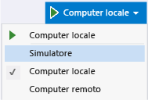

# Aggiornare un&#39;applicazione (JavaScript)
[!INCLUDE[vs2017banner](../code-quality/includes/vs2017banner.md)]

  
  
 Puoi apportare modifiche al codice durante il debug e poi aggiornare un'app Windows Store con JavaScript scegliendo il pulsante **Aggiorna applicazione Windows** sulla barra degli strumenti **Debug**.  Facendo clic su questo pulsante, l'app viene ricaricata senza arrestare e riavviare il debugger.  La funzionalità di aggiornamento ti consente di modificare il codice HTML, CSS e JavaScript e visualizzare rapidamente i risultati.  Questa funzionalità è supportata per app Windows Store e Windows Phone Store.  
  
 L'aggiornamento non mantiene lo stato dell'app né riflette le seguenti modifiche nell'app:  
  
-   Modifiche al file manifesto del pacchetto, incluse le modifiche alle immagini specificato nel manifesto di pacchetto.  
  
-   Modifiche dei riferimenti, ad esempio l'aggiunta o la rimozione di un riferimento SDK, o le modifiche ai componenti Windows Runtime \(file con estensione winmd\).  
  
-   Modifiche delle risorse, ad esempio modifiche alle stringhe nei file con estensione resjson.  
  
-   Modifiche dei file di progetto che causano modifiche dei nomi di percorso, nuovi file di progetto e file eliminati.  
  
-   Modifiche delle proprietà di elementi e progetti, ad esempio modifiche al dispositivo di debug selezionato o modifiche all'azione del pacchetto per un file \(nella finestra Proprietà\).  
  
> [!IMPORTANT]
>  Quando modifichi i riferimenti, cambi il manifesto del pacchetto o apporti altre modifiche specificate nell'elenco precedente, devi arrestare e riavviare il debugger per aggiornare i file di origine HTML, CSS e JavaScript.  
  
### Per aggiornare un'app  
  
1.  In Visual Studio crea un nuovo progetto usando il modello di progetto Applicazione di navigazione.  
  
     Può trattarsi di un'app Windows Store, di un'app Windows Phone Store o di un'app universale.  
  
2.  Con il modello aperto in Visual Studio, seleziona una destinazione di debug.  
  
     Se un progetto Windows Phone è il tuo attuale progetto di avvio, seleziona un'emulatore Windows Phone come destinazione di debug.  Altrimenti, seleziona **Simulatore** o **Computer locale**.  
  
       
  
3.  Premi F5 per eseguire l'app in modalità debug.  
  
4.  Passa a Visual Studio.  Premi F12.  
  
5.  In **Esplora soluzioni** apri il file home.html nella cartella **pages** \> **home**.  
  
6.  Modificare il testo del titolo della pagina da  
  
    ```html  
    Welcome to yourAppName!  
    ```  
  
     in un altro titolo, ad esempio:  
  
    ```html  
    Hello!  
    ```  
  
7.  Fai clic sul pulsante **Aggiorna applicazione Windows**, che ha un aspetto simile a  o premi F4.  
  
8.  Torna all'app.  L'app viene ricaricata senza riavviare il debugger e viene visualizzato il nuovo titolo della pagina.  
  
## Vedere anche  
 [Guida introduttiva: Eseguire il debug di HTML e CSS](../debugger/quickstart-debug-html-and-css.md)