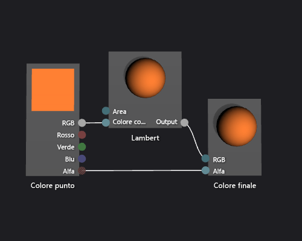

# Procedura: Creare uno shader con Lambert di base
[!INCLUDE[vs2017banner](../code-quality/includes/vs2017banner.md)]

In questo documento viene illustrato come utilizzare la finestra di Progettazione shader e il linguaggio DGSL per creare uno shader di illuminazione che implementa il modello di illuminazione di Lambert classico.  
  
 In questo documento vengono illustrate queste attività:  
  
-   Aggiunta di nodi a un grafico shader  
  
-   Disconnessione di nodi  
  
-   Connessione di nodi  
  
## Modello di illuminazione di Lambert  
 Il modello di illuminazione di Lambert incorpora l'illuminazione ambientale e direzionale per ombreggiare gli oggetti in una scena tridimensionale.  Il componente di ambiente fornisce un livello di base di illuminazione della scena tridimensionale.  Il componente direzionale fornisce illuminazione aggiuntiva da sorgenti di luce direzionali \(distanti\).  L'illuminazione dell'ambiente interessa ugualmente tutte le superfici della scena, indipendentemente dall'orientamento.  Per una superficie specificata, si tratta di un prodotto del colore ambiente della superficie e il colore e l'intensità dell'illuminazione di ambiente nella scena.  L'illuminazione direzionale influenza ogni area nella scena in modo diverso, in base all'orientamento della superficie rispetto alla direzione di una sorgente di luce.  È un prodotto del colore diffuso e dell'orientamento della superficie e del colore, dell'intensità e della direzione delle sorgenti di luce.  Le superfici rivolte direttamente verso una sorgente di luce ricevono il massimo contributo mentre le superfici rivolte in senso contrario alla luce non ricevono alcun contributo.  Nel modello di illuminazione di Lambert, il componente ambiente e uno o più componenti direzionali vengono combinati per determinare il contributo di diffusione totale del colore per ogni punto sull'oggetto.  
  
 Prima di iniziare, assicurarsi che la finestra **Proprietà** e la **casella degli strumenti** siano visualizzate.  
  
#### Per creare uno shader di Lambert  
  
1.  Creare uno shader DGSL da utilizzare.  Per informazioni su come aggiungere uno shader DGSL al progetto, vedere la sezione della Guida introduttiva in [Finestra di progettazione shader](../designers/shader-designer.md).  
  
2.  Disconnettere il nodo **Colore punto** dal nodo **Colore finale**.  Scegliere il terminale **RGB** del nodo **Colore punto**, quindi scegliere **Interrompi collegamenti**.  Lasciare connesso il terminale **Alfa**.  
  
3.  Aggiungere un nodo **Lambert** al grafico.  Nella **Casella degli strumenti** in **Utilità** selezionare **Lambert** e spostarla nell'area di progettazione.  Il nodo di Lambert calcola il contributo di diffusione totale del colore del pixel, in base ai parametri di ambiente e di diffusione dell'illuminazione.  
  
4.  Connettere il nodo **Colore punto** al nodo **Lambert**.  In modalità **Seleziona**, spostare il terminale **RGB** del nodo **Colore punto** al terminale **Colore diffuso** del nodo **Lambert**.  Questa connessione fornisce il nodo Lambert con l'interpolazione diffusa del colore del pixel.  
  
5.  Connettere il valore della costante di colore elaborata al colore finale.  Spostare il terminale **Output** del nodo **Lambert** nel terminale **RGB** del nodo **Colore finale**.  
  
 Nella figura seguente viene mostrato il grafico di shader completato e un'anteprima dello shader applicato a un modello di teiera.  
  
> [!NOTE]
>  Per illustrare meglio l'effetto dello shader in questa illustrazione, è stato specificato un colore arancione utilizzando il parametro **MaterialDiffuse** dello shader.  Un gioco o un'applicazione può utilizzare questo parametro per specificare un valore di colore univoco per ogni oggetto.  Per informazioni sui parametri materiali, vedere la sezione di visualizzazione in anteprima dello shader in [Finestra di progettazione shader](../designers/shader-designer.md).  
  
   
  
 Alcune forme potrebbero fornire anteprime ottimizzate per alcuni pixel.  Per ulteriori informazioni su come visualizzare in anteprima gli shader nella finestra di progettazione dello shader, vedere la sezione di visualizzazione in anteprima dello shader in [Finestra di progettazione shader](../designers/shader-designer.md).  
  
 Nella figura seguente viene illustrato lo shader descritto in questo documento applicato a un modello tridimensionale.  
  
   
  
 Per ulteriori informazioni su come applicare uno shader a un modello tridimensionale, vedere [Procedura: Applicare uno shader a un modello tridimensionale](../designers/how-to-apply-a-shader-to-a-3-d-model.md).  
  
## Vedere anche  
 [Procedura: Applicare uno shader a un modello tridimensionale](../designers/how-to-apply-a-shader-to-a-3-d-model.md)   
 [Procedura: Esportare uno shader](../designers/how-to-export-a-shader.md)   
 [Procedura: Creare uno shader con phong di base](../designers/how-to-create-a-basic-phong-shader.md)   
 [Finestra di progettazione shader](../designers/shader-designer.md)   
 [Nodi della finestra di progettazione shader](../designers/shader-designer-nodes.md)