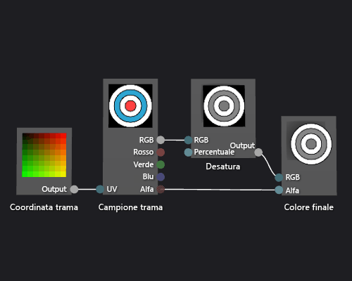

# Procedura: Creare uno shader con trama in scala di grigi
[!INCLUDE[vs2017banner](../code-quality/includes/vs2017banner.md)]

In questo documento viene illustrato come utilizzare la finestra di Progettazione shader e il linguaggio DGSL per creare uno shader di trama in scala di grigi.  Questo shader modifica il valore di colore RGB del campione di trama, quindi lo utilizza insieme al valore alfa invariato per impostare il colore finale.  
  
## Creazione di uno shader della trama in scala di grigi  
 È possibile implementare uno shader a trama in scala di grigi modificando il valore del colore di un esempio di trama prima di scriverlo nel colore di output finale.  
  
 Prima di iniziare, assicurarsi che la finestra **Proprietà** e la **casella degli strumenti** siano visualizzate.  
  
#### Per creare uno shader di trama in scala di grigi  
  
1.  Creare uno shader di base di trama, come descritto in [Procedura: Creare uno shader con trama di base](../designers/how-to-create-a-basic-texture-shader.md).  
  
2.  Disconnettere il terminale **RGB** del nodo **Campione trama** da terminale **RGB** del nodo **Colore finale**.  In modalità **Seleziona**, scegliere il terminale **RGB** del nodo **Campione trama**, quindi scegliere **Interrompi collegamenti**.  In questo modo si crea lo spazio per il nodo che viene aggiunto nel passaggio successivo.  
  
3.  Aggiungere un nodo **Desatura** al grafico.  Nella **Casella degli strumenti** in **Filtri** selezionare **Desatura** e spostarlo nell'area di progettazione.  
  
4.  Calcola il valore di scala di grigi utilizzando il nodo **Desatura**.  In modalità **Seleziona** spostare il terminale **RGB** del nodo **Campione trama** nel terminale **RGB** del nodo **Desatura**.  
  
    > [!NOTE]
    >  Per impostazione predefinita, il nodo **Desatura** desatura completamente il colore di input, e utilizza i pesi standard di luminanza per la conversione in scala di grigi.  È possibile modificare come si comporta il nodo **Desatura** modificando il valore della proprietà **Luminanza**, o desaturando parzialmente il colore di input.  Per desaturare parzialmente il colore di input, immettere un valore scalare nell'intervallo \[0,1\) nel terminale **Percentuale** del nodo **Desatura**.  
  
5.  Connettere il valore del colore di scala di grigi al colore finale.  Spostare il terminale **Output** del nodo **Desatura** nel terminale **RGB** del nodo **Colore finale**.  
  
 Nella figura seguente viene mostrato il grafico di shader completato e un'anteprima dello shader applicato a un cubo.  
  
> [!NOTE]
>  In questa illustrazione, un piano viene utilizzato come forma di anteprima, e una trama è stata specificata per illustrare meglio l'effetto dello shader.  
  
   
  
 Alcune forme potrebbero fornire anteprime ottimizzate per alcuni pixel.  Per ulteriori informazioni su come visualizzare in anteprima gli shader nella finestra di Progettazione shader, vedere [Finestra di progettazione shader](../designers/shader-designer.md).  
  
## Vedere anche  
 [Procedura: Applicare uno shader a un modello tridimensionale](../designers/how-to-apply-a-shader-to-a-3-d-model.md)   
 [Procedura: Esportare uno shader](../designers/how-to-export-a-shader.md)   
 [Editor immagini](../designers/image-editor.md)   
 [Finestra di progettazione shader](../designers/shader-designer.md)   
 [Nodi della finestra di progettazione shader](../designers/shader-designer-nodes.md)