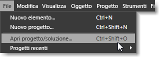

# Tasti di scelta rapida e tasti di modifica in Blend
I tasti di scelta rapida consentono di velocizzare il lavoro riducendo un'azione che richiederebbe diversi clic del pulsante del mouse a un unico tasto di scelta rapida. In [!INCLUDE[blend_first](../debugger/includes/blend_first_md.md)] i tasti di scelta rapida sono divisi nelle due categorie seguenti:  
  
-   **Tasti di scelta** I tasti di scelta consentono di accedere a un comando di menu o a un'area della finestra di dialogo premendo un tasto specifico della tastiera. I tasti di scelta sono identificati da caratteri di sottolineatura che vengono visualizzati nella finestra di dialogo o nel comando attualmente selezionato.  
  
     Per usare i tasti di scelta, premere ALT o F10 per visualizzare i caratteri di sottolineatura, quindi premere la lettera corrispondente del menu o dell'elemento della finestra di dialogo specifico. In alternativa, è possibile spostarsi in un menu o in una finestra di dialogo usando TAB o i tasti di direzione. Se ad esempio si preme ALT in [!INCLUDE[blend_subs](../debugger/includes/blend_subs_md.md)], viene visualizzata una sottolineatura sotto la lettera **F** nel menu **File** per identificarlo come tasto di scelta. Per aprire un progetto, è possibile tenere premuto ALT, premere F, quindi O.  
  
       
Tasti di scelta che vengono visualizzati con un carattere di sottolineatura dopo aver premuto ALT  
  
-   **Tasti di scelta rapida** I tasti di scelta rapida consentono di eseguire un'azione, ad esempio la selezione di un comando di menu o la modifica del comportamento di uno strumento.  
  
     La maggior parte dei tasti di scelta rapida è facilmente identificabile nell'interfaccia utente di [!INCLUDE[blend_subs](../debugger/includes/blend_subs_md.md)]. Essi vengono visualizzati a destra dei comandi di menu. Ad esempio, nel menu **File** il comando di menu **Apri progetto** include il tasto di scelta rapida CTRL+MAIUSC+O. Per visualizzare i tasti di scelta rapida per uno strumento nel pannello **Strumenti**, posizionare il puntatore sullo strumento.  
  
       
Tasti di scelta rapida visualizzati accanto alle voci di menu che dispongono di tali tasti.  
  
 Per altre informazioni sull'accessibilità e le funzionalità, vedere [Accessibilità in Microsoft](http://go.microsoft.com/fwlink/?LinkId=75069).  
  
## Tasti di modifica  
 Alcuni tasti di scelta rapida non presentano elementi di menu associati, pertanto non è possibile usare l'interfaccia utente [!INCLUDE[blend_subs](../debugger/includes/blend_subs_md.md)] per individuarli. Nelle sezioni seguenti vengono elencati i tasti di scelta rapida che consentono di modificare il comportamento di strumenti o un'azione, ad esempio il ridimensionamento di un oggetto:  
  
-   [Tasti di modifica della tavola da disegno](../designers/artboard-modifier-keys-in-blend.md)  
  
-   [Tasti di modifica strumento Penna](../designers/pen-tool-modifier-keys-in-blend.md)  
  
-   [Tasti di modifica strumento Selezione diretta](../designers/direct-selection-tool-modifier-keys-in-blend.md)