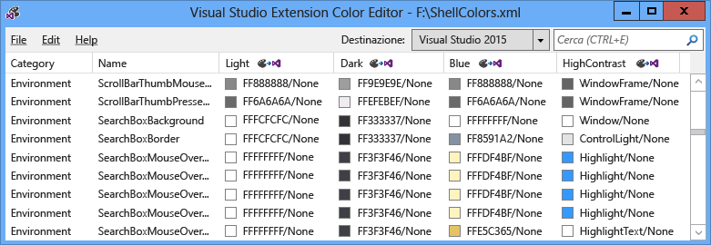
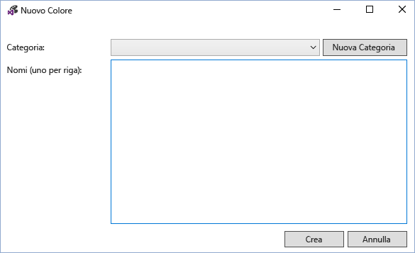
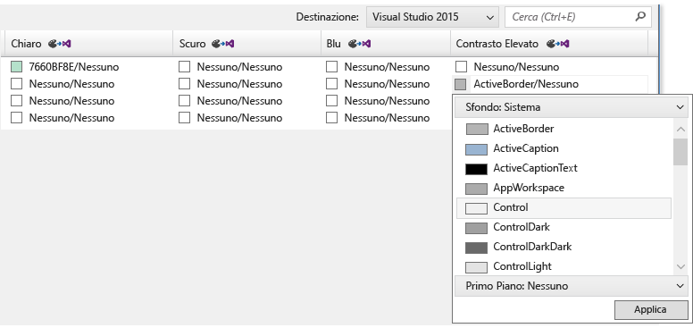
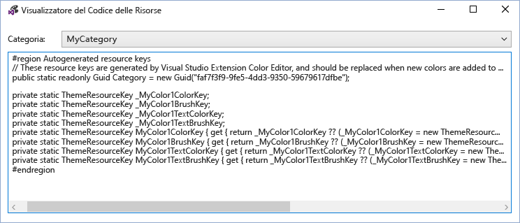

# Editor dei colori VSIX
[!INCLUDE[vs2017banner](../../code-quality/includes/vs2017banner.md)]

Lo strumento Editor colore di estensione di Visual Studio può creare e modificare i colori personalizzati per Visual Studio. Lo strumento può inoltre generare le chiavi di risorsa tema in modo che i colori da utilizzare nel codice. Questo strumento è utile per rendere i colori per un'estensione di Visual Studio che supporta l'utilizzo dei temi. Questo strumento è possibile aprire file. pkgdef e XML. Visual Studio temi \(file .vstheme\) possono essere utilizzati con Visual Studio estensione Editor dei colori modificando l'estensione del file in XML. Inoltre, .vstheme file possono essere importati in un file con estensione XML corrente.  
  
   
  
 **File di definizione del pacchetto**  
  
 File di definizione \(. pkgdef\) del pacchetto sono i file che definiscono i temi. I colori stessi vengono archiviati in file XML di tema colori, che vengono compilati in un file. pkgdef. I file. pkgdef sono distribuiti su percorsi disponibili per la ricerca di Visual Studio, elaborati in fase di esecuzione e uniti per definire i temi.  
  
 **Token di colore**  
  
 Un token di colore è costituito da quattro elementi:  
  
-   **Nome categoria:** un raggruppamento logico di un set di colori. Utilizzare un nome di categoria esistente se esistono già colori specifici per l'elemento desiderato dell'interfaccia utente o gruppo di elementi dell'interfaccia utente.  
  
-   **Nome token:** un nome descrittivo per il token di colore e un set di token. Deve essere denominati in modo che sia facile identificare le coppie e gli Stati che si applicano a set includono sfondo e i nomi dei token di primo piano \(testo\), nonché tutti i relativi stati.  
  
-   **Colore valori \(o tonalità\):** necessarie per ogni tema colorato. Creare sempre sfondo e testo i valori di colore in coppie. Colori vengono combinati per\/colore di sfondo in modo che il colore del testo \(primo piano\) è sempre leggibile contro il colore di sfondo in cui viene disegnato. I colori sono collegati e vengono utilizzati insieme nell'interfaccia utente. Se lo sfondo non deve essere utilizzato con il testo, non definire un colore di primo piano.  
  
-   **Nome colore di sistema:** per l'utilizzo nelle visualizzazioni di contrasto elevato.  
  
## Procedura: utilizzare lo strumento  
 Per quanto possibile, e dove appropriato, i colori di Visual Studio esistenti devono essere riutilizzati anziché apportare nuovi. Tuttavia, per i casi in cui non sono definiti i colori appropriati, colori personalizzati devono essere creati per mantenere un'applicazione di temi estensione compatibile.  
  
 **Creazione di nuovi token di colore**  
  
 Per creare colori personalizzati utilizzando l'Editor colore estensione di Visual Studio, seguire questi passaggi:  
  
1.  Determinare i nomi di categoria e il token per i nuovi token di colore.  
  
2.  Scegliere le tonalità che verrà utilizzato l'elemento dell'interfaccia utente per ogni tema e il colore di sistema di contrasto elevato.  
  
3.  Utilizzare l'editor di colori per creare nuovi token di colore.  
  
4.  Utilizzare i colori in un'estensione di Visual Studio.  
  
5.  Verificare le modifiche in Visual Studio.  
  
 **Passaggio 1: Determinare la categoria e i nomi dei token per i nuovi token di colore.**  
  
 La denominazione preferita schema per un VSColor è **\[Category\] \[tipo di interfaccia utente\] \[stato\]**. Non utilizzare la parola "colore" nei nomi VSColor, come è ridondante.  
  
 I nomi di categoria contengono raggruppamenti logici e devono essere definiti come ristretto possibile. Ad esempio, il nome di una finestra degli strumenti singolo può essere un nome di categoria, ma non è il nome di un team di unità o un progetto di attività. Raggruppamento di voci in categorie consente di evitare confusione tra i colori con lo stesso nome.  
  
 Un token nome debba indicare chiaramente il tipo di elemento e le situazioni o "stato", per cui verrà applicato il colore. Ad esempio, un dati attivi suggerimento **\[tipo di interfaccia utente\]** potrebbe essere denominato "**suggerimento dati**" e il **\[stato\]** potrebbe essere denominato "**Active**," risultante in un nome di colore di "**DataTipActive**." Poiché i suggerimenti dati text, è necessario definire sia un primo piano e un colore di sfondo. Utilizzando un'associazione di sfondo o in primo piano, l'editor di colori creerà automaticamente i colori "**DataTipActive**" per lo sfondo e "**DataTipActiveText**" per il primo piano.  
  
 Se la parte dell'interfaccia utente ha un solo stato, il **\[stato\]** parte del nome può essere omessa. Ad esempio, se una casella di ricerca con un bordo e alcun cambiamento di stato che hanno effetto sulla colore del bordo, quindi il nome per il token di colore del bordo può semplicemente essere chiamato "**SearchBoxBorder**."  
  
 Alcuni nomi di stato comuni includono:  
  
-   Attivo  
  
-   Inattivo  
  
-   MouseOver  
  
-   MouseDown  
  
-   Selezionati  
  
-   Con stato attivo  
  
 Esempi di alcuni nomi token per parti di un controllo elemento elenco  
  
-   ListItem  
  
-   ListItemBorder  
  
-   ListItemMouseOver  
  
-   ListItemMouseOverBorder  
  
-   ListItemSelected  
  
-   ListItemSelectedBorder  
  
-   ListItemDisabled  
  
-   ListItemDisabledBorder  
  
 **Passaggio 2: Scegliere le tonalità che verrà utilizzato l'elemento dell'interfaccia utente per ogni tema e il colore di sistema di contrasto elevato.**  
  
 Quando si scelgono colori personalizzati per l'interfaccia utente, selezionare un elemento dell'interfaccia utente esistente simile e utilizzare i colori come base. I colori per gli elementi dell'interfaccia utente nella casella sottoposte a livello di revisione e il testing in modo che verrà Cerca appropriati e funzionino correttamente in tutti i temi.  
  
 **Passaggio 3: Utilizzare l'editor di colori per creare nuovi token di colore.**  
  
 Avviare l'editor di colori e aprire o creare un nuovo file XML di colori del tema personalizzato. Selezionare **modificare \> nuovo colore** dal menu. Verrà aperta una finestra di dialogo per specificare la categoria e uno o più nomi per le voci di colore all'interno di tale categoria:  
  
   
  
 Selezionare una categoria esistente oppure **nuova categoria** per creare una nuova categoria. Verrà aperta un'altra finestra di dialogo, creando un nuovo nome di categoria:  
  
   
  
 La nuova categoria quindi diventerà disponibile nel **nuovo colore** menu a discesa categoria. Dopo aver scelto una categoria, immettere un nome per riga per ogni nuovo token di colore e selezionare "Create" al termine:  
  
   
  
 I valori di colore vengono visualizzati in coppie di sfondo o in primo piano, con "None" che indica che il colore non è stato definito. Nota: se un colore non dispone di un testo di colore o coppia di colori di sfondo, quindi solo lo sfondo deve essere definita.  
  
   
  
 Per modificare un token di colore, selezionare un colore per il tema \(colonna\) del token. Aggiungere il valore del colore digitando un valore di colore esadecimale nel formato ARGB a 8 cifre, immettere il nome di un colore di sistema nella cella, o utilizzando il menu a discesa per selezionare il colore desiderato tramite un set di dispositivi di scorrimento colore o un elenco di colori di sistema.  
  
   
  
   
  
 Per i componenti che non è necessario per visualizzare il testo, immettere il valore di un solo colore: il colore di sfondo. In caso contrario, immettere i valori per il colore di sfondo e di testo, separato da una barra rovesciata.  
  
 Quando si immettono valori di contrasto elevato, immettere i nomi di colori di sistema Windows validi. Non immettere valori ARGB hardcoded. Selezionando "Sfondo: sistema" o "in primo piano:" dal menu a discesa valore colore, è possibile visualizzare un elenco di nomi di colori di sistema valido. Quando si creano gli elementi che hanno componenti di testo, utilizzare la coppia di colori di sfondo correzione sistema o il testo potrebbe essere illeggibile.  
  
 Terminata la creazione, l'impostazione e modifica i token di colore, salvarli nella XML desiderato o formato. pkgdef. Colore token con uno sfondo né né un set di primo piano verrà salvato come colori vuoti in formato XML, ma eliminato, con formato. pkgdef. Una finestra di dialogo avverte l'utente della potenziale perdita di colore, se si tenta di salvare i colori vuoti in un file. pkgdef.  
  
 **Passaggio 4: Utilizzare i colori in un'estensione di Visual Studio.**  
  
 Dopo aver definito il nuovo colore token, includere il pkgdef nel file di progetto con "Compila azione" impostato su "Content" e "Includi in VSIX" impostato su "True".  
  
   
  
 Nell'Editor di Visual Studio estensione colore, scegliere File \> Visualizza risorse codice per visualizzare il codice che viene utilizzato per l'accesso personalizzato colori nell'interfaccia utente basata su WPF.  
  
   
  
 Includere questo codice in una classe statica nel progetto. Un riferimento a **Microsoft.VisualStudio.Shell. \< VSVersion \>.0.dll** deve essere aggiunto al progetto per utilizzare il **ThemeResourceKey** tipo.  
  
```c#  
namespace MyCustomColors { public static class MyCategory { #region Autogenerated resource keys // These resource keys are generated by Visual Studio Extension Color Editor, and should be replaced when new colors are added to this category. public static readonly Guid Category = new Guid("faf7f3f9-9fe5-4dd3-9350-59679617dfbe"); private static ThemeResourceKey _MyColor1ColorKey; private static ThemeResourceKey _MyColor1BrushKey; private static ThemeResourceKey _MyColor1TextColorKey; private static ThemeResourceKey _MyColor1TextBrushKey; public static ThemeResourceKey MyColor1ColorKey { get { return _MyColor1ColorKey ?? (_MyColor1ColorKey = new ThemeResourceKey(Category, "MyColor1", ThemeResourceKeyType.BackgroundColor)); } } public static ThemeResourceKey MyColor1BrushKey { get { return _MyColor1BrushKey ?? (_MyColor1BrushKey = new ThemeResourceKey(Category, "MyColor1", ThemeResourceKeyType.BackgroundBrush)); } } public static ThemeResourceKey MyColor1TextColorKey { get { return _MyColor1TextColorKey ?? (_MyColor1TextColorKey = new ThemeResourceKey(Category, "MyColor1", ThemeResourceKeyType.ForegroundColor)); } } public static ThemeResourceKey MyColor1TextBrushKey { get { return _MyColor1TextBrushKey ?? (_MyColor1TextBrushKey = new ThemeResourceKey(Category, "MyColor1", ThemeResourceKeyType.ForegroundBrush)); } } #endregion } }  
```  
  
 Questo consente l'accesso per i colori nel codice XAML e consente all'interfaccia utente di rispondere alle modifiche al tema.  
  
```xaml  
<UserControl x:Class="NewTestProject.TestPackageControl" Name="MyToolWindow" xmlns="http://schemas.microsoft.com/winfx/2006/xaml/presentation" xmlns:x="http://schemas.microsoft.com/winfx/2006/xaml" xmlns:ns="clr-namespace:MyCustomColors"> <Grid> <TextBlock Background="{DynamicResource {x:Static ns:MyCategory.MyColor1BrushKey}}" Foreground="{DynamicResource {x:Static ns:MyCategory.MyColor1TextBrushKey}}" >Sample Text</TextBlock> </Grid> </UserControl>  
```  
  
 **Passaggio 5: Verificare le modifiche in Visual Studio.**  
  
 Editor dei colori temporaneamente possibile applicare i token di colore per le istanze in esecuzione di Visual Studio per visualizzare le modifiche live colori senza ricompilare il pacchetto di estensione. A tale scopo, fare clic sul pulsante "Applica questo tema per l'esecuzione di windows di Visual Studio" si trova nell'intestazione di ogni colonna del tema. Questo tema temporaneo spariscono quando viene chiuso l'Editor di colori VSIX.  
  
   
  
 Per rendere permanenti le modifiche, ricompilare e ridistribuire l'estensione di Visual Studio dopo aver aggiunto i nuovi colori per il file. pkgdef e scrivere il codice che utilizzerà i colori. La ricompilazione di estensione di Visual Studio consentono di unire i valori del Registro di sistema per i nuovi colori nel resto dei temi. Riavviare Visual Studio, visualizzare l'interfaccia utente e verificare che i nuovi colori vengono visualizzati come previsto.  
  
## Note  
 Questo strumento deve essere utilizzata per creare colori personalizzati per i temi di Visual Studio preesistenti, oppure per modificare i colori di un tema personalizzato di Visual Studio. Per creare temi di Visual Studio personalizzati completati, scaricare il [estensione di Editor di Visual Studio colore tema](http://visualstudiogallery.msdn.microsoft.com/6f4b51b6-5c6b-4a81-9cb5-f2daa560430b) dalla raccolta di estensioni di Visual Studio.  
  
## Esempio di output  
 **Output di colore XML**  
  
 Il file XML generato dallo strumento sarà simile al seguente:  
  
```xml  
<Themes> <Theme Name="Light" GUID="{de3dbbcd-f642-433c-8353-8f1df4370aba}"> <Category Name="CategoryName" GUID="{eee9d521-dac2-48d9-9a5e-5c625ba2040c}"> <Color Name="ColorName1"> <Background Type="CT_RAW" Source="FFFFFFFF" /> </Color> <Color Name="ColorName2"> <Background Type="CT_RAW" Source="FFFFFFFF" /> <Foreground Type="CT_RAW" Source="FF000000" /> </Color> <Color Name="ColorName3"> <Background Type="CT_RAW" Source="FFFF0000" /> </Color> <Color Name="ColorName4"> <Background Type="CT_RAW" Source="FF000088" /> <Foreground Type="CT_RAW" Source="FFFFFFFF" /> </Color> </Category> </Theme> <Theme Name="Dark" GUID="{1ded0138-47ce-435e-84ef-9ec1f439b749}">...</Theme> <Theme Name="Blue" GUID="{a4d6a176-b948-4b29-8c66-53c97a1ed7d0}">...</Theme> <Theme Name="HighContrast" GUID="{a5c004b4-2d4b-494e-bf01-45fc492522c7}">...</Theme> </Themes>  
  
```  
  
 **Output a colori PKGDEF**  
  
 Il file. pkgdef generato dallo strumento sarà simile al seguente:  
  
```  
[$RootKey$\Themes\{de3dbbcd-f642-433c-8353-8f1df4370aba}\CategoryName] "Data"=hex:78,00,00,00,0b,00,00,00,01,00,00,00,21,d5,e9,ee,c2,da,d9,48,9a,5e,5c,62,5b,a2,04,0c,04,00,00,00,0a,00,00,00,43,6f,6c,6f,72,4e,61,6d,65,31,01,ff,ff,ff,ff,00,0a,00,00,00,43,6f,6c,6f,72,4e,61,6d,65,32,01,ff,ff,ff,ff,01,00,00,00,ff,0a,00,00,00,43,6f,6c,6f,72,4e,61,6d,65,33,01,ff,00,00,ff,00,0a,00,00,00,43,6f,6c,6f,72,4e,61,6d,65,34,01,00,00,88,ff,01,ff,ff,ff,ff [$RootKey$\Themes\{1ded0138-47ce-435e-84ef-9ec1f439b749}\CategoryName] "Data"=hex:... [$RootKey$\Themes\{a4d6a176-b948-4b29-8c66-53c97a1ed7d0}\CategoryName] "Data"=hex:... [$RootKey$\Themes\{a5c004b4-2d4b-494e-bf01-45fc492522c7}\CategoryName] "Data"=hex:...  
  
```  
  
 **Wrapper di chiavi di risorse c\#**  
  
 Le chiavi di risorsa colore generate dallo strumento sarà simile al seguente:  
  
```c#  
namespace MyNamespace { public static class MyColors { #region Autogenerated resource keys // These resource keys are generated by Visual Studio Extension Color Editor, and should be replaced when new colors are added to this category. public static string ColorName1ColorKey { get { return "ColorName1ColorKey"; } } public static string ColorName1BrushKey { get { return "ColorName1BrushKey"; } } public static string ColorName2ColorKey { get { return "ColorName2ColorKey"; } } public static string ColorName2BrushKey { get { return "ColorName2BrushKey"; } } public static string ColorName2TextColorKey { get { return "ColorName2TextColorKey"; } } public static string ColorName2TextBrushKey { get { return "ColorName2TextBrushKey"; } } public static string ColorName3ColorKey { get { return "ColorName4ColorKey"; } } public static string ColorName3BrushKey { get { return "ColorName4BrushKey"; } } public static string ColorName3TextColorKey { get { return "ColorName4TextColorKey"; } } public static string ColorName3TextBrushKey { get { return "ColorName4TextBrushKey"; } } #endregion } }  
```  
  
 **Wrapper di dizionario risorse WPF**  
  
 Il colore **ResourceDictionary** chiavi generate dallo strumento sarà simile al seguente:  
  
```xaml  
<ResourceDictionary xmlns="http://schemas.microsoft.com/winfx/2006/xaml/presentation" xmlns:x="http://schemas.microsoft.com/winfx/2006/xaml" xmlns:colors="clr-namespace:MyNamespace"> <SolidColorBrush x:Key="{x:Static colors:MyColors.ColorName1BrushKey}" Color="#FFFFFFFF" /> <Color x:Key="{x:Static colors:MyColors.ColorName1ColorKey}" A="255" R="255" G="255" B="255" /> <SolidColorBrush x:Key="{x:Static colors:MyColors.ColorName2BrushKey}" Color="#FFFFFFFF" /> <Color x:Key="{x:Static colors:MyColors.ColorName2ColorKey}" A="255" R="255" G="255" B="255" /> <SolidColorBrush x:Key="{x:Static colors:MyColors.ColorName2TextBrushKey}" Color="#FF000000" /> <Color x:Key="{x:Static colors:MyColors.ColorName2TextColorKey}" A="255" R="0" G="0" B="0" /> <SolidColorBrush x:Key="{x:Static colors:MyColors.ColorName3BrushKey}" Color="#FFFF0000" /> <Color x:Key="{x:Static colors:MyColors.ColorName3ColorKey}" A="255" R="255" G="0" B="0" /> <SolidColorBrush x:Key="{x:Static colors:MyColors.ColorName4BrushKey}" Color="#FF000088" /> <Color x:Key="{x:Static colors:MyColors.ColorName4ColorKey}" A="255" R="0" G="0" B="136" /> <SolidColorBrush x:Key="{x:Static colors:MyColors.ColorName4TextBrushKey}" Color="#FFFFFFFF" /> <Color x:Key="{x:Static colors:MyColors.ColorName4TextColorKey}" A="255" R="255" G="255" B="255" /> </ResourceDictionary>  
```