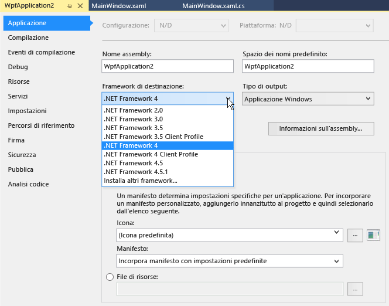

# Procedura: destinare una versione di .NET Framework

In questo documento viene descritto come scegliere una versione di destinazione di .NET Framework quando si crea un progetto e come modificare la versione di destinazione in un progetto di Visual Basic, Visual C# o Visual F# esistente.

> [!IMPORTANT]
> Per informazioni su come modificare la versione di destinazione per i progetti C++, vedere [Procedura: Modificare il framework di destinazione e il set di strumenti della piattaforma](/cpp/build/how-to-modify-the-target-framework-and-platform-toolset).

## Scelta di una versione di destinazione durante la creazione di un progetto

Quando si crea un progetto, la versione di .NET Framework di destinazione determina i modelli che è possibile utilizzare.

### Per scegliere una versione di destinazione durante la creazione di un progetto

1.  Nella barra dei menu scegliere **File**, **Nuovo**, **Progetto**.

2.  Nell'elenco che si trova nella parte superiore della finestra di dialogo **Nuovo progetto** scegliere la versione di .NET Framework a cui si vuole destinare il progetto.

3.  Nell'elenco dei modelli installati, selezionare il tipo di progetto che si vuole creare, assegnare un nome al progetto e quindi scegliere **OK**.

    Nell'elenco dei modelli vengono mostrati solo quei progetti che sono supportati dalla versione di .NET Framework selezionata.

## Modifica della versione di destinazione

È possibile cambiare la versione di destinazione di .NET Framework in un progetto di Visual Basic, Visual C#, Visual F# seguendo la procedura seguente.

Per informazioni su come modificare la versione di destinazione per i progetti C++, vedere [Procedura: Modificare il framework di destinazione e il set di strumenti della piattaforma](/cpp/build/how-to-modify-the-target-framework-and-platform-toolset).

### Per cambiare la versione di destinazione

1.  In **Esplora soluzioni** aprire il menu di scelta rapida del progetto che si vuole modificare e scegliere **Proprietà**.

    

2. Nella colonna sinistra della finestra delle proprietà scegliere la scheda **Applicazione**.

    

    > [!NOTE]
    > Dopo aver creato un'app UWP, non è possibile cambiare la versione di destinazione di Windows o di .NET Framework.

3.  Nell'elenco **Framework di destinazione** selezionare la versione appropriata.

4.  Nella finestra di dialogo di verifica visualizzata scegliere **Sì**.

    Il progetto verrà scaricato. Una volta caricato nuovamente, il progetto sarà destinato alla versione di .NET Framework appena scelta.

    > [!NOTE]
    > Se il codice contiene riferimenti a una versione di .NET Framework diversa rispetto a quella di destinazione, è possibile che vengano visualizzati dei messaggi di errore durante la compilazione o l'esecuzione del codice. Per risolvere questi errori è necessario modificare i riferimenti. Vedere [Risoluzione dei problemi relativi agli errori di impostazione di .NET Framework come destinazione](../msbuild/troubleshooting-dotnet-framework-targeting-errors.md).

## Vedere anche

[Panoramica del multitargeting di Visual Studio](../ide/visual-studio-multi-targeting-overview.md)  
[Risoluzione dei problemi relativi agli errori di impostazione di .NET Framework come destinazione](../msbuild/troubleshooting-dotnet-framework-targeting-errors.md)  
[Pagina Applicazione, Creazione progetti (C#)](../ide/reference/application-page-project-designer-csharp.md)  
[Pagina Applicazione, Creazione progetti (Visual Basic)](../ide/reference/application-page-project-designer-visual-basic.md)  
[Procedura: Modificare il framework di destinazione e il set di strumenti della piattaforma (C++)](/cpp/build/how-to-modify-the-target-framework-and-platform-toolset)