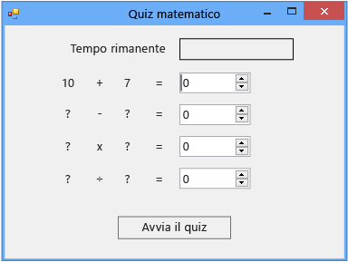

# Passaggio 2: creare un problema di addizione casuale
Nella seconda parte di questa esercitazione vengono aggiunti al quiz problemi di matematica basati su numeri casuali. Viene inoltre creato un metodo denominato `StartTheQuiz()` che completa i problemi e avvia il timer del conto alla rovescia. Più avanti nell'esercitazione si aggiungeranno problemi di sottrazione, moltiplicazione e divisione.

> [!NOTE]
>  Questo argomento fa parte di una serie di esercitazioni sui concetti di codifica di base. Per una panoramica dell'esercitazione, vedere [Esercitazione 2: creare un quiz matematico a tempo](../ide/tutorial-2-create-a-timed-math-quiz.md).

### Per creare un problema di addizione casuale

1.  Nella finestra di progettazione dei form scegliere il form (Form1).

2.  Nella barra dei menu scegliere **Visualizza**, **Codice**.

     Viene visualizzato il file Form1.cs o Form1.vb, a seconda del linguaggio di programmazione in uso, per consentire la visione del codice alla base del form.

3.  Creare un oggetto `Random` aggiungendo un'istruzione `new` nella parte superiore del codice, come illustrato di seguito.

     [!code-csharp[VbExpressTutorial3Step2#1](../ide/codesnippet/CSharp/step-2-create-a-random-addition-problem_1.cs)]
     [!code-vb[VbExpressTutorial3Step2#1](../ide/codesnippet/VisualBasic/step-2-create-a-random-addition-problem_1.vb)]

     Al form è stato aggiunto un oggetto `Random`, denominato **randomizer**.

     `Random` è noto come oggetto. Probabilmente la parola oggetto è già stata incontrata. Nella prossima esercitazione ne verrà spiegato il significato in termini di programmazione. Per ora, è sufficiente ricordare che è possibile utilizzare le istruzioni `new` per creare pulsanti, etichette, panelli, elementi OpenFileDialog, ColorDialog, SoundPlayer, Random e form e che tali elementi sono definiti oggetti. Quando si esegue il programma, viene avviato il form e il codice sottostante crea un oggetto `Random` a cui viene assegnato il nome **randomizer**.

     Verrà quindi compilato un metodo per controllare le risposte, pertanto nel quiz è richiesto l'uso di variabili per archiviare numeri casuali generati per ciascun problema. Vedere [Variabili](/dotnet/visual-basic/programming-guide/language-features/variables/index) o [Tipi](/dotnet/csharp/programming-guide/types/index). Per utilizzare correttamente le variabili, è necessario dichiararle ovvero elencarne i nomi e i tipi di dati.

4.  Aggiungere due variabili Integer al form e denominarle **addend1** e **addend2**.

    > [!NOTE]
    >  Una variabile Integer è nota come int in C# o Integer in Visual Basic. Questo tipo di variabile archivia un numero intero positivo o negativo compreso tra -2147483648 e 2147483647 e non può archiviare numeri decimali.

     Aggiungere una variabile Integer con una sintassi analoga a quella utilizzata per aggiungere l'oggetto `Random`, come illustrato nel codice seguente.

     [!code-csharp[VbExpressTutorial3Step2#2](../ide/codesnippet/CSharp/step-2-create-a-random-addition-problem_2.cs)]
     [!code-vb[VbExpressTutorial3Step2#2](../ide/codesnippet/VisualBasic/step-2-create-a-random-addition-problem_2.vb)]

5.  Aggiungere un metodo denominato `StartTheQuiz()` che utilizza il metodo `Random` dell'oggetto `Next()` per mostrare i numeri casuali nelle etichette. `StartTheQuiz()` compilerà infine tutti i problemi e avvierà il timer. Aggiungere quindi un commento. La funzione dovrebbe essere simile alla seguente.

     [!code-csharp[VbExpressTutorial3Step2#3](../ide/codesnippet/CSharp/step-2-create-a-random-addition-problem_3.cs)]
     [!code-vb[VbExpressTutorial3Step2#3](../ide/codesnippet/VisualBasic/step-2-create-a-random-addition-problem_3.vb)]

     Si noti che quando si inserisce il punto (.) dopo **randomizer** nel codice, viene aperta una finestra di IntelliSense che mostra tutti i metodi dell'oggetto `Random` che è possibile chiamare. Ad esempio, in IntelliSense è elencato il metodo `Next()`, come indicato di seguito.

      Metodo Next

     Quando si inserisce un punto dopo un oggetto, IntelliSense mostra un elenco dei membri dell'oggetto, ad esempio proprietà, metodi ed eventi.

    > [!NOTE]
    >  Quando si utilizza il metodo `Next()` con l'oggetto `Random`, ad esempio quando si chiama `randomizer.Next(50)`, si ottiene un numero casuale minore di 50 (compreso tra 0 e 49). In questo esempio, è stato chiamato `randomizer.Next(51)`. Viene utilizzato 51 e non 50 di modo che la somma dei due numeri casuali corrisponda a una risposta compresa tra 0 e 100. Se si passa 50 al metodo `Next()`, viene scelto un numero compreso tra 0 e 49, pertanto la risposta più alta possibile è 98, non 100. Dopo l'esecuzione delle prime due istruzioni nel metodo, ciascuna delle due variabili Integer, `addend1` e `addend2`, mantiene un numero casuale compreso tra 0 a 50. In questa schermata è riportato il codice Visual C#, ma IntelliSense funziona in modo analogo per Visual Basic.

     Esaminare attentamente queste istruzioni.

     [!code-csharp[VbExpressTutorial3Step2#18](../ide/codesnippet/CSharp/step-2-create-a-random-addition-problem_4.cs)]
     [!code-vb[VbExpressTutorial3Step2#18](../ide/codesnippet/VisualBasic/step-2-create-a-random-addition-problem_4.vb)]

     Le istruzioni impostano le proprietà **Text** delle due etichette **plusLeftLabel** e **plusRightLabel**, in modo da visualizzare i due numeri casuali. È necessario utilizzare il metodo `ToString()` della variabile Integer per convertire i numeri in testo. In termini di programmazione, stringa significa testo. I controlli di etichetta visualizzare solo testo, non numeri.

6.  Nella finestra di progettazione fare doppio clic sul pulsante **Avvio** o sceglierlo e premere INVIO.

     Quando un esecutore del quiz sceglie il pulsante, viene avviato il quiz; è appena stato aggiunto un gestore dell'evento Click per implementare questo comportamento.

7.  Aggiungere le due istruzioni riportate di seguito.

     [!code-csharp[VbExpressTutorial3Step2#4](../ide/codesnippet/CSharp/step-2-create-a-random-addition-problem_5.cs)]
     [!code-vb[VbExpressTutorial3Step2#4](../ide/codesnippet/VisualBasic/step-2-create-a-random-addition-problem_5.vb)]

     La prima istruzione chiama il nuovo metodo `StartTheQuiz()`. La seconda imposta la proprietà **Enabled** del controllo **startButton** su **False** per impedire all'esecutore del quiz di scegliere il pulsante durante il quiz.

8.  Salvare il codice, eseguirlo e scegliere il pulsante **Avvio**.

     Viene visualizzato un problema di addizione casuale, come illustrato nella figura seguente.

      Problema di addizione casuale

     Nel passaggio successivo dell'esercitazione, verrà aggiunta la somma.

### Per continuare o rivedere l'esercitazione

-   Per andare al passaggio successivo dell'esercitazione, vedere [Passaggio 3: aggiungere un timer per il conto alla rovescia](../ide/step-3-add-a-countdown-timer.md).

-   Per tornare al passaggio precedente dell'esercitazione, vedere [Passaggio 1: creare un progetto e aggiungere etichette al form](../ide/step-1-create-a-project-and-add-labels-to-your-form.md).