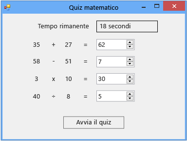

# Esercitazione 2: creare un quiz matematico a tempo
In questa esercitazione si compila un quiz dove l'esecutore deve rispondere a quattro problemi aritmetici casuali entro il tempo specificato. Vengono illustrate le seguenti procedure:  
  
-   Generare numeri casuali utilizzando la classe `Random`.  
  
-   Attivare eventi che devono verificarsi in un momento specifico usando un controllo **Timer**.  
  
-   Controllare il flusso di programma mediante istruzioni `if else`.  
  
-   Eseguire operazioni aritmetiche di base nel codice.  
  
 Al termine, il quiz sarà simile all'immagine riportata di seguito, ma con numeri diversi.  
  
   
Quiz creato in questa esercitazione  
  
 Per scaricare una versione completa del quiz, vedere [Esempio di esercitazione per un quiz matematico completo](http://code.msdn.microsoft.com/Complete-Math-Quiz-8581813c).  
  
> [!NOTE]
>  In questa esercitazione sono trattati sia Visual C# sia Visual Basic; concentrarsi sulle informazioni specifiche del linguaggio di programmazione in uso.  
  
## Argomenti correlati  
  
|Titolo|Descrizione|  
|-----------|-----------------|  
|[Passaggio 1: creare un progetto e aggiungere etichette al form](../ide/step-1-create-a-project-and-add-labels-to-your-form.md)|Iniziare creando il progetto, modificando le proprietà e aggiungendo controlli `Label`.|  
|[Passaggio 2: creare un problema di addizione casuale](../ide/step-2-create-a-random-addition-problem.md)|Creare un problema di addizione e utilizzare la classe `Random` per generare numeri casuali.|  
|[Passaggio 3: aggiungere un timer per il conto alla rovescia](../ide/step-3-add-a-countdown-timer.md)|Aggiungere un timer per il conto alla rovescia in modo che sia possibile impostare una durata per il quiz.|  
|[Passaggio 4: aggiungere il metodo CheckTheAnswer()](../ide/step-4-add-the-checktheanswer-parens-method.md)|Aggiungere un metodo per controllare se l'esecutore del quiz ha immesso una risposta corretta al problema.|  
|[Passaggio 5: aggiungere gestori di eventi Enter per i controlli NumericUpDown](../ide/step-5-add-enter-event-handlers-for-the-numericupdown-controls.md)|Aggiungere gestori eventi per semplificare lo svolgimento del quiz.|  
|[Passaggio 6: aggiungere un problema di sottrazione](../ide/step-6-add-a-subtraction-problem.md)|Aggiungere un problema di sottrazione che genera numeri casuali, utilizza il timer e controlla le risposte corrette.|  
|[Passaggio 7: aggiungere problemi di moltiplicazione e divisione](../ide/step-7-add-multiplication-and-division-problems.md)|Aggiungere problemi di moltiplicazione e divisione che generano numeri casuali, utilizzano il timer e controllano le risposte corrette.|  
|[Passaggio 8: personalizzare il quiz](../ide/step-8-customize-the-quiz.md)|Provare altre funzionalità, ad esempio la modifica dei colori e l'aggiunta di un suggerimento.|