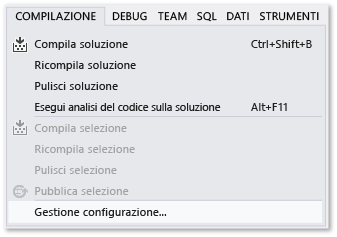
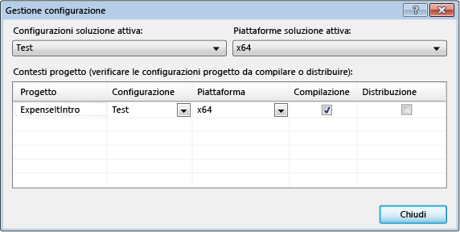
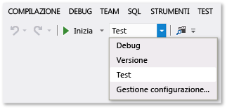
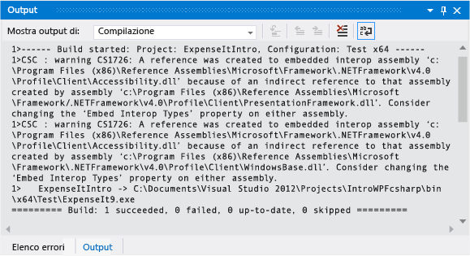
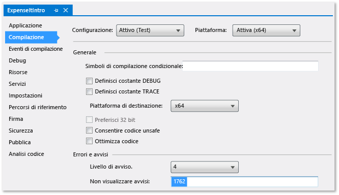
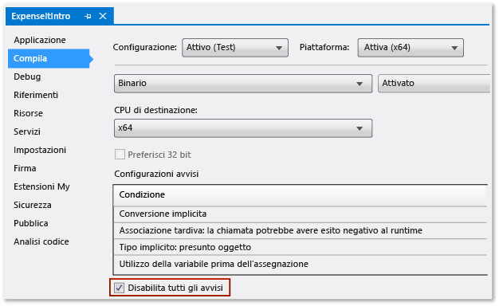
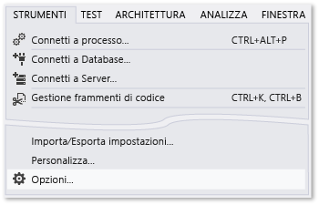

# Procedura dettagliata: compilazione di un'applicazione

Completando questa procedura dettagliata è possibile acquisire familiarità con numerose opzioni che possono essere configurate quando si compilano applicazioni con Visual Studio. Verrà illustrato come creare una configurazione della build personalizzata, nascondere alcuni messaggi di avviso e aumentare le informazioni di output di compilazione per un'applicazione di esempio.

## Installare l'applicazione di esempio

Scaricare l'esempio di [introduzione alla creazione di applicazioni WPF](https://code.msdn.microsoft.com/Introduction-to-Building-b8d16419). Scegliere C# o Visual Basic. Dopo aver scaricato il file con estensione zip, estrarlo e aprire il file **ExpenseItIntro.sln** usando Visual Studio.

## Creare una configurazione della build personalizzata

Quando si crea una soluzione, le configurazioni della build di versione e di debug e le relative destinazioni della piattaforma predefinite sono definite automaticamente per la soluzione. È quindi possibile personalizzare queste configurazioni o crearne di proprie. Le configurazioni della build specificano il tipo di compilazione. Le piattaforme di compilazione specificano il sistema operativo a cui è rivolta un'applicazione per la configurazione. Per altre informazioni, vedere [Informazioni sulle configurazioni della build](../ide/understanding-build-configurations.md), [Informazioni sulle piattaforme di compilazione](../ide/understanding-build-platforms.md) e [Procedura: Impostare le configurazioni di debug e di versione](../debugger/how-to-set-debug-and-release-configurations.md).

È possibile modificare o creare configurazioni e impostazioni piattaforma usando la finestra di dialogo **Gestione configurazione**. In questa procedura si creerà una configurazione della build per il test.

### Per creare una configurazione della build
  
1. Aprire la finestra di dialogo **Gestione configurazione**.
  
       
  
2. Nell'elenco **Configurazione soluzione attiva** scegliere **\<Nuova\>**.
  
3. Nella finestra di dialogo **Nuova configurazione soluzione** assegnare il nome `Test` alla nuova configurazione, copiare le impostazioni dalla configurazione per il debug esistente e quindi scegliere il pulsante **OK**.
  
       
  
4. Nell'elenco **Piattaforma soluzione attiva** scegliere **\<Nuova\>**.
  
5. Nella finestra di dialogo **Nuova piattaforma soluzione** scegliere **x64** e non copiare le impostazioni dalla piattaforma x86.
  
       
  
6. Scegliere il pulsante **OK**.
  
 La configurazione della soluzione attiva è stata modificata su Test con la piattaforma della soluzione attiva impostata su x64.
  
   
  
7. Scegliere **Chiudi**.

È possibile verificare o modificare rapidamente la configurazione della soluzione attiva tramite l'elenco **Configurazioni soluzione** nella barra degli strumenti **Standard**.
  
  
  
## Compilare l'applicazione

Successivamente verrà creata la soluzione con la configurazione della build personalizzata.
  
### Per compilare la soluzione
  
-   Nella barra dei menu scegliere **Compilazione**, **Compila soluzione**.
  
    Nella finestra **Output** vengono visualizzati i risultati della compilazione. La compilazione è stata completata.
  
## Nascondere gli avvisi del compilatore

A questo punto viene presentata la parte del codice che determina un avviso generato dal compilatore.

1. Nel progetto C# aprire il file **ExpenseReportPage.xaml.cs**. Nel metodo **ExpenseReportPage** aggiungere il codice seguente: `int i;`.

    OR

    Nel progetto Visual Basic aprire il file **ExpenseReportPage.xaml.vb**. Nel costruttore personalizzato **Public Sub New...**  aggiungere il codice seguente: `Dim i`.

2. Compilare la soluzione.

Nella finestra **Output** vengono visualizzati i risultati della compilazione. La compilazione è stata completata, ma sono stati generati avvisi:  

 Figura 1: Avvisi di Visual Basic  
  
   
  
 Figura 2: Avvisi di C#  
  
   
  
È possibile nascondere temporaneamente determinati messaggi di avviso durante una compilazione anziché lasciare che ingombrino l'output di compilazione.

### Per nascondere un avviso specifico di C#
  
1. Scegliere il nodo di progetto di primo livello in **Esplora soluzioni**.
  
2. Sulla barra dei menu scegliere **Visualizza**, **Pagine delle proprietà**.
  
     The **Project Designer** opens.
  
3. Scegliere la pagina **Compilazione** e specificare il numero di avviso **0168** nella casella **Non visualizzare avvisi**.
  
       
  
     For more information, see [Build Page, Project Designer (C#)](../ide/reference/build-page-project-designer-csharp.md).
  
4. Compilare la soluzione.
  
     The **Output** window displays only summary information for the build.
  
       
  
### Per eliminare tutti gli avvisi durante la compilazione di Visual Basic
  
1. Scegliere il nodo di progetto di primo livello in **Esplora soluzioni**.
  
2. Sulla barra dei menu scegliere **Visualizza**, **Pagine delle proprietà**.
  
     The **Project Designer** opens.
  
3. Nella pagina **Compilazione** selezionare la casella di controllo **Disabilita tutti gli avvisi**.
  
       
  
     For more information, see [Configuring Warnings in Visual Basic](../ide/configuring-warnings-in-visual-basic.md).
  
4. Compilare la soluzione.
  
 Nella finestra **Output** vengono visualizzate solo le informazioni di riepilogo per la compilazione.
  
   
  
 Per altre informazioni, vedere [Procedura: Non visualizzare avvisi del compilatore](../ide/how-to-suppress-compiler-warnings.md).
  
## Visualizzare dettagli di compilazione aggiuntivi nella finestra di output

È possibile modificare la quantità di informazioni sul processo di compilazione visualizzate nella finestra **Output**. Il livello di dettaglio di compilazione è in genere impostato su minimo, cioè nella finestra **Output** viene visualizzato solo un riepilogo del processo di compilazione insieme a eventuali errori o avvisi di priorità alta. È possibile visualizzare altre informazioni sulla compilazione tramite la [finestra di dialogo Opzioni, Progetti e soluzioni, Compila ed esegui](../ide/reference/options-dialog-box-projects-and-solutions-build-and-run.md).
  
> [!IMPORTANT]
>  Se si visualizzano maggiori informazioni, il completamento della compilazione richiederà più tempo.
  
### Per modificare la quantità di informazioni nella finestra Output
  
1. Aprire la finestra di dialogo **Opzioni**.
  
       
  
2. Scegliere la categoria **Progetti e soluzioni** e quindi scegliere la pagina **Compila ed esegui**.
  
3. Nell'elenco **Livello di dettaglio output in compilazione progetto MSBuild** scegliere **Normale** e quindi **OK**.
  
4. Nella barra dei menu scegliere **Compilazione**, **Pulisci soluzione**.
  
5. Compilare la soluzione e quindi esaminare le informazioni nella finestra **Output**.
  
     The build information includes the time that the build started (located at the beginning) and the order in which files were processed. This information also includes the actual compiler syntax that Visual Studio runs during the build.
  
     For example, in the C# build, the [/nowarn](/dotnet/visual-basic/reference/command-line-compiler/nowarn) option lists the warning code, 1762, that you specified earlier in this topic, along with three other warnings.
  
     In the Visual Basic build, [/nowarn](/dotnet/visual-basic/reference/command-line-compiler/nowarn) doesn't include specific warnings to exclude, so no warnings appear.
  
    > [!TIP]
    >  You can search the contents of the **Output** window if you display the **Find** dialog box by choosing the Ctrl+F keys.
  
Per altre informazioni, vedere [Procedura: Visualizzare, salvare e configurare file di log di compilazione](../ide/how-to-view-save-and-configure-build-log-files.md).
  
## Creare una build di versione

È possibile compilare una versione dell'applicazione di esempio ottimizzata per la spedizione. Per la build di versione, si specificherà che il file eseguibile venga copiato in una condivisione di rete prima dell'avvio della compilazione.

Per altre informazioni, vedere [Procedura: Modificare la directory dell'output compilato](../ide/how-to-change-the-build-output-directory.md) e [Compilazione e pulizia di progetti e soluzioni in Visual Studio](../ide/building-and-cleaning-projects-and-solutions-in-visual-studio.md).

### Per specificare una build di versione per Visual Basic
  
1. Aprire **Creazione progetti**.
  
       
  
2. Scegliere la pagina **Compilazione**.
  
3. Nell'elenco **Configurazione** scegliere **Versione**.
  
4. Nell'elenco **Piattaforma** scegliere **x86**.
  
5. Specificare un percorso di compilazione nella casella **Percorso dell'output di compilazione**.
  
     For example, you can specify \\\myserver\builds.
  
    > [!IMPORTANT]
    >  A message box might appear, warning you that the network share that you've specified might not be a trusted location. If you trust the location that you've specified, choose the **OK** button in the message box.
  
6. Compilare l'applicazione.
  
       
  
### Per specificare una build di versione per Visual C# #
  
1. Aprire **Creazione progetti**.
  
       
  
2. Scegliere la scheda **Compila**.
  
3. Nell'elenco **Configurazione** scegliere **Versione**.
  
4. Nell'elenco **Piattaforma** scegliere **x86**.
  
5. Specificare un percorso di rete nella casella **Percorso output**.
  
     For example, you could specify \\\myserver\builds.
  
    > [!IMPORTANT]
    >  A message box might appear, warning you that the network share that you've specified might not be a trusted location. If you trust the location that you've specified, choose the **OK** button in the message box.
  
6. Nella **barra degli strumenti Standard** impostare le opzioni Configurazioni soluzione su **Versione** e Piattaforme soluzione su **x86**.

7. Compilare l'applicazione.
  
       
  
 Il file eseguibile viene copiato nel percorso di rete specificato. Il percorso sarà \\\mioserver\compilazioni\\*Nomefile*.exe.
  
Congratulazioni: questa procedura dettagliata è stata completata correttamente.
  
## Vedere anche

[Procedura dettagliata: compilazione di un progetto (C++)](/cpp/ide/walkthrough-building-a-project-cpp)  
[Panoramica della precompilazione del progetto di applicazione Web ASP.NET](http://msdn.microsoft.com/b940abbd-178d-4570-b441-52914fa7b887)  
[Procedura dettagliata: uso di MSBuild](../msbuild/walkthrough-using-msbuild.md)
