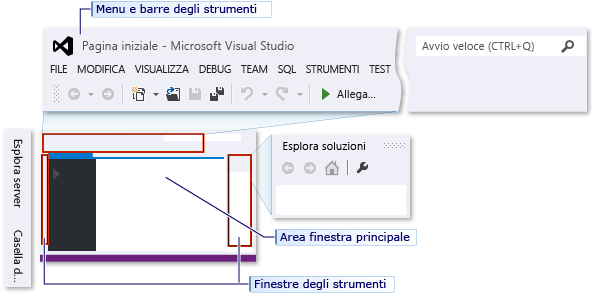
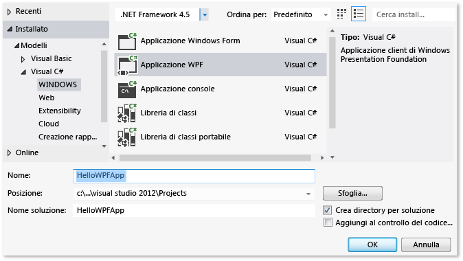
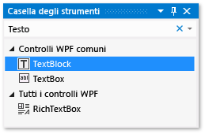
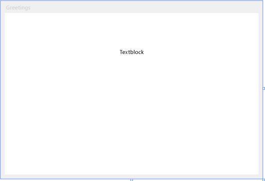
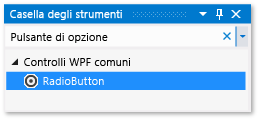
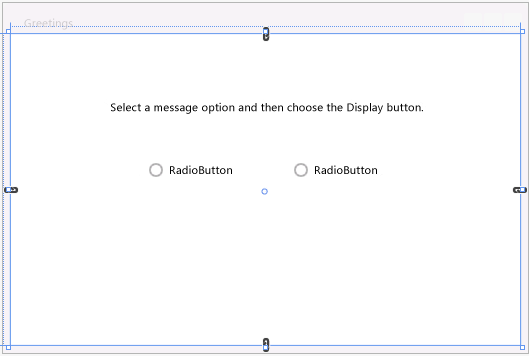
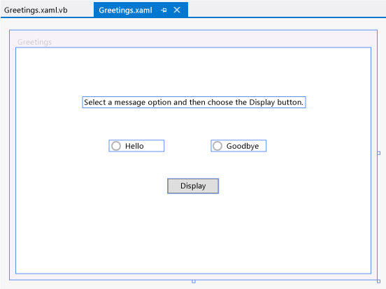
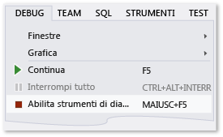
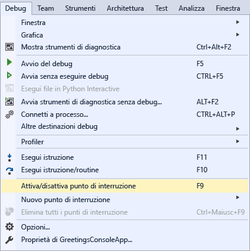
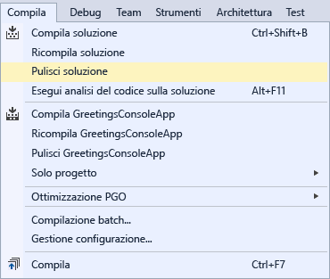

# <a name="walkthrough-create-a-simple-application-with-visual-c-or-visual-basic"></a>Procedura dettagliata: creare un'applicazione semplice con Visual C# o Visual Basic
Completando questa procedura dettagliata, si acquisirà familiarità con molti strumenti, finestre di dialogo e finestre di progettazione che è possibile usare quando si sviluppano applicazioni con Visual Studio. Sarà possibile creare una semplice applicazione "Hello, World", progettare l'interfaccia utente, aggiungere codice ed eseguire il debug degli errori, acquisendo al contempo altre informazioni su come lavorare nell'ambiente di sviluppo integrato (IDE).
  
##  <a name="BKMK_ConfigureIDE"></a> Configurare IDE  
Quando viene avviato per la prima volta, Visual Studio richiede di eseguire l'accesso. Questo passaggio è facoltativo per questa procedura dettagliata. È possibile che venga visualizzata una finestra di dialogo in cui viene chiesto di scegliere le impostazioni di sviluppo e il tema colori. Mantenere i valori predefiniti e scegliere **Avvia Visual Studio**.  


  
Dopo aver avviato Visual Studio, saranno visualizzati le finestre degli strumenti, i menu, le barre degli strumenti e l'area della finestra principale. Le finestre degli strumenti sono ancorate ai lati sinistro e destro della finestra dell'applicazione, con **Avvio veloce**, la barra dei menu e la barra degli strumenti standard nella parte superiore. Al centro della finestra dell'applicazione si trova **Pagina iniziale**. Quando si carica una soluzione o un progetto, gli editor e le finestre di progettazione vengono visualizzati nello spazio in cui si trova la **pagina iniziale** . Quando si sviluppa un'applicazione, per la maggior parte del tempo si usa quest'area centrale.  
  
  
  
##  <a name="BKMK_CreateApp"></a> Creare una semplice applicazione  
  
### <a name="create-the-project"></a>Creare il progetto  
Quando si crea un'applicazione in Visual Studio, è innanzitutto necessario creare un progetto e una soluzione. In questo esempio verrà creato un progetto Windows Presentation Foundation (WPF).  
  
#### <a name="to-create-the-wpf-project"></a>Per creare il progetto WPF  
  
1.  Creare un nuovo progetto. Nella barra dei menu scegliere **File**, **Nuovo**, **Progetto**.  
  
       
  
2.  Scegliere il modello di app WPF di Visual Basic o Visual C# selezionando ad esempio nel riquadro a sinistra **Installato**, **Visual C#**, **Desktop classico di Windows** e scegliendo poi **App WPF (.NET Framework)** nel riquadro centrale.  Denominare il progetto HelloWPFApp nella parte inferiore della finestra di dialogo Nuovo progetto.  
  
       
  
Visual Studio crea il progetto e la soluzione HelloWPFApp e in **Esplora soluzioni** vengono visualizzati i vari file. In WPF Designer vengono illustrate una visualizzazione Progettazione e una visualizzazione XAML suddivise di MainWindow.xaml. È possibile far scorrere la barra di divisione in modo da mostrare più o meno elementi in ciascuna visualizzazione.  È possibile scegliere di visualizzare solo la visualizzazione degli elementi visivi o solo la visualizzazione XAML. Per altre informazioni, vedere [WPF Designer per gli sviluppatori di Windows Form](http://msdn.microsoft.com/47ad0909-e89b-4996-b4ac-874d929f94ca). In **Esplora soluzioni**vengono visualizzati gli elementi indicati di seguito.  
  
  
  
Dopo aver creato il progetto, sarà possibile personalizzarlo. Nella finestra **Proprietà** (disponibile nel menu **Visualizzazione** ) è possibile visualizzare e modificare le opzioni per elementi di progetto, controlli e altri elementi in un'applicazione.  
  
#### <a name="to-change-the-name-of-mainwindowxaml"></a>Per cambiare il nome di MainWindow.xaml  
Assegnare a MainWindow un nome più specifico.  

1. In **Esplora soluzioni**selezionare MainWindow.xaml. Verrà visualizzata la finestra **Proprietà**, altrimenti scegliere il menu **Visualizzazione** e l'elemento **Finestra Proprietà**.  
2. Cambiare la proprietà **Nome file** in `Greetings.xaml`.  
  
       
  
     **Esplora soluzioni** indica che il nome del file è ora Greetings.xaml e che il file di codice annidato è ora denominato Greetings.xaml.vb o Greetings.xaml.cs. Questo file di codice è annidato sotto il nodo del file con estensione xaml a indicare che sono strettamente correlati tra loro.  
  
### <a name="design-the-user-interface-ui"></a>Progettare l'interfaccia utente  
Verranno aggiunti tre tipi di controlli all'applicazione: un controllo TextBlock, due controlli RadioButton e un controllo Button.  
  
#### <a name="to-add-a-textblock-control"></a>Per aggiungere un controllo TextBlock  
  
1.  Aprire la finestra **Casella degli strumenti** scegliendo il menu **Visualizzazione** e l'elemento **Casella degli strumenti** .  
  
2.  Nella **casella degli strumenti** espandere il nodo **Controlli WPF comuni** per visualizzare il controllo TextBlock.  
  
       
  
3.  Aggiungere un controllo TextBlock all'area di progettazione scegliendo l'elemento **TextBlock** e trascinandolo nell'area di progettazione nella finestra. Centrare il controllo nella parte superiore della finestra.  
  
La finestra dovrebbe essere simile a quella illustrata nella figura di seguito.  
  
  
  
Il markup XAML dovrebbe essere analogo a quello indicato di seguito.  
  
```xaml  
<TextBlock HorizontalAlignment="Center" TextWrapping="Wrap" VerticalAlignment="Center" RenderTransformOrigin="4.08,2.312" Margin="237,57,221,238"><Run Text="TextBlock"/><InlineUIContainer><TextBlock TextWrapping="Wrap" Text="TextBlock"/>  
```  

#### <a name="to-customize-the-text-in-the-text-block"></a>Per personalizzare il testo nel blocco  
  
1.  Nella visualizzazione XAML individuare il markup di TextBlock e modificare l'attributo Text:  

   ```xaml
   Text="Select a message option and then choose the Display button."
   ```  
  
2.  Se necessario, riallineare al centro il controllo TextBlock, salvare le modifiche premendo **CTRL + S** oppure usando la voce di menu **File**.  
  
Verranno successivamente aggiunti due controlli [RadioButton](/dotnet/framework/wpf/controls/radiobutton) al form.  
  
#### <a name="to-add-radio-buttons"></a>Per aggiungere pulsanti di opzione  
  
1.  Nella **casella degli strumenti** cercare il controllo **RadioButton**.  
  
       
  
2.  Aggiungere due controlli RadioButton all'area di progettazione scegliendo l'elemento **RadioButton** e trascinandolo nell'area di progettazione nella finestra. Selezionare i pulsanti e usare i tasti di direzione per spostare i pulsanti in modo che vengano visualizzati affiancati sotto il controllo TextBlock.  
  
     La finestra dovrebbe risultare simile alla seguente:  
  
       
  
3.  Nella finestra **Proprietà** per il controllo RadioButton a sinistra modificare la proprietà **Name**, ossia la proprietà nella parte superiore della finestra **Proprietà**, in **HelloButton**.  

       
  
4.  Nella finestra **Proprietà** per il controllo RadioButton a destra, modificare la proprietà **Name** in **GoodbyeButton** e salvare le modifiche.  
  
È ora possibile aggiungere il testo visualizzato per ogni controllo RadioButton. Nella procedura seguente verrà aggiornata la proprietà **Contenuto** per un controllo RadioButton.  
  
#### <a name="to-add-display-text-for-each-radio-button"></a>Per aggiungere testo visualizzato per ogni pulsante di opzione  
  
1.  Nell'area di progettazione aprire il menu di scelta rapida per HelloButton premendo il pulsante destro del mouse mentre si seleziona HelloButton, scegliere **Modifica testo** e immettere "Hello".  
  
2.  Aprire il menu di scelta rapida per GoodbyeButton premendo il pulsante destro del mouse mentre si seleziona GoodbyeButton, scegliere **Modifica testo** e immettere 'Goodbye'.  

### <a name="to-set-a-radio-button-to-be-checked-by-default"></a>Per impostare un pulsante di opzione che deve essere selezionato per impostazione predefinita  
In questo passaggio il pulsante di opzione HelloButton viene impostato in modo che sia selezionato per impostazione predefinita. Uno dei due pulsanti di opzione sarà quindi sempre selezionato.  

Nella visualizzazione XAML individuare il markup per HelloButton e aggiungere un attributo **IsChecked**:

```xaml
IsChecked="True"
```  

L'elemento finale dell'interfaccia utente da aggiungere è un controllo [Button](/dotnet/framework/wpf/controls/button).  
  
#### <a name="to-add-the-button-control"></a>Per aggiungere il controllo del pulsante  
  
1.  Nella **casella degli strumenti** cercare il controllo **Button** e aggiungerlo all'area di progettazione sotto i controlli RadioButton trascinandolo nel modulo nella visualizzazione Progettazione.  
  
2.  Nella visualizzazione XAML modificare il valore di **Contenuto** per il controllo Button da `Content="Button"` a `Content="Display"`, e salvare le modifiche.  
  
     Il markup dovrebbe essere simile all'esempio seguente:  
     `<Button Content="Display" HorizontalAlignment="Left" VerticalAlignment="Top" Width="75" Margin="215,204,0,0"/>`  
  
     La finestra dovrebbe essere simile a quella illustrata nella figura di seguito.  
  
       
  
### <a name="add-code-to-the-display-button"></a>Aggiungere codice al pulsante Visualizza  
Quando l'applicazione è in esecuzione, si apre una finestra di messaggio se si sceglie un pulsante di opzione e si seleziona il pulsante **Visualizza**. Verranno visualizzate una finestra di messaggio per Hello e una per Goodbye. Per creare questo comportamento, è necessario aggiungere codice all'evento Button_Click in Greetings.xaml.vb o Greetings.xaml.cs.  
  
#### <a name="add-code-to-display-message-boxes"></a>Aggiungere codice per visualizzare finestre di messaggio    
1.  Nell'area di progettazione fare doppio clic sul pulsante **Visualizza** .  
  
     Verrà visualizzato Greetings.xaml.vb o Greetings.xaml.cs con il cursore nell'evento Button_Click. 
  
    ```vb  
    Private Sub Button_Click_1(sender As Object, e As RoutedEventArgs)  
  
    End Sub  
    ```    
    ```csharp  
    private void Button_Click_1(object sender, RoutedEventArgs e)  
    {  
  
    }  
    ```  
  
2.  Immettere il codice seguente:  
  
    ```vb  
    If HelloButton.IsChecked = True Then  
        MessageBox.Show("Hello.")  
    ElseIf GoodbyeButton.IsChecked = True Then 
        MessageBox.Show("Goodbye.")  
    End If  
  
    ```    
    ```csharp  
    if (HelloButton.IsChecked == true)
    {
         MessageBox.Show("Hello.");
    }
    else if (GoodbyeButton.IsChecked == true)
    {
        MessageBox.Show("Goodbye.");
    }
    ```  
  
3.  Salvare l'applicazione.  
  
##  <a name="BKMK_DebugTest"></a> Eseguire il debug e il test dell'applicazione  
Verrà quindi eseguito il debug dell'applicazione per rilevare eventuali errori e verificare che entrambe le finestre di messaggio vengano visualizzate correttamente. Le istruzioni seguenti indicano come compilare e avviare il debugger, ma in un secondo momento può essere utile leggere [Compilazione di un'applicazione WPF (WPF)](/dotnet/framework/wpf/app-development/building-a-wpf-application-wpf) e [Debugging WPF](../debugger/debugging-wpf.md) per altre informazioni.  
  
### <a name="find-and-fix-errors"></a>Trovare e correggere errori  
In questo passaggio verrà identificato l'errore precedentemente generato modificando il nome del file MainWindow.xaml.  
  
#### <a name="to-start-debugging-and-find-the-error"></a>Per avviare il debug e individuare l'errore  
  
1.  Avviare il debugger selezionando **Debug**, quindi **Avvia debug**.  
  
       
  
     Si apre la finestra **Modalità interruzione**. La finestra **Output** indica che si è verificata un'eccezione IOException: Impossibile individuare la risorsa 'mainwindow.xaml'.  
  
2.  Arrestare il debugger scegliendo **Debug**, **Termina debug**.  
  
       
  
Il file MainWindow.xaml è stato rinominato in Greetings.xaml all'inizio di questa procedura dettagliata, ma il codice fa ancora riferimento a mainwindow.xaml come URI di avvio per l'applicazione. Il progetto non può pertanto essere avviato.  
  
#### <a name="to-specify-greetingsxaml-as-the-startup-uri"></a>Per specificare Greetings.xaml come URI di avvio  
  
1.  In **Esplora soluzioni** aprire il file App.xaml nel progetto C# o il file Application.xaml nel progetto Visual Basic.  
  
2.  Modificare `StartupUri="MainWindow.xaml"` in `StartupUri="Greetings.xaml"`, quindi salvare le modifiche.  
  
Avviare nuovamente il debugger premendo **F5**. Verrà visualizzata la finestra Greetings dell'applicazione. Chiudere la finestra dell'applicazione per arrestare il debug.  
  
### <a name="to-debug-with-breakpoints"></a>Per eseguire il debug con punti di interruzione  
Aggiungendo alcuni punti di interruzione, è possibile testare il codice durante il debug. È possibile aggiungere punti di interruzione selezionando **Debug**, **Imposta/Rimuovi punto di interruzione**, facendo clic sul margine sinistro dell'editor accanto alla riga di codice in cui si vuole inserire l'interruzione oppure premendo **F9**.  
  
#### <a name="to-add-breakpoints"></a>Per aggiungere punti di interruzione  
  
1.  Aprire Greetings.xaml.vb o Greetings.xaml.cs e selezionare la riga seguente: `MessageBox.Show("Hello.")`  
  
2.  Aggiungere un punto di interruzione dal menu selezionando **Debug**, quindi **Imposta/Rimuovi punto di interruzione**.  
  
       
  
     Accanto alla riga di codice nel margine di estrema sinistra della finestra dell'editor verrà visualizzato un cerchio rosso.  
  
3.  Selezionare la riga seguente: `MessageBox.Show("Goodbye.")`.  
  
4.  Premere **F9** per aggiungere un punto di interruzione e poi premere **F5** per avviare il debug.  
  
5.  Nella finestra **Greetings** scegliere il pulsante di opzione **Hello** , quindi il pulsante **Visualizza** .  
  
     La riga `MessageBox.Show("Hello.")` viene evidenziata in giallo. Nella parte inferiore di IDE, le finestre Auto, Variabili locali ed Espressioni di controllo sono ancorate insieme sul lato sinistro e le finestre Stack di chiamate, Punti di interruzione, Comando, Controllo immediato e Output sono ancorate insieme sul lato destro.  
  
6.  Nella barra dei menu scegliere **Debug**, **Esci da istruzione/routine**.  
  
     L'applicazione riprende l'esecuzione e verrà visualizzata una finestra di messaggio con la parola "Hello".  
  
7.  Scegliere il pulsante **OK** per chiudere la finestra di messaggio.  
  
8.  Nella finestra **Greetings** scegliere il pulsante di opzione **Goodbye** , quindi il pulsante **Visualizza** .  
  
     La riga `MessageBox.Show("Goodbye.")` viene evidenziata in giallo.  
  
9. Scegliere **F5** per proseguire con il debug. Quando verrà visualizzata la finestra del messaggio, scegliere il pulsante **OK** per chiuderla.  
  
10. Chiudere la finestra dell'applicazione per arrestare il debug.  
  
11. Nella barra dei menu scegliere **Debug**, **Disabilita tutti i punti di interruzione**.  
  
### <a name="build-a-release-version-of-the-application"></a>Compilare una versione di rilascio dell'applicazione  
 Dopo aver verificato che tutto funzioni, sarà possibile preparare una build di versione dell'applicazione.  
  
#### <a name="to-clean-the-solution-files-and-build-a-release-version"></a>Per pulire i file della soluzione e compilare una versione di rilascio  
  
1.  Nel menu principale selezionare **Compila**, **Pulisci soluzione** per eliminare i file intermedi e di output creati durante le compilazioni precedenti. Questa operazione non è necessaria, ma elimina l'output di compilazione di debug.  
  
       
  
2.  Modificare la configurazione della build per HelloWPFApp da **Debug** a **Rilascio** usando il controllo a discesa sulla barra degli strumenti (al momento è selezionato "Debug").  
  
       
  
3.  Compilare la soluzione scegliendo **Compila** e **Compila soluzione**.  
  
       
  
La procedura dettagliata è stata completata. È possibile trovare il file con estensione exe compilato nella directory di progetto e soluzione (…\HelloWPFApp\HelloWPFApp\bin\Release\\). Per esaminare altri esempi, vedere [Visual Studio Samples](../ide/visual-studio-samples.md).  
  
## <a name="see-also"></a>Vedere anche
[Novità di Visual Studio 2017](../ide/whats-new-in-visual-studio.md)   
[Get Started Developing with Visual Studio](../ide/get-started-developing-with-visual-studio.md)  (Introduzione allo sviluppo con Visual Studio)  
[Suggerimenti per la produttività](../ide/productivity-tips-for-visual-studio.md)