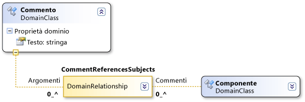

# Sintassi del percorso di dominio
Le definizioni DSL usano una sintassi di tipo XPath per individuare elementi specifici in un modello.  
  
 Normalmente, non è necessario usare questa sintassi direttamente. Se presente nella finestra Dettagli DSL o Proprietà, è possibile fare clic sulla freccia rivolta verso il basso e usare l'editor dei percorsi. Tuttavia, il percorso viene visualizzato in questo formato nel campo dopo avere usato l'editor.  
  
 Un percorso di dominio usa il formato seguente:  
  
 *RelationshipName.PropertyName/! Ruolo*  
  
   
  
 La sintassi attraversa l'albero del modello. Ad esempio, la relazione di dominio **CommentReferencesSubjects** nella figura precedente include un **soggetti** ruolo. Il segmento di percorso **/! Subjectt** specifica che il percorso sia completata per gli elementi tramiti il **soggetti** ruolo.  
  
 Ogni segmento inizia con il nome di una relazione di dominio. Se l'attraversamento di un elemento a una relazione, il segmento di percorso viene visualizzato come *Relationship.PropertyName*. Se l'hop proviene da un collegamento a un elemento, il segmento di percorso viene visualizzato come *relazione /! RoleName*.  
  
 Le barre separano la sintassi di un percorso. Ogni segmento di percorso è un hop da un elemento a un collegamento (istanza di una relazione) o da un collegamento a un elemento. I segmenti di percorso vengono visualizzati spesso in coppie. Un segmento di percorso rappresenta un hop da un elemento a un collegamento e il segmento successivo rappresenta un hop dal collegamento all'elemento all'altra estremità. Un collegamento può anche essere l'origine o la destinazione di una relazione stessa.  
  
 Il nome usato per l'hop da un elemento a un collegamento corrisponde al valore dell'oggetto `Property Name` del ruolo. Il nome usato per l'hop da un collegamento a un elemento corrisponde al nome del ruolo di destinazione.  
  
## Vedere anche  
 [Informazioni su modelli, classi e relazioni](../modeling/understanding-models-classes-and-relationships.md)