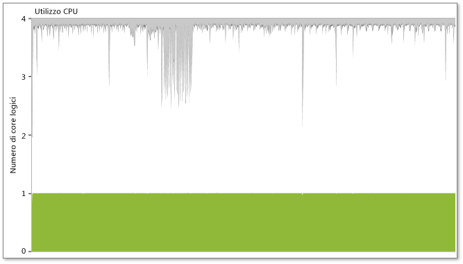
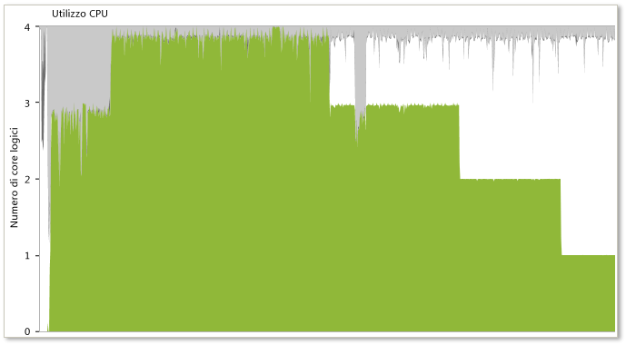

# Modelli comuni per applicazioni multithreading con comportamenti non validi
[!INCLUDE[vs2017banner](../code-quality/includes/vs2017banner.md)]

Il visualizzatore della concorrenza consente agli sviluppatori di esaminare il comportamento di un'applicazione multithreading.  Questo strumento include una raccolta di modelli comuni per applicazioni multithreading con comportamenti non validi.  La raccolta include modelli visivi tipici e riconoscibili esposti tramite lo strumento, insieme a una spiegazione del comportamento rappresentato da ogni modello, del risultato probabile del comportamento in questione e dell'approccio più comune per risolvere il problema.  
  
## Conflitti di blocco ed esecuzione serializzata  
   
  
 Le applicazioni parallelizzate continuano talvolta a essere eseguite in modo seriale nonostante contengano diversi thread e nel computer sia presente un numero sufficiente di core logici.  Il primo sintomo è rappresentato da una riduzione delle prestazioni multithreading, a volte perfino maggiore di un'implementazione seriale.  Nella visualizzazione Thread non viene rappresentata l'esecuzione di più thread in parallelo, ma è possibile vedere che in un determinato momento viene eseguito un solo thread.  In questa fase, facendo clic su un segmento di sincronizzazione in un thread è possibile visualizzare uno stack di chiamate per il thread bloccato \(stack di chiamate di blocco\) e il thread che ha rimosso la condizione di blocco \(stack di chiamate di sblocco\).  Inoltre, se lo stack di chiamate di sblocco si verifica nel processo che si sta analizzando, viene visualizzato un connettore pronto per thread.  A questo punto è possibile passare al codice dagli stack di chiamate di blocco e sblocco per un'ulteriore analisi della possibile causa della serializzazione.  
  
 Come illustrato nella figura seguente, il visualizzatore della concorrenza è inoltre in grado di esporre il sintomo nella visualizzazione Utilizzo CPU in cui, nonostante la presenza di più thread, l'applicazione consuma solo un core logico.  
  
 Per ulteriori informazioni, vedere l'articolo sull'identificazione dei conflitti di blocco "Performance Pattern 1: Identifying Lock Contention" nel blog [Parallel Performance Tools For Windows](http://go.microsoft.com/fwlink/?LinkID=160569) sul sito Web MSDN.  
  
   
  
## Distribuzione non uniforme del carico di lavoro  
   
  
 Nei casi in cui il carico di lavoro è distribuito in modo irregolare tra diversi thread paralleli di un'applicazione, viene visualizzato un tipico modello a gradini indicante i momenti in cui ciascun thread viene completato, come illustrato nella figura precedente. Nel visualizzatore della concorrenza vengono spesso indicati momenti di inizio molto ravvicinati per ogni thread concorrente.  Tali thread terminano tuttavia in modo irregolare, non contemporaneamente.  Questo modello indica una distribuzione irregolare del carico di lavoro in un gruppo di thread paralleli che può causare una riduzione delle prestazioni.  L'approccio consigliato a questo problema consiste nel rivalutare l'algoritmo mediante il quale il carico di lavoro è stato suddiviso tra i thread paralleli.  
  
 Come illustrato nella figura seguente, il visualizzatore della concorrenza è inoltre in grado di esporre questo sintomo nella visualizzazione Utilizzo CPU sotto forma di scala discendente dell'utilizzo della CPU.  
  
   
  
## Oversubscription  
   
  
 L'oversubscription si verifica quando il numero di thread attivi in un processo è maggiore del numero di core logici disponibili nel sistema.  Nella figura precedente viene illustrato il risultato dell'oversubscription, indicato dall'alternanza di fasce di precedenza in tutti i thread attivi.  Inoltre, la legenda indica una notevole percentuale di tempo impiegata nella fase di precedenza \(84% in questo esempio\).  Ciò può indicare che il processo richiede al sistema di eseguire un numero di thread concorrenti superiore a quello dei core logici.  Questa condizione può tuttavia indicare che le risorse che dovrebbero essere disponibili per il processo vengono invece utilizzate da altri processi nel sistema.  
  
 Ai fini della valutazione di questo problema occorre considerare quanto segue:  
  
-   Il sistema complessivo potrebbe trovarsi in una condizione di oversubscription.  Considerare la possibilità che altri processi nel sistema abbiano precedenza sui thread in questione.  Quando si posiziona il puntatore del mouse su un segmento di precedenza nella visualizzazione dei thread, viene visualizzata una descrizione indicante il thread e il processo con precedenza.  Questo processo non è necessariamente quello eseguito durante l'intero periodo di tempo in cui il proprio processo è stato superato, tuttavia fornisce un suggerimento su ciò che ha determinato la condizione di precedenza a discapito del processo in questione.  
  
-   Valutare la modalità con cui il processo determina il numero di thread appropriato per l'esecuzione durante la fase di lavoro.  Se il processo calcola direttamente il numero di thread paralleli attivi, modificare l'algoritmo affinché tenga in considerazione il numero di core logici disponibili nel sistema.  Se si utilizza il runtime di concorrenza, la libreria TPL \(Task Parallel Library\) o PLINQ, il calcolo del numero di thread viene eseguito da queste librerie.  
  
## I\/O inefficiente  
   
  
 L'uso eccessivo o improprio delle operazioni di I\/O rappresenta una causa comune di inefficienze delle applicazioni.  Esaminare la figura precedente.  Nel Profilo cronologia visibile è indicato che il 42% della durata dei thread visibili è occupato da operazioni di I\/O.  La cronologia indica notevoli quantità di operazioni di I\/O, ovvero che l'applicazione profilata è spesso bloccata da I\/O.  Per visualizzare dettagli sul tipo di operazioni di I\/O e sui momenti di blocco del programma, concentrarsi sulle aree problematiche, esaminare il Profilo cronologia visibile, quindi fare clic su un blocco di I\/O specifico per osservare gli stack di chiamate correnti.  
  
## Serie di istruzioni di blocco  
   
  
 La serie di istruzioni di blocco si verifica quando l'applicazione acquisisce blocchi in ordine FIFO e quando la frequenza di arrivo nel blocco è più elevata della frequenza di acquisizione.  La combinazione di queste due condizioni causa l'avvio del backup delle richieste del blocco.  È possibile contrastare questo problema utilizzando blocchi "non equi" ovvero blocchi che danno accesso al primo thread in modo da non risultare bloccati.  Nella figura precedente è indicato il comportamento delle serie di istruzioni.  Per risolvere il problema, provare a ridurre il conflitto degli oggetti di sincronizzazione e a utilizzare blocchi non equi.  
  
## Vedere anche  
 [Visualizzazione Thread](../profiling/threads-view-parallel-performance.md)