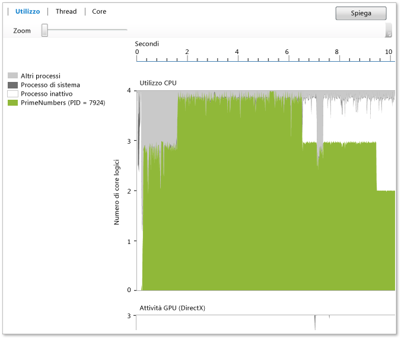

# Visualizzazione Uso
[!INCLUDE[vs2017banner](../code-quality/includes/vs2017banner.md)]

La **Visualizzazione Utilizzo** mostra informazioni sulla CPU, GPU e altre risorse di sistema utilizzate dal processo corrente.  Viene mostrato l'utilizzo medio dei core nel tempo da parte del processo analizzato, del processo inattivo, del processo di sistema e di altri processi in esecuzione nel sistema.  Non viene tuttavia indicato quale core specifico è attivo in un determinato momento.  Ad esempio, se due core sono ciascuno in esecuzione al 50 percento della capacità per un periodo di tempo specificato, in questa visualizzazione verrà indicato l'utilizzo di un solo core logico.  La visualizzazione viene generata suddividendo il tempo di profilatura in segmenti temporali più brevi.  Per ogni segmento, nel grafico viene tracciato il numero medio di thread di processo in esecuzione su core logici in tale intervallo.  
  
   
  
 Nel grafico vengono illustrati il tempo \(sull'asse x\) e il numero medio di core logici utilizzati dal processo target, il processo inattivo e il processo di sistema. \(Il processo inattivo mostra core inattivi.  Il processo di sistema è un processo in Windows che può eseguire operazioni per conto di altri processi.\) Gli altri processi in esecuzione nel sistema vengono presi in considerazione per l'utilizzo di eventuali core rimanenti.  
  
 Il numero di core logici viene visualizzato sull'asse Y.  Il supporto multithreading simultaneo nell'hardware viene considerato da Windows sotto forma di core logici \(ad esempio, Hyper\-Threading\).  Pertanto, un sistema che dispone di un processore quad\-core che supporta due thread hardware per core risulta provvisto di otto core logici.  Questo concetto si applica anche alla visualizzazione Core.  Per ulteriori informazioni, vedere [Visualizzazione Core](../profiling/cores-view.md).  
  
 Il grafico di attività della GPU mostra il numero dei motori di DirectX in uso nel tempo.  Un motore è utilizzato se sta elaborando un pacchetto di DMA.  Il grafico non mostra lo specifico motore di DirectX \(ad esempio, motore tridimensionale, motore video, e gli altri\).  
  
## Scopo  
 Si raccomanda l'utilizzo della Visualizzazione Utilizzo come punto di partenza per le analisi delle prestazioni tramite il visualizzatore della concorrenza.  Poiché vengono fornite informazioni generali sul grado di concorrenza in un'applicazione nel tempo, è possibile utilizzarla per identificare rapidamente le aree che richiedono l'ottimizzazione delle prestazioni o la parallelizzazione.  
  
 Se si è interessati all'ottimizzazione delle prestazioni, potrebbe risultare opportuno tentare di identificare i comportamenti diversi dalle aspettative.  È possibile inoltre che risulti utile identificare l'esistenza e la causa di aree con un utilizzo ridotto di core CPU logici.  È inoltre possibile cercare i modelli di utilizzo tra la CPU e la GPU.  
  
 Se si è interessati alla parallelizzazione di un'applicazione, in genere è consigliabile concentrarsi sulle aree di esecuzione associate alla CPU oppure su aree in cui la CPU non viene utilizzata.  
  
 Le aree associate alla CPU sono verdi.  Nel grafico viene mostrato che solo un core viene utilizzato se l'applicazione è seriale.  
  
 Le aree in cui non viene utilizzata la CPU sono di colore grigio.  Tali aree potrebbero rappresentare punti in cui l'applicazione è inattiva o esegue operazioni di I\/O di blocco che forniscono opportunità di parallelismo mediante la sovrapposizione con altro lavoro associato alla CPU.  
  
 Dopo aver trovato un comportamento di interesse, è possibile selezionare l'area per applicare lo zoom avanti.  Una volta ingrandita l'area, è possibile passare alla visualizzazione dei thread o dei core per condurre un'analisi più approfondita.  
  
 Se si utilizza la GPU tramite C\+\+ AMP o DirectX, potrebbe essere necessario identificare il numero dei motori della GPU in uso o le aree in cui la GPU è inattiva in modo imprevisto.  
  
## Zoom  
 Per applicare lo zoom avanti e ingrandire il grafico relativo all'utilizzo della CPU o quello relativo all'attività della GPU, selezionare una sezione o utilizzare il dispositivo di scorrimento dello zoom disponibile sopra il grafico.  L'impostazione di zoom viene mantenuta quando si passa ad altre visualizzazioni.  Per applicare lo zoom indietro, utilizzare di nuovo il dispositivo di scorrimento dello zoom.  È inoltre possibile ingrandire utilizzando Ctrl\+scroll.  
  
## Vedere anche  
 [Visualizzatore di concorrenze](../profiling/concurrency-visualizer.md)   
 [Visualizzazione Core](../profiling/cores-view.md)