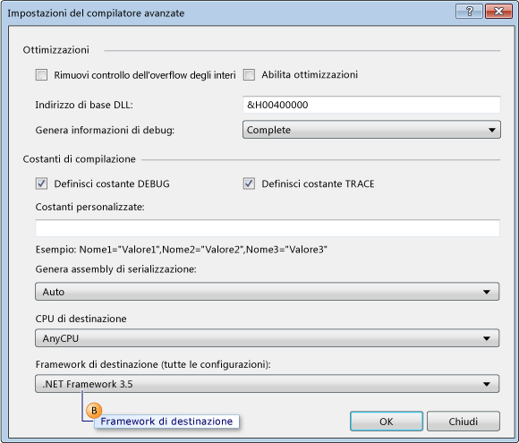
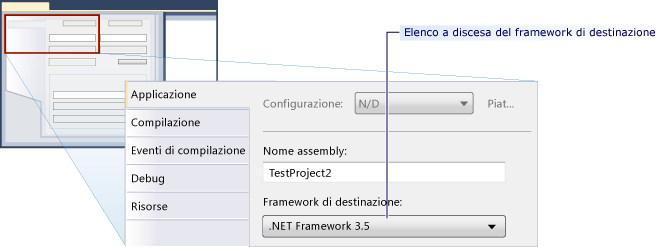

# <a name="how-to-configure-unit-tests-to-target-an-earlier-version-of-the-net-framework"></a>Procedura: configurare unit test destinati a una versione precedente di .NET Framework
Quando si crea un progetto di test in Microsoft Visual Studio, per impostazione predefinita viene impostata come destinazione la versione più recente di .NET Framework. Inoltre, se si esegue l'aggiornamento di progetti di test da versioni precedenti di Visual Studio, questi vengono aggiornati in modo da usare la versione più recente di .NET Framework come destinazione. Modificando le proprietà del progetto, è possibile ridefinire in modo esplicito la destinazione del progetto per le versioni precedenti di .NET Framework.  
  
 È possibile creare progetti di unit test destinati a specifiche versioni di .NET Framework. La versione di destinazione deve essere 3.5 o successiva e non può essere una versione client. Visual Studio consente il supporto di base seguente per gli unit test destinati a versioni specifiche:  
  
-   È possibile creare progetti di unit test destinati a una specifica versione di .NET Framework.  
  
-   È possibile eseguire unit test destinati a una versione specifica di .NET Framework da Visual Studio nel computer locale.  
  
-   È possibile eseguire unit test destinati a una versione specifica di .NET Framework usando MSTest.exe dal prompt dei comandi.  
  
-   È possibile eseguire unit test su un agente di compilazione come parte di una compilazione.  
  
 **Test delle applicazioni di SharePoint**  
  
 Le funzionalità elencate in precedenza consentono inoltre di scrivere unit test e test di integrazione per applicazioni di SharePoint tramite Visual Studio. [!INCLUDE[crabout](../test/includes/crabout_md.md)] come sviluppare applicazioni di SharePoint tramite Visual Studio, vedere [Creare soluzioni di SharePoint](/office-dev/office-dev/create-sharepoint-solutions), [Compilazione e debug delle soluzioni SharePoint](/office-dev/office-dev/building-and-debugging-sharepoint-solutions) e [Verifica e debug del codice di SharePoint](/office-dev/office-dev/verifying-and-debugging-sharepoint-code).  
  
 **Limitazioni**  
  
 Quando si ridefinisce la destinazione dei progetti di test per l'uso di versioni precedenti di .NET Framework, si applicano le limitazioni seguenti:  
  
-   In .NET Framework 3.5 è supportato il multitargeting per i progetti di test che contengono solo unit test. .NET Framework 3.5 non supporta altri tipi di test, ad esempio test di carico o test codificato dell'interfaccia utente. La modifica della destinazione è bloccata per i tipi di test diversi dagli unit test.  
  
-   L'esecuzione di test che sono destinati a una versione precedente di .NET Framework è supportata solo nell'adattatore host predefinito. Non è supportata nell'adattatore host ASP.NET. Le applicazioni ASP.NET che devono essere eseguite nel contesto del server di sviluppo ASP.NET devono essere compatibili con la versione corrente di .NET Framework.  
  
-   Il supporto per la raccolta dei dati è disabilitato quando si eseguono test che supportano il multitargeting di .NET Framework 3.5. È possibile eseguire il code coverage tramite gli strumenti da riga di comando di Visual Studio.  
  
-   Non è possibile eseguire unit test che usano .NET Framework 3.5 in un computer remoto.  
  
-   Non è possibile destinare unit test a versioni client precedenti del framework.  
  
### <a name="re-targeting-to-a-specific-version-of-the-net-framework-for-visual-basic-unit-test-projects"></a>Reindirizzamento di una versione specifica di .NET Framework per progetti unit test Visual Basic  
  
1.  Creare un nuovo progetto di unit test Visual Basic. Scegliere **Nuovo** dal menu **File** e quindi **Progetto**.  
  
     Verrà visualizzata la finestra di dialogo **Nuovo progetto**.  
  
2.  In **Modelli installati** espandere **Visual Basic**. Selezionare **Test** e quindi selezionare il modello **Progetto di test**.  
  
3.  Nella casella di testo **Nome** digitare un nome per il progetto di test Visual Basic e scegliere **OK**.  
  
4.  In Esplora soluzioni scegliere **Proprietà** dal menu di scelta rapida del nuovo progetto di test Visual Basic.  
  
     Verranno visualizzate le proprietà del progetto di test Visual Basic.  
  
5.  Nella scheda **Compila** scegliere **Opzioni di compilazione avanzate**, come illustrato nella figura seguente.  
  
       
  
6.  Usare l'elenco a discesa **Framework di destinazione (tutte le configurazioni)** per impostare il framework di destinazione su **.NET Framework 3.5** o una versione successiva, come indicato nella didascalia B della figura seguente. Non specificare una versione client.  
  
       
  
### <a name="re-targeting-to-a-specific-version-of-the-net-framework-for-visual-c-unit-test-projects"></a>Reindirizzamento di una versione specifica di .NET Framework per progetti unit test Visual C#  
  
1.  Creare un nuovo progetto di unit test Visual C#. Scegliere **Nuovo** dal menu **File** e quindi **Progetto**.  
  
     Verrà visualizzata la finestra di dialogo **Nuovo progetto**.  
  
2.  In **Modelli installati** espandere **Visual C#**. Selezionare **Test** e quindi selezionare il modello **Progetto di test**.  
  
3.  Nella casella di testo **Nome** digitare un nome per il progetto di test Visual C# e scegliere **OK**.  
  
4.  In Esplora soluzioni scegliere **Proprietà** dal menu di scelta rapida del nuovo progetto di test Visual C#.  
  
     Verranno visualizzate le proprietà del progetto di test Visual C#.  
  
5.  Nella scheda **Applicazione** scegliere **Framework di destinazione** e quindi scegliere dall'elenco a discesa **.NET Framework 3.5** o una versione successiva per modificare il framework di destinazione, come indicato nella figura seguente. Non specificare una versione client.  
  
       
  
### <a name="re-targeting-to-a-specific-version-of-the-net-framework-for-ccli-unit-test-projects"></a>Reindirizzamento di una versione specifica di .NET Framework per progetti unit test C++/CLI  
  
1.  Creare un nuovo progetto di unit test Visual C++. Nel menu **File** fare clic su **Nuovo** e quindi su **Progetto**.  
  
     Verrà visualizzata la finestra di dialogo **Nuovo progetto**.  
  
    > [!WARNING]
    >  Per compilare unit test C++/CLI per una versione precedente di .NET Framework per Visual C++, è necessario usare la versione corrispondente di Visual Studio. Ad esempio, per impostare come destinazione .NET Framework 3.5, è necessario installare [!INCLUDE[vs_orcas_long](../debugger/includes/vs_orcas_long_md.md)] e [!INCLUDE[vs_orcas_long](../debugger/includes/vs_orcas_long_md.md)] Service Pack 1.  
  
2.  In **Modelli installati** espandere **Visual C++**. Selezionare **Test** e quindi selezionare il modello **Progetto di test**.  
  
3.  Nella casella di testo **Nome** digitare un nome per il progetto di test Visual C++ e scegliere **OK**.  
  
4.  In Esplora soluzioni scegliere **Scarica progetto** dal nuovo progetto di test Visual C++.  
  
5.  In Esplora soluzioni scegliere il progetto di test di Visual C++ scaricato, quindi selezionare **Modifica \<nome progetto>.vcxproj**.  
  
     Il file con estensione vcxproj verrà aperto nell'editor.  
  
6.  Impostare `TargetFrameworkVersion` sulla versione 3.5 o una versione successiva nel `PropertyGroup` con etichetta `"Globals"`. Non specificare una versione client:  
  
    ```  
    <PropertyGroup Label="Globals">  
        <TargetName>DefaultTest</TargetName>  
        <ProjectTypes>{3AC096D0-A1C2-E12C-1390-A8335801FDAB};{8BC9CEB8-8B4A-11D0-8D11-00A0C91BC942}</ProjectTypes>  
        <ProjectGUID>{CE16D77A-E364-4ACD-948B-1EB6218B0EA3}</ProjectGUID>  
        <TargetFrameworkVersion>3.5</TargetFrameworkVersion>  
        <Keyword>ManagedCProj</Keyword>  
        <RootNamespace>CPP_Test</RootNamespace>  
      </PropertyGroup>  
  
    ```  
  
7.  Salvare e chiudere il file con estensione vcxproj.  
  
8.  In Esplora soluzioni selezionare **Ricarica progetto** dal menu di scelta rapida del nuovo progetto di test Visual C++.  
  
## <a name="see-also"></a>Vedere anche  
 [Creazione ed esecuzione di unit test per il codice esistente](http://msdn.microsoft.com/en-us/e8370b93-085b-41c9-8dec-655bd886f173)   
 [Creare soluzioni di SharePoint](/office-dev/office-dev/create-sharepoint-solutions)   
 [Compilazione e debug delle soluzioni SharePoint](/office-dev/office-dev/building-and-debugging-sharepoint-solutions)   
 [Finestra di dialogo Impostazioni del compilatore avanzate (Visual Basic)](../ide/reference/advanced-compiler-settings-dialog-box-visual-basic.md)
