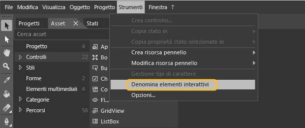
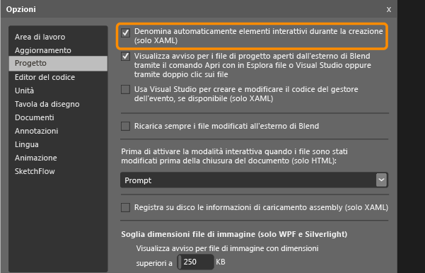

# <a name="set-a-unique-automation-property-for-uwp-controls-for-testing"></a>Impostare una proprietà di automazione univoca dei controlli UWP per il test
Per eseguire test codificati dell'interfaccia utente per un'applicazione UWP basata su XAML, è necessario disporre di una proprietà di automazione univoca che identifichi ogni controllo.  
  
 È possibile assegnare una proprietà di automazione univoca in base al tipo di controllo XAML nell'applicazione. Ecco come assegnare questa proprietà di automazione univoca nelle situazioni seguenti:  
  
-   [Definizione XAML statica di controlli](#UniquePropertyWindowsStoreControlsStaticXAML)  
  
-   [Assegnazione di proprietà di automazione univoche con Visual Studio o Blend per Visual Studio](#UniquePropertyWindowsStoreControlsExpressionBlend)  
  
-   [Uso di un modello di dati](#UniquePropertyWindowsStoreControlsDataTemplate)  
  
-   [Uso di un modello di controllo](#UniquePropertyWindowsStoreControlsControlTemplate)  
  
-   [Controlli dinamici](#UniquePropertyWindowsStoreControlsDynamicControls)  
  
## <a name="use-methods-to-assign-a-unique-automation-property"></a>Usare metodi per assegnare una proprietà di automazione univoca  
  
###  <a name="UniquePropertyWindowsStoreControlsStaticXAML"></a> Definizione XAML statica  
 Per specificare una proprietà di automazione univoca per un controllo definito nel file XAML, è possibile impostare AutomationProperties.AutomationId o AutomationProperties.Name in modo implicito o esplicito, come illustrato negli esempi seguenti. Quando si imposta uno di questi valori, al controllo viene assegnata una proprietà di automazione univoca che può essere usata per identificare il controllo quando si crea una registrazione delle azioni o di un test codificato dell'interfaccia utente.  
  
 **Impostare la proprietà in modo implicito**  
  
 Impostare AutomationProperties.AutomationId su **ButtonX** con la proprietà Name nel file XAML per il controllo.  
  
```xaml  
<Button Name="ButtonX" Height="31" HorizontalAlignment="Left" Margin="23,26,0,0"  VerticalAlignment="Top" Width="140" Click="ButtonX_Click" />  
  
```  
  
 Impostare AutomationProperties.Name su **ButtonY** con la proprietà Content nel file XAML per il controllo.  
  
```xaml  
<Button Content="ButtonY" Height="31" HorizontalAlignment="Left" Margin="23,76,0,0" VerticalAlignment="Top" Width="140" Click="ButtonY_Click" />  
  
```  
  
 **Impostare la proprietà in modo esplicito**  
  
 Impostare AutomationProperties.AutomationId su **ButtonX** in modo esplicito nel file XAML per il controllo.  
  
```xaml  
<Button AutomationProperties.AutomationId="ButtonX" Height="31" HorizontalAlignment="Left" Margin="23,26,0,0"  VerticalAlignment="Top" Width="140" Click="ButtonX_Click" />  
  
```  
  
 Impostare AutomationProperties.Name su **ButtonY** in modo esplicito nel file XAML per il controllo.  
  
```  
<Button AutomationProperties.Name="ButtonY" Height="31" HorizontalAlignment="Left" Margin="23,76,0,0" VerticalAlignment="Top" Width="140" Click="ButtonY_Click" />  
```  
  
###  <a name="UniquePropertyWindowsStoreControlsExpressionBlend"></a> Assegnazione di proprietà di automazione univoche con Visual Studio o Blend per Visual Studio  
 È possibile usare Visual Studio o Blend per Visual Studio per assegnare nomi univoci a elementi interattivi quali pulsanti, caselle di riepilogo, caselle combinate e caselle di testo. In questo modo al controllo viene assegnato un valore univoco per AutomationProperties.Name.  
  
 **Visual Studio:** nel menu **Strumenti** fare clic su **Opzioni**, scegliere **Editor di testo**, **XAML** e infine **Varie**.  
  
 Selezionare **Assegna automaticamente un nome agli elementi interattivi durante la creazione** e quindi fare clic su **OK**.  
  
   
  
 **Blend per Visual Studio:** usare uno dei metodi seguenti per eseguire questa operazione da Blend per Visual Studio.  
  
> [!NOTE]
>  È possibile usare questo metodo solo per i controlli che vengono creati in modo statico con XAML.  
  
 **Per assegnare un nome univoco a controlli esistenti**  
  
 Nel menu **Strumenti** scegliere **Denomina elementi interattivi**, come illustrato di seguito:  
  
   
  
 **Per assegnare automaticamente un nome univoco a controlli creati**  
  
 Nel menu **Strumenti** fare clic su **Opzioni** e quindi scegliere **Progetto**. Selezionare **Assegna automaticamente un nome agli elementi interattivi durante la creazione** e quindi fare clic su **OK**, come illustrato di seguito:  
  
   
  
###  <a name="UniquePropertyWindowsStoreControlsDataTemplate"></a> Uso di un modello di dati  
 Per definire un modello semplice che usa ItemTemplate per associare i valori di una casella di riepilogo alle variabili, usare il codice XAML seguente.  
  
```xaml  
  
<ListBox Name="listBox1" ItemsSource="{Binding Source={StaticResource employees}}">  
   <ListBox.ItemTemplate>  
      <DataTemplate>  
         <StackPanel Orientation="Horizontal">  
            <TextBlock Text="{Binding EmployeeName}" />  
            <TextBlock Text="{Binding EmployeeID}" />  
         </StackPanel>  
      </DataTemplate>  
   </ListBox.ItemTemplate>  
</ListBox>  
```  
  
 Per associare i valori alle variabili è anche possibile usare un modello con ItemContainerStyle, usando il codice XAML seguente.  
  
```xaml  
  
      <ListBox Name="listBox1" ItemsSource="{Binding Source={StaticResource employees}}">  
            <ListBox.ItemContainerStyle>  
                <Style TargetType="ListBoxItem">  
                    <Setter Property="Template">  
                        <Setter.Value>  
                            <ControlTemplate TargetType="ListBoxItem">  
                                <Grid>  
                                    <Button Content="{Binding EmployeeName}" AutomationProperties.AutomationId="{Binding EmployeeID}"/>  
                                </Grid>  
                            </ControlTemplate>  
                        </Setter.Value>  
                    </Setter>  
                </Style>  
            </ListBox.ItemContainerStyle>           
        </ListBox>  
  
```  
  
 Per entrambi gli esempi, è quindi necessario eseguire l'override del metodo ToString () di ItemSource, come indicato nel codice seguente. Questo codice consente di verificare che il valore di AutomationProperties.Name sia impostato e univoco, dal momento che non è possibile usare l'associazione per impostare una proprietà di automazione univoca per ogni elemento elenco associato a dati. In questo caso è sufficiente impostare un valore univoco per Automation Properties.Name.  
  
> [!NOTE]
>  Con questo approccio è anche possibile usare l'associazione per impostare il contenuto interno dell'elemento elenco su una stringa della classe Employee. Come illustrato nell'esempio, al controllo pulsante all'interno di ciascun elemento elenco viene assegnato un ID automazione univoco che corrisponde all'ID dipendente.  
  
```  
  
Employee[] employees = new Employee[]   
{  
   new Employee("john", "4384"),  
   new Employee("margaret", "7556"),  
   new Employee("richard", "8688"),  
   new Employee("george", "1293")  
};  
  
listBox1.ItemsSource = employees;  
  
public override string ToString()  
{  
    return EmployeeName + EmployeeID; // Unique Identification to be set as the AutomationProperties.Name  
}  
  
```  
  
###  <a name="UniquePropertyWindowsStoreControlsControlTemplate"></a> Uso di un modello di controllo  
 È possibile usare un modello di controllo per fare in modo che ogni istanza di un tipo specifico ottenga una proprietà di automazione univoca quando viene definita nel codice. È necessario creare il modello in modo che AutomationProperty sia associato a un ID univoco nell'istanza del controllo. Il codice XAML seguente illustra un approccio per la creazione di questa associazione con un modello di controllo.  
  
```xaml  
  
<Style x:Key="MyButton" TargetType="Button">  
<Setter Property="Template">  
   <Setter.Value>  
<ControlTemplate TargetType="Button">  
   <Grid>  
      <CheckBox HorizontalAlignment="Left" AutomationProperties.AutomationId="{TemplateBinding Content}"></CheckBox>  
      <Button Width="90" HorizontalAlignment="Right" Content="{TemplateBinding Content}" AutomationProperties.AutomationId="{TemplateBinding Content}"></Button>  
   </Grid>  
</ControlTemplate>  
   </Setter.Value>  
</Setter>  
</Style>  
  
```  
  
 Quando si definiscono due istanze di un pulsante con questo modello di controllo, l'ID automazione viene impostato sulla stringa di contenuto univoca per i controlli nel modello, come illustrato nel codice XAML seguente.  
  
```xaml  
  
<Button Content="Button1" Style="{StaticResource MyButton}" Width="140"/>  
<Button Content="Button2" Style="{StaticResource MyButton}" Width="140"/>  
```  
  
###  <a name="UniquePropertyWindowsStoreControlsDynamicControls"></a> Controlli dinamici  
 Se sono presenti controlli creati dinamicamente dal codice e non creati in modo statico o tramite modelli nei file XAML, è necessario impostare le proprietà Content o Name per il controllo, per fare in modo che a ogni controllo dinamico sia associata una proprietà di automazione univoca. Ad esempio, se è presente una casella di controllo che deve essere visualizzata quando si seleziona un elemento elenco, è possibile impostare queste proprietà, come illustrato di seguito:  
  
```csharp  
  
private void CreateCheckBox(string txt, StackPanel panel)  
   {  
      CheckBox cb = new CheckBox();  
      cb.Content = txt; // Sets the AutomationProperties.Name  
      cb.Height = 50;  
      cb.Width = 100;  
      cb.Name = "DynamicCheckBoxAid"+ txt; // Sets the AutomationProperties.AutomationId  
      panel.Children.Add(cb);  
    }  
  
```  
  
## <a name="see-also"></a>Vedere anche  
 [Testare app UWP di Windows con test codificati dell'interfaccia utente](../test/test-windows-store-8-1-apps-with-coded-ui-tests.md)
