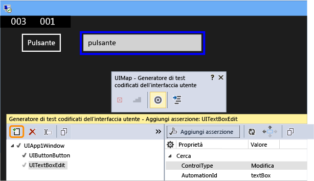
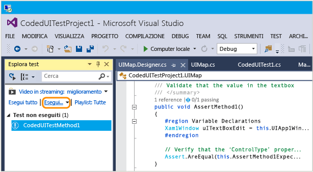
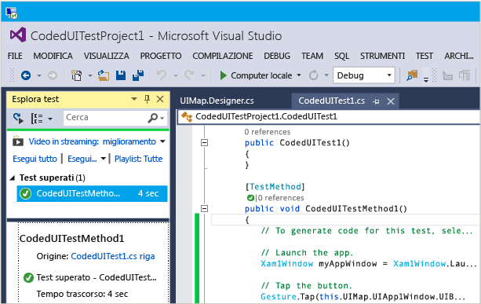

# <a name="test-windows-uwp-and-81-store-apps-with-coded-ui-tests"></a>Test Windows UWP and 8.1 Store Apps with Coded UI Tests

Use this walkthrough for creating UI tests for UWP apps and XAML-based Store 8.1 apps. 
  
## <a name="create-a-simple-windows-store-app"></a>Create a simple Windows Store app  
  
1.  If you want to run coded UI tests for your XAML-based Windows Store app, you must [set a unique automation property that identifies each control](../test/set-a-unique-automation-property-for-windows-store-controls-for-testing.md).  
  
     On the **Tools** menu, point to **Options** and then choose **Text Editor**, then **XAML**, and finally **Miscellaneous**.  
  
     Select the check box to automatically name interactive elements on creation.  
  
       
  
2.  Create a new project for a blank XAML based Windows Store app using either Visual C# or Visual Basic template.  
  
       
  
3.  In Solution Explorer, open MainPage.xaml. From the Toolbox, drag a button control and a textbox control to the design surface.  
  
       
  
4.  Double-click the button control and add the following code:  
  
    ```csharp  
    private void button_Click_1(object sender, RoutedEventArgs e)  
    {  
        this.textBox.Text = this.button.Name;  
    }  
  
    ```  
  
    ```vb  
    Public NotInheritable Class MainPage  
        Inherits Page  
  
        Private Sub button_Click(sender As Object, e As RoutedEventArgs) Handles Button.Click  
            Me.textBox.Text = Me.button.Name  
        End Sub  
    End Class  
    ```  
  
5.  Press F5 to run your Windows Store app.  
  
## <a name="create-and-run-a-coded-ui-test-for-the-windows-store-app"></a>Create and run a coded UI test for the Windows Store app  

[How do I create coded UI tests for Universal Windows Platform (UWP) apps?](#uwpapps)
  
1.  Create a new coded UI test project for the Windows Store app.  
  
       
  
2.  Choose to edit the UI map using the cross-hair tool.  
  
       
  
3.  Use the cross-hair tool in the Coded UI Test Builder to select the app tile, right-click **AutomationId** and choose **Copy Value to Clipboard**. The value in the clipboard will be used later for writing action to launch the app for testing.  
  
       
  
4.  In the running Windows Store app, use the cross-hair tool to select the button control and the textbox control. After adding each control, choose the **Add control to UI control map** button in the Coded UI Test Builder toolbar.  
  
       
  
5.  Choose the **Generate Code** button in the Coded UI Test Builder toolbar and then choose **Generate** to create code for changes to the UI control map.  
  
       
  
6.  Choose the button to set a value in the textbox.  
  
       
  
7.  Use the cross-hair tool to select the textbox control, and then select the **Text** property.  
  
       
  
8.  Add an assertion. It will be used in the test to verify that the value is correct.  
  
       
  
9. Add and generate code for the assertion.  
  
       
  
10. **Visual C#**  
  
     In Solution Explorer, open the UIMap.Designer.cs file to view the added code for the assert method and the controls.  
  
     **Visual Basic**  
  
     In Solution Explorer, open the CodedUITest1.vb file and then in the CodedUITestMethod1() test method code, right-click the call to the assertion method that was automatically added `Me.UIMap.AssertMethod1()` and choose **Go To Definition**. This will open the UIMap.Designer.vb file in the code editor so you can view the view the added code for the assert method and the controls.  
  
    > [!WARNING]
    >  Do not modify the UIMap.designer.cs or UIMap.Designer.vb file directly. If you do this, the changes to the file will be overwritten each time the test is generated.  
  
     **Assert method**  
  
    ```csharp  
    public void AssertMethod1()  
    {  
        #region Variable Declarations  
        XamlEdit uITextBoxEdit = this.UIApp1Window.UITextBoxEdit;  
        #endregion  
  
        // Verify that the 'Text' property of 'textBox' text box equals 'button'  
        Assert.AreEqual(this.AssertMethod3ExpectedValues.UITextBoxEditText, uITextBoxEdit.Text);  
    }  
    ```  
  
    ```vb  
    Public Sub AssertMethod1()  
        Dim uITextBoxEdit As XamlEdit = Me.UIApp2Window.UITextBoxEdit  
  
        'Verify that the 'Text' property of 'textBox' text box equals 'button'  
        Assert.AreEqual(Me.AssertMethod1ExpectedValues.UITextBoxEditText, uITextBoxEdit.Text)  
    End Sub  
    ```  
  
     **Controls**  
  
    ```csharp  
    #region Properties  
    public XamlButton UIButtonButton  
    {  
        get  
        {  
            if ((this.mUIButtonButton == null))  
            {  
                this.mUIButtonButton = new XamlButton(this);  
                #region Search Criteria  
                this.mUIButtonButton.SearchProperties[XamlButton.PropertyNames.AutomationId] = "button";  
                this.mUIButtonButton.WindowTitles.Add("App1");  
                #endregion  
            }  
            return this.mUIButtonButton;  
        }  
    }  
  
    public XamlEdit UITextBoxEdit  
    {  
        get  
        {  
            if ((this.mUITextBoxEdit == null))  
            {  
                this.mUITextBoxEdit = new XamlEdit(this);  
                #region Search Criteria  
                this.mUITextBoxEdit.SearchProperties[XamlEdit.PropertyNames.AutomationId] = "textBox";  
                this.mUITextBoxEdit.WindowTitles.Add("App1");  
                #endregion  
            }  
            return this.mUITextBoxEdit;  
        }  
    }  
    #endregion  
  
    #region Fields  
    private XamlButton mUIButtonButton;  
  
    private XamlEdit mUITextBoxEdit;  
    #endregion  
    ```  
  
    ```vb  
    #Region "Properties"  
    Public ReadOnly Property UIButtonButton() As XamlButton  
        Get  
            If (Me.mUIButtonButton Is Nothing) Then  
                Me.mUIButtonButton = New XamlButton(Me)  
                Me.mUIButtonButton.SearchProperties(XamlButton.PropertyNames.AutomationId) = "button"  
                Me.mUIButtonButton.WindowTitles.Add("App2")  
            End If  
            Return Me.mUIButtonButton  
        End Get  
    End Property  
  
    Public ReadOnly Property UITextBoxEdit() As XamlEdit  
        Get  
            If (Me.mUITextBoxEdit Is Nothing) Then  
                Me.mUITextBoxEdit = New XamlEdit(Me)  
                Me.mUITextBoxEdit.SearchProperties(XamlEdit.PropertyNames.AutomationId) = "textBox"  
                Me.mUITextBoxEdit.WindowTitles.Add("App2")  
            End If  
            Return Me.mUITextBoxEdit  
        End Get  
    End Property  
    #End Region  
  
    #Region "Fields"  
    Private mUIButtonButton As XamlButton  
  
    Private mUITextBoxEdit As XamlEdit  
    #End Region  
    ```  
  
11. In Solution Explorer, open the CodedUITest1.cs or CodedUITest1.vb file. You can now add code to the CodedUTTestMethod1 method for the actions need to run the test using the controls added to the UIMap:  
  
    1.  Launch the Windows Store app using the automation ID property you copied to the clipboard previously:  
  
        ```csharp  
        XamlWindow.Launch("8ebca7c4-effe-4c86-9998-068daccee452_cyrqexqw8cc7c!App")  
        ```  
  
        ```vb  
        XamlWindow myAppWindow = XamlWindow.Launch("7254db3e-20a7-424e-8e05-7c4dabf4f28d_cyrqexqw8cc7c!App");  
        ```  
  
    2.  Add a gesture to tap the button control:  
  
        ```csharp  
        Gesture.Tap(this.UIMap.UIApp1Window. UIButtonButton);  
        ```  
  
        ```vb  
        Gesture.Tap(Me.UIMap.UIApp2Window. UIButtonButton)  
        ```  
  
    3.  Verify that the call to the assert method that was automatically generated comes after launching the app and tap gesture on the button:  
  
        ```csharp  
        this.UIMap.AssertMethod1();  
        ```  
  
        ```vb  
        Me.UIMap.AssertMethod1()  
        ```  
  
     After adding the code, the CodedUITestMethod1 test method should appear as follows:  
  
    ```csharp  
    [TestMethod]  
    public void CodedUITestMethod1()  
    {  
        // To generate code for this test, select "Generate Code for Coded UI Test" from the shortcut menu and select one of the menu items.  
  
        // Launch the app.  
        XamlWindow myAppWindow = XamlWindow.Launch("7254db3e-20a7-424e-8e05-7c4dabf4f28d_cyrqexqw8cc7c!App");  
  
        // Tap the button.  
        Gesture.Tap(this.UIMap.UIApp1Window.UIButtonButton);  
  
        this.UIMap.AssertMethod1();  
    }  
    ```  
  
    ```vb  
    <CodedUITest(CodedUITestType.WindowsStore)>  
    Public Class CodedUITest1  
  
        <TestMethod()>  
        Public Sub CodedUITestMethod1()  
            '              
            ' To generate code for this test, select "Generate Code for Coded UI Test" from the shortcut menu and select one of the menu items.  
            '  
  
            ' Launch the app.  
            XamlWindow.Launch("8ebca7c4-effe-4c86-9998-068daccee452_cyrqexqw8cc7c!App")  
  
            '// Tap the button.  
            Gesture.Tap(Me.UIMap.UIApp2Window.UIButtonButton)  
  
            Me.UIMap.AssertMethod1()  
        End Sub  
    ```  
  
12. Build your test and then run the test using the test explorer.  
  
       
  
     The Windows Store app launches, the action to tap the button is completed, and the textbox's Text property is populated and validated using the assert method.  
  
       
  
     After the test completes, the test explorer displays that the test passed.  
  
       
  
## <a name="q--a"></a>Q & A  
  
#### <a name="q-why-dont-i-see-the-option-to-record-my-coded-ui-test-in-the-generate-code-for-a-coded-ui-test-dialog"></a>Q: Why don't I see the option to record my coded UI test in the Generate Code for a Coded UI Test dialog?**  
  
**A**: The option to record is not supported for Windows Store apps.  
  
#### <a name="q-can-i-create-a-coded-ui-test-for-my-windows-store-apps-based-on-winjs"></a>Q: Can I create a coded UI test for my Windows Store apps based on WinJS?**  

**A**: No, only XAML based apps are supported.  
  
#### <a name="q-can-i-create-coded-ui-tests-for-my-windows-store-apps-on-a-system-that-is-not-running-windows-81-or-windows-10"></a>Q: Can I create coded UI tests for my Windows Store apps on a system that is not running Windows 8.1 or Windows 10?**  
  
**A**: No, the Coded UI Test Project templates are only available on Windows 8.1 and Windows 10. To create automation for Universal Windows Platform (UWP) apps, you'll need Windows 10.  

<a name="uwpapps"></a>  
#### <a name="q-how-do-i-create-coded-ui-tests-for-universal-windows-platform-uwp-apps"></a>Q: How do I create coded UI tests for Universal Windows Platform (UWP) apps?**  
  
**A**: Depending on the platform where you're testing your UWP app, create coded UI test project in one of these ways:  
  
- A UWP app running on local machine will run as a Store app. To test this, you must use the **Coded UI Test Project (Windows)** template. To find this template when you create a new project, go to the **Windows**, **Universal** node. Or go to the **Windows**, **Windows 8**, **Windows** node.  
  
- A UWP app running on mobile device or emulator will run as a Phone app. To test this, you must use the **Coded UI Test Project (Windows Phone)** template. To find this template when you create a new project, go to the **Windows**, **Universal** node. Or go to the **Windows**, **Windows 8**, **Windows Phone** node.  
  
After you create the project, authoring a test stays the same as before.  
  
#### <a name="q-why-cant-i-modify-the-code-in-the-uimapdesigner-file"></a>Q: Why can't I modify the code in the UIMap.Designer file?**  
  
**A**: Any code changes you make in the UIMapDesigner.cs file will be overwritten every time you generate code using the UIMap - Coded UI Test Builder. If you have to modify a recorded method, you must copy it to UIMap.cs file and rename it. The UIMap.cs file can be used to override methods and properties in the UIMapDesigner.cs file. You must remove the reference to the original method in the Coded UITest.cs file and replace it with the renamed method name.  
  
## <a name="see-also"></a>See Also  
 [Use UI Automation To Test Your Code](../test/use-ui-automation-to-test-your-code.md)   
 [Set a Unique Automation Property for Windows Store Controls for Testing](../test/set-a-unique-automation-property-for-windows-store-controls-for-testing.md)

