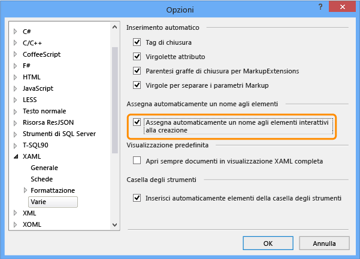
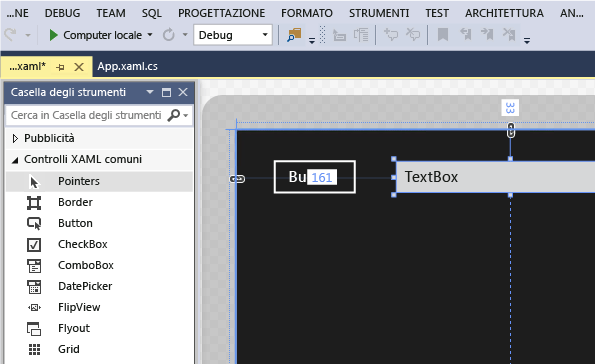
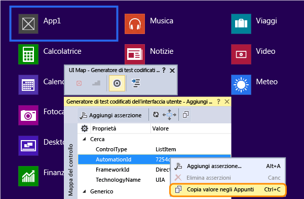
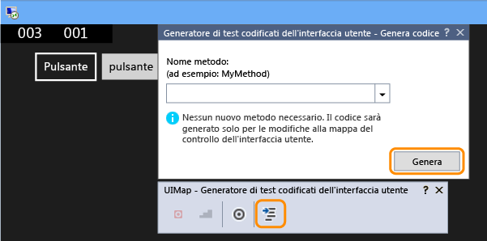
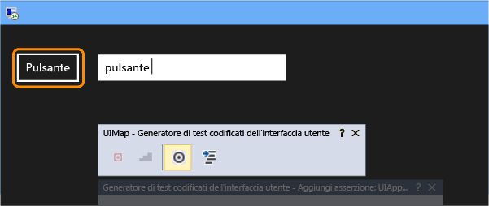
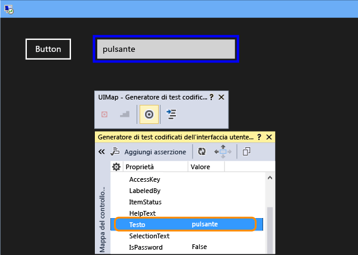
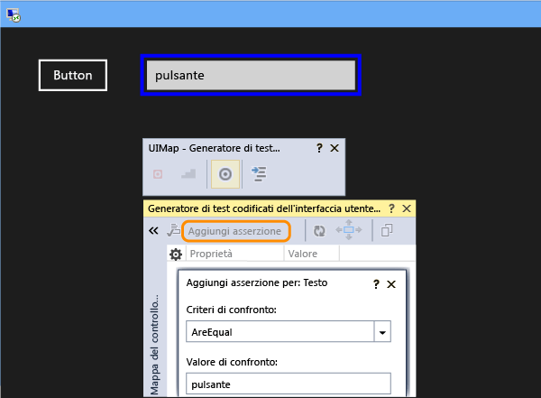

# <a name="test-windows-uwp-apps-with-coded-ui-tests"></a>Testare app UWP di Windows con test codificati dell'interfaccia utente

Usare questa procedura dettagliata per creare test dell'interfaccia utente per app UWP e app 8.1 basate su XAML. 
  
## <a name="create-a-simple-uwp-app"></a>Creare una semplice app UWP  
  
1.  Per eseguire test codificati dell'interfaccia utente per un'app UWP basata su XAML, è necessario [impostare una proprietà di automazione univoca che identifichi ogni controllo](../test/set-a-unique-automation-property-for-windows-store-controls-for-testing.md).  
  
     Scegliere **Opzioni** dal menu **Strumenti** , quindi **Editor di testo**, **XAML**e infine **Varie**.  
  
     Selezionare la casella di controllo per denominare automaticamente gli elementi non attivi al momento della creazione.  
  
       
  
2.  Creare un nuovo progetto per un'app UWP vuota basata su XAML, usando un modello di Visual C# o Visual Basic.  
  
       
  
3.  In Esplora soluzioni aprire il file MainPage.xaml. Dalla casella degli strumenti trascinare un controllo Button e un controllo Textbox nell'area di progettazione.  
  
       
  
4.  Fare doppio clic sul controllo Button e aggiungere il codice seguente:  
  
    ```csharp  
    private void button_Click_1(object sender, RoutedEventArgs e)  
    {  
        this.textBox.Text = this.button.Name;  
    }  
  
    ```  
  
    ```vb  
    Public NotInheritable Class MainPage  
        Inherits Page  
  
        Private Sub button_Click(sender As Object, e As RoutedEventArgs) Handles Button.Click  
            Me.textBox.Text = Me.button.Name  
        End Sub  
    End Class  
    ```  
  
5.  Premere F5 per eseguire l'app UWP.  
  
## <a name="create-and-run-a-coded-ui-test-for-the-uwp-app"></a>Creare ed eseguire un test codificato dell'interfaccia utente per l'app UWP  

[Come si creano i test codificati dell'interfaccia utente per le app UWP (Universal Windows Platform)?](#uwpapps)
  
1.  Creare un nuovo progetto di test codificato dell'interfaccia utente per l'app UWP.  
  
       
  
2.  Scegliere di modificare la mappa dell'interfaccia utente usando lo strumento selettore di precisione.  
  
       
  
3.  Usare lo strumento selettore di precisione nel Generatore di test codificati dell'interfaccia utente per selezionare il riquadro dell'app, fare clic con il pulsante destro del mouse su **AutomationId** e scegliere **Copia valore negli Appunti**. Il valore presente negli Appunti verrà usato più avanti per scrivere l'azione per l'avvio dell'app per i test.  
  
       
  
4.  Nell'app UWP in esecuzione usare lo strumento selettore di precisione per selezionare il controllo Button e il controllo Textbox. Dopo avere aggiunto ogni controllo, scegliere il pulsante **Aggiungi controllo alla mappa del controllo dell'interfaccia utente** sulla barra degli strumenti Generatore di test codificati dell'interfaccia utente.  
  
       
  
5.  Scegliere il pulsante **Genera codice** sulla barra degli strumenti Generatore di test codificati dell'interfaccia utente, quindi scegliere **Genera** per creare il codice per le modifiche alla mappa del controllo dell'interfaccia utente.  
  
       
  
6.  Scegliere il pulsante per impostare un valore nella casella di testo.  
  
       
  
7.  Usare lo strumento selettore di precisione per selezionare il controllo TextBox e quindi selezionare la proprietà **Text**.  
  
       
  
8.  Aggiungere un'asserzione. Verrà usata nel test per verificare che il valore sia corretto.  
  
       
  
9. Aggiungere e generare il codice per l'asserzione.  
  
       
  
10. **Visual C#**  
  
     In Esplora soluzioni aprire il file UIMap.Designer.cs per visualizzare il codice aggiunto per il metodo Assert e i controlli.  
  
     **Visual Basic**  
  
     Aprire il file CodedUITest1.vb in Esplora soluzioni, quindi nel codice del metodo CodedUITestMethod1() fare clic con il pulsante destro del mouse sulla chiamata al metodo di asserzione `Me.UIMap.AssertMethod1()` aggiunto automaticamente e scegliere **Vai a definizione**. Verrà aperto il file UIMap.Designer.vb nell'editor del codice, in cui è visibile il codice aggiunto per il metodo di asserzione e i controlli.  
  
    > [!WARNING]
    >  Non modificare direttamente il file UIMap.designer.cs o UIMap.Designer.vb perché, così facendo, le modifiche apportate al file verrebbero sovrascritte ogni volta che viene generato il test.  
  
     **Metodo Assert**  
  
    ```csharp  
    public void AssertMethod1()  
    {  
        #region Variable Declarations  
        XamlEdit uITextBoxEdit = this.UIApp1Window.UITextBoxEdit;  
        #endregion  
  
        // Verify that the 'Text' property of 'textBox' text box equals 'button'  
        Assert.AreEqual(this.AssertMethod3ExpectedValues.UITextBoxEditText, uITextBoxEdit.Text);  
    }  
    ```  
  
    ```vb  
    Public Sub AssertMethod1()  
        Dim uITextBoxEdit As XamlEdit = Me.UIApp2Window.UITextBoxEdit  
  
        'Verify that the 'Text' property of 'textBox' text box equals 'button'  
        Assert.AreEqual(Me.AssertMethod1ExpectedValues.UITextBoxEditText, uITextBoxEdit.Text)  
    End Sub  
    ```  
  
     **Controlli**  
  
    ```csharp  
    #region Properties  
    public XamlButton UIButtonButton  
    {  
        get  
        {  
            if ((this.mUIButtonButton == null))  
            {  
                this.mUIButtonButton = new XamlButton(this);  
                #region Search Criteria  
                this.mUIButtonButton.SearchProperties[XamlButton.PropertyNames.AutomationId] = "button";  
                this.mUIButtonButton.WindowTitles.Add("App1");  
                #endregion  
            }  
            return this.mUIButtonButton;  
        }  
    }  
  
    public XamlEdit UITextBoxEdit  
    {  
        get  
        {  
            if ((this.mUITextBoxEdit == null))  
            {  
                this.mUITextBoxEdit = new XamlEdit(this);  
                #region Search Criteria  
                this.mUITextBoxEdit.SearchProperties[XamlEdit.PropertyNames.AutomationId] = "textBox";  
                this.mUITextBoxEdit.WindowTitles.Add("App1");  
                #endregion  
            }  
            return this.mUITextBoxEdit;  
        }  
    }  
    #endregion  
  
    #region Fields  
    private XamlButton mUIButtonButton;  
  
    private XamlEdit mUITextBoxEdit;  
    #endregion  
    ```  
  
    ```vb  
    #Region "Properties"  
    Public ReadOnly Property UIButtonButton() As XamlButton  
        Get  
            If (Me.mUIButtonButton Is Nothing) Then  
                Me.mUIButtonButton = New XamlButton(Me)  
                Me.mUIButtonButton.SearchProperties(XamlButton.PropertyNames.AutomationId) = "button"  
                Me.mUIButtonButton.WindowTitles.Add("App2")  
            End If  
            Return Me.mUIButtonButton  
        End Get  
    End Property  
  
    Public ReadOnly Property UITextBoxEdit() As XamlEdit  
        Get  
            If (Me.mUITextBoxEdit Is Nothing) Then  
                Me.mUITextBoxEdit = New XamlEdit(Me)  
                Me.mUITextBoxEdit.SearchProperties(XamlEdit.PropertyNames.AutomationId) = "textBox"  
                Me.mUITextBoxEdit.WindowTitles.Add("App2")  
            End If  
            Return Me.mUITextBoxEdit  
        End Get  
    End Property  
    #End Region  
  
    #Region "Fields"  
    Private mUIButtonButton As XamlButton  
  
    Private mUITextBoxEdit As XamlEdit  
    #End Region  
    ```  
  
11. In Esplora soluzioni aprire il file CodedUITest1.cs o CodedUITest1.vb. A questo punto è possibile aggiungere il codice al metodo CodedUTTestMethod1 per le azioni necessarie per l'esecuzione del test usando i controlli aggiunti a UIMap:  
  
    1.  Avviare l'app UWP usando la proprietà automationID copiata in precedenza negli Appunti:  
  
        ```csharp  
        XamlWindow.Launch("8ebca7c4-effe-4c86-9998-068daccee452_cyrqexqw8cc7c!App")  
        ```  
  
        ```vb  
        XamlWindow myAppWindow = XamlWindow.Launch("7254db3e-20a7-424e-8e05-7c4dabf4f28d_cyrqexqw8cc7c!App");  
        ```  
  
    2.  Aggiungere un gesto tocco per il controllo Button:  
  
        ```csharp  
        Gesture.Tap(this.UIMap.UIApp1Window. UIButtonButton);  
        ```  
  
        ```vb  
        Gesture.Tap(Me.UIMap.UIApp2Window. UIButtonButton)  
        ```  
  
    3.  Verificare che la chiamata al metodo Assert generato automaticamente avvenga dopo l'avvio dell'app e del gesto tocco sul pulsante:  
  
        ```csharp  
        this.UIMap.AssertMethod1();  
        ```  
  
        ```vb  
        Me.UIMap.AssertMethod1()  
        ```  
  
     Dopo avere aggiunto il codice, il metodo di test CodedUITestMethod1 dovrebbe avere un aspetto simile al seguente:  
  
    ```csharp  
    [TestMethod]  
    public void CodedUITestMethod1()  
    {  
        // To generate code for this test, select "Generate Code for Coded UI Test" from the shortcut menu and select one of the menu items.  
  
        // Launch the app.  
        XamlWindow myAppWindow = XamlWindow.Launch("7254db3e-20a7-424e-8e05-7c4dabf4f28d_cyrqexqw8cc7c!App");  
  
        // Tap the button.  
        Gesture.Tap(this.UIMap.UIApp1Window.UIButtonButton);  
  
        this.UIMap.AssertMethod1();  
    }  
    ```  
  
    ```vb  
    <CodedUITest(CodedUITestType.WindowsStore)>  
    Public Class CodedUITest1  
  
        <TestMethod()>  
        Public Sub CodedUITestMethod1()  
            '              
            ' To generate code for this test, select "Generate Code for Coded UI Test" from the shortcut menu and select one of the menu items.  
            '  
  
            ' Launch the app.  
            XamlWindow.Launch("8ebca7c4-effe-4c86-9998-068daccee452_cyrqexqw8cc7c!App")  
  
            '// Tap the button.  
            Gesture.Tap(Me.UIMap.UIApp2Window.UIButtonButton)  
  
            Me.UIMap.AssertMethod1()  
        End Sub  
    ```  
  
12. Compilare ed eseguire il test con Esplora test.  
  
       
  
     L'app UWP viene avviata, l'azione per il tocco del pulsante viene completata e la proprietà Text della casella di testo viene popolata e convalidata tramite il metodo Assert.  
  
       
  
     Al termine dell'operazione, Esplora test indica che il test è stato superato.  
  
       
  
## <a name="q--a"></a>Domande e risposte  
  
#### <a name="q-why-dont-i-see-the-option-to-record-my-coded-ui-test-in-the-generate-code-for-a-coded-ui-test-dialog"></a>D: Perché nella finestra di dialogo Genera codice per un test codificato dell'interfaccia utente non è presente un'opzione per registrare un test codificato dell'interfaccia utente personalizzato?**  
  
**R**: L'opzione per la registrazione non è supportata per le app UWP.  
  
#### <a name="q-can-i-create-a-coded-ui-test-for-my-uwp-apps-based-on-winjs"></a>D: È possibile creare un test codificato dell'interfaccia utente per le app UWP basate su WinJS?**  

**R**: No, sono supportate solo le app basate su XAML.  
  
#### <a name="q-can-i-create-coded-ui-tests-for-my-uwp-apps-on-a-system-that-is-not-running-windows-81-or-windows-10"></a>D: È possibile creare test codificati dell'interfaccia utente per le app UWP in un sistema che non esegue Windows 8.1 o Windows 10?**  
  
**R**: No, i modelli di progetto per i test codificati dell'interfaccia utente sono disponibili solo in Windows 8.1 e Windows 10. Per creare l'automazione per le app UWP (Universal Windows Platform), sarà necessario Windows 10.  

<a name="uwpapps"></a>  
#### <a name="q-how-do-i-create-coded-ui-tests-for-universal-windows-platform-uwp-apps"></a>D: Come si creano i test codificati dell'interfaccia utente per le app UWP (Universal Windows Platform)?**  
  
**A**: A seconda della piattaforma dove si sta testando l'app UWP, creare un progetto di test codificato dell'interfaccia utente in uno di questi modi:  
  
- Un'app UWP in esecuzione in un computer locale verrà eseguita come app UWP. Per testarla, è necessario usare il modello **Progetto di test codificato dell'interfaccia utente (Windows)** . Per trovare questo modello quando si crea un nuovo progetto, andare al nodo **Universal**, **Windows** oppure in alternativa andare al nodo **Windows**, **Windows 8**, **Windows** .  
  
- Un'app della piattaforma UWP in esecuzione su un dispositivo mobile ed emulatore verrà eseguita come app per Windows Phone. Per testarla, è necessario usare il modello **Progetto di test codificato dell'interfaccia utente (Windows Phone)** . Per trovare questo modello quando si crea un nuovo progetto, andare al nodo **Universal**, **Windows** oppure in alternativa andare al nodo **Windows**, **Windows 8**, **Windows Phone** .  
  
Dopo aver creato il progetto, la creazione di un test è uguale a quella descritta in precedenza.  
  
#### <a name="q-why-cant-i-modify-the-code-in-the-uimapdesigner-file"></a>D: Perché non è possibile modificare il codice nel file UIMap.Designer?**  
  
**R**: Qualsiasi modifica del codice apportata nel file UIMapDesigner.cs verrà sovrascritta ogni volta che si genera codice usando UIMap - Generatore di test codificati dell'interfaccia utente. Se è necessario modificare un metodo registrato, copiarlo nel file UIMap.cs e rinominarlo. Il file UIMap.cs può essere usato per eseguire l'override dei metodi e delle proprietà contenuti nel file UIMapDesigner.cs. È necessario rimuovere il riferimento al metodo originale nel file Coded UITest.cs e sostituirlo con il nome del metodo rinominato.  
  
## <a name="see-also"></a>Vedere anche  
 [Usare l'automazione dell'interfaccia utente per testare il codice](../test/use-ui-automation-to-test-your-code.md)   
 [Impostare una proprietà di automazione univoca dei controlli UWP per il test](../test/set-a-unique-automation-property-for-windows-store-controls-for-testing.md)
