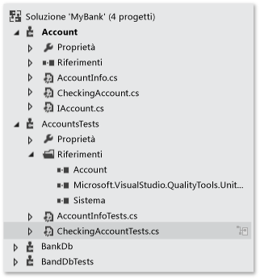
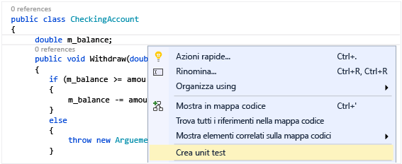
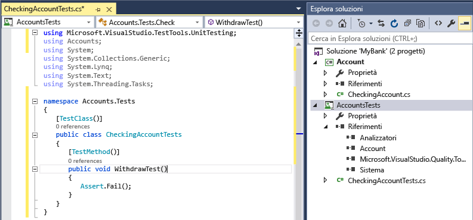
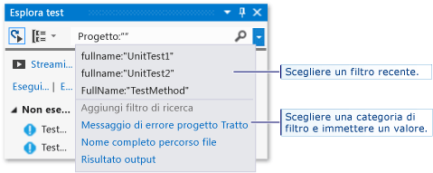

# Nozioni fondamentali sugli unit test
[!INCLUDE[vs2017banner](../code-quality/includes/vs2017banner.md)]

Per controllare che il codice funzioni come previsto, creare ed eseguire unit test. Si parla di unit test in quanto le funzionalità del programma vengono scomposte in comportamenti discreti testabili che possono essere testati come singole *unità*. Esplora test di Visual Studio offre un modo flessibile ed efficiente per eseguire gli unit test e visualizzarne i risultati in Visual Studio. Visual Studio installa i framework per unit test Microsoft per codice gestito e nativo. Usare un *framework di unit test* per creare unit test, eseguirli e creare report con i relativi risultati. Eseguire nuovamente gli unit test quando si apportano modifiche per verificare che il codice funzioni ancora correttamente. Quando si usa Visual Studio Enterprise, è possibile eseguire automaticamente i test dopo ogni compilazione.  
  
 Gli unit test offrono i risultati migliori in relazione alla qualità del codice quando sono parte integrante del flusso di lavoro di sviluppo di software. Non appena si scrive una funzione o un altro blocco di codice dell'applicazione, creare unit test per verificare il comportamento del codice in risposta a casi standard, limite e non corretti di dati di input e quindi controllare eventuali presupposti espliciti o impliciti presenti nel codice. Con lo *sviluppo basato su test*, gli unit test vengono creati prima di scrivere il codice e quindi vengono usati sia come documentazione di progettazione sia come specifiche funzionali.  
  
 È possibile generare rapidamente progetti di test e metodi di test dal codice oppure creare manualmente i test necessari. Quando si usa IntelliTest per esplorare il codice .NET, è possibile generare dati di test e un gruppo di unit test. Per ogni istruzione nel codice viene generato un input di test che eseguirà l'istruzione. Informazioni su come [generare unit test per il codice](http://msdn.microsoft.com/library/dn823749.aspx).  
  
 Esplora test può eseguire anche framework per unit test di terze parti e open source che hanno implementato le interfacce dei componenti aggiuntivi di Esplora test. È possibile aggiungere molti di questi framework tramite Gestione estensioni di Visual Studio e la Visual Studio Gallery. Vedere [Installare framework di unit test di terze parti](../test/install-third-party-unit-test-frameworks.md)  
  
-   [Guide introduttive](#BKMK_Quick_starts)  
  
-   [Esempio della soluzione MyBank](#BKMK_The_MyBank_Solution_example)  
  
-   [Creare progetti di unit test e metodi di test](#BKMK_Creating_the_unit_test_projects)  
  
-   [Scrivere i test](#BKMK_Writing_your_tests)  
  
-   [Eseguire test in Esplora test](#BKMK_Running_tests_in_Test_Explorer)  
  
-   [Eseguire e visualizzare i test](#BKMK_Running_and_viewing_tests_from_the_Test_Explorer_toolbar)  
  
##  <a name="BKMK_Unit_testing_overview"></a> Panoramica degli unit test  
  
###  <a name="BKMK_Quick_starts"></a> Guide introduttive  
 Per un'introduzione agli unit test che mostra direttamente la creazione di codice, vedere uno degli argomenti seguenti:  
  
-   [Procedura dettagliata: Creazione ed esecuzione di unit test per codice gestito](../test/walkthrough-creating-and-running-unit-tests-for-managed-code.md)  
  
-   [Guida introduttiva allo sviluppo basato su test con Esplora test](../test/quick-start-test-driven-development-with-test-explorer.md)  
  
-   [Unit test di codice nativo con Esplora test](http://msdn.microsoft.com/it-it/8a09d6d8-3613-49d8-9ffe-11375ac4736c)  
  
##  <a name="BKMK_The_MyBank_Solution_example"></a> Esempio della soluzione MyBank  
 In questo argomento si usa lo sviluppo di un'applicazione fittizia denominata `MyBank` come esempio. Per seguire le spiegazioni disponibili in questo argomento non è necessario il codice effettivo. I metodi di test sono scritti in C\# e sono presentati tramite il framework per unit test Microsoft per codice gestito. I concetti possono essere tuttavia trasferiti facilmente ad altri linguaggi e altri framework.  
  
   
  
 Il primo tentativo di progettazione per l'applicazione `MyBank` include un componente conti che rappresenta un singolo conto e le rispettive transazioni con la banca e un componente database che rappresenta la funzionalità per l'aggregazione e la gestione dei singoli conti.  
  
 Verrà creata una soluzione `MyBank` che contiene due progetti:  
  
-   `Accounts`  
  
-   `BankDb`  
  
 Il primo tentativo di progettazione del progetto `Accounts` include una classe per le informazioni di base su un conto, un'interfaccia che specifica la funzionalità comune di un tipo di conto, ad esempio il deposito e il prelievo di beni dal conto, e una classe derivata dall'interfaccia che rappresenta un conto corrente. Il progetto Accounts inizia con la creazione dei file di origine seguenti:  
  
-   `AccountInfo.cs` definisce le informazioni di base per un conto.  
  
-   `IAccount.cs` definisce un'interfaccia `IAccount` standard per un conto, inclusi metodi per il deposito e il prelievo di beni da un conto e per il recupero del saldo del conto.  
  
-   `CheckingAccount.cs` contiene la classe `CheckingAccount` che implementa l'interfaccia `IAccounts` per un conto corrente.  
  
 L'esperienza mostra che per un prelievo da un conto corrente è necessario essere sicuri che l'importo prelevato sia inferiore al saldo del conto. Viene quindi eseguito l'override del metodo `IAccount.Withdaw` in `CheckingAccount` con un metodo che verifica questa condizione. Il metodo può avere un aspetto analogo al seguente:  
  
```c#  
  
public void Withdraw(double amount)  
{  
    if(m_balance >= amount)  
    {  
        m_balance -= amount;  
    }  
    else  
    {  
        throw new ArgumentException(amount, "Withdrawal exceeds balance!")  
    }  
}  
  
```  
  
 Ora che è disponibile codice, è possibile passare al test.  
  
##  <a name="BKMK_Creating_the_unit_test_projects"></a> Creare progetti di unit test e metodi di test  
 Spesso è più rapido generare il progetto di unit test e gli stub di unit test dal codice. In alternativa, è possibile creare il progetto di unit test e i test manualmente, in base alle esigenze.  
  
 **Generare progetto e stub di unit test**  
  
1.  Nella finestra dell'editor di codice fare clic con il pulsante destro del mouse e scegliere **Crea Unit test** dal menu di scelta rapida.  
  
       
  
2.  Fare clic su OK per accettare le impostazioni predefinite per creare gli unit test oppure modificare i valori usati per creare e denominare il progetto di unit test e gli unit test. È possibile selezionare il codice aggiunto per impostazione predefinita ai metodi di unit test.  
  
       
  
3.  Gli stub di unit test vengono creati in un nuovo progetto di unit test per tutti i metodi nella classe.  
  
       
  
4.  Passare quindi alle informazioni seguenti per apprendere come [aggiungere codice ai metodi di unit test](#BKMK_Writing_your_tests) per rendere significativo lo unit test ed eventuali unit test aggiuntivi che è possibile aggiungere per testare accuratamente il codice.  
  
 **Creare il progetto di unit test e gli unit test manualmente**  
  
 Un progetto unit test rispecchia in genere la struttura di un progetto a codice singolo. Nell'esempio MyBank si aggiungono due progetti unit test denominati `AccountsTests` e `BankDbTests` alla soluzione `MyBanks`. I nomi dei progetti di test sono arbitrari, ma è consigliabile adottare una convenzione di denominazione standard.  
  
 **Per aggiungere un progetto unit test a una soluzione:**  
  
1.  Scegliere **Nuovo** dal menu **File**, quindi scegliere **Progetto** oppure premere CTRL\+MAIUSC\+N.  
  
2.  Nella finestra di dialogo Nuovo progetto espandere il nodo **Installato**, scegliere il linguaggio da usare per il progetto di test, quindi scegliere **Test**.  
  
3.  Per usare uno dei framework per unit test Microsoft, scegliere **Progetto unit test** dall'elenco di modelli di progetto. In alternativa, scegliere il modello di progetto del framework per unit test che si vuole usare. Per testare il progetto `Accounts` dell'esempio, assegnare al progetto il nome `AccountsTests`.  
  
    > [!WARNING]
    >  Non tutti i framework per unit test di terze parti e open source offrono un modello di progetto di Visual Studio. Per informazioni sulla creazione di un progetto, vedere la documentazione relativa al framework.  
  
4.  Nel progetto unit test aggiungere un riferimento al progetto di codice da testare, che nell'esempio corrisponde al progetto Accounts.  
  
     Per creare il riferimento al progetto di codice:  
  
    1.  Selezionare il progetto in Esplora soluzioni.  
  
    2.  Scegliere **Aggiungi riferimento** dal menu **Progetto**.  
  
    3.  Nella finestra di dialogo Gestione riferimenti aprire il nodo **Soluzione** e scegliere **Progetti**. Selezionare il nome del progetto di codice e chiudere la finestra di dialogo.  
  
 Ogni progetto unit test contiene classi che rispecchiano i nomi delle classe del progetto di codice. Nell'esempio il progetto `AccountsTests` contiene le classi seguenti:  
  
-   La classe `AccountInfoTests` contiene i metodi di unit test per la classe `AccountInfo` nel progetto `BankAccount`.  
  
-   La classe `CheckingAccountTests` contiene i metodi di unit test per la classe `CheckingAccount`.  
  
##  <a name="BKMK_Writing_your_tests"></a> Scrivere i test  
 Il framework di unit test usato e Visual Studio IntelliSense forniranno indicazioni per la scrittura del codice per gli unit test per un progetto di codice. Per l'esecuzione in Esplora test, la maggior parte dei framework richiede l'aggiunta di attributi specifici per identificare i metodi di unit test. I framework offrono anche un modo, in genere tramite istruzioni Assert o attributi di metodo, per indicare se un metodo di test ha avuto esito positivo o negativo. Altri attributi identificano metodi di configurazione facoltativi che si trovano in corrispondenza dell'inizializzazione delle classi e prima di ogni metodo di test e dei metodi di disinstallazione eseguiti dopo ogni metodo di test e prima dell'eliminazione della classe.  
  
 Lo schema AAA \(Arrange, Act, Assert\) è un modo comune per scrivere unit test per un metodo da testare.  
  
-   La sezione **Arrange** di un metodo di unit test inizializza oggetti e imposta il valore dei dati passati al metodo da testare.  
  
-   La sezione **Act** richiama il metodo da testare con i parametri definiti.  
  
-   La sezione **Assert** verifica che l'azione del metodo da testare si comporti come previsto.  
  
 Per testare il metodo `CheckingAccount.Withdraw` dell'esempio, si possono scrivere due test: un test che verifica il comportamento standard del metodo e un test che verifica che un prelievo superiore al saldo del conto avrà esito negativo. Nella classe `CheckingAccountTests` vengono aggiunti i metodi seguenti:  
  
```c#  
[TestMethod]  
public void Withdraw_ValidAmount_ChangesBalance()  
{  
    // arrange  
    double currentBalance = 10.0;  
    double withdrawal = 1.0;  
    double expected = 9.0;  
    var account = new CheckingAccount("JohnDoe", currentBalance);  
    // act  
    account.Withdraw(withdrawal);  
    double actual = account.Balance;  
    // assert  
    Assert.AreEqual(expected, actual);  
}  
  
[TestMethod]  
[ExpectedException(typeof(ArgumentException))]  
public void Withdraw_AmountMoreThanBalance_Throws()  
{  
    // arrange  
    var account = new CheckingAccount("John Doe", 10.0);  
    // act  
    account.Withdraw(20.0);  
    // assert is handled by the ExpectedException  
}  
  
```  
  
 Si noti che `Withdraw_ValidAmount_ChangesBalance` usa un'istruzione `Assert` esplicita per determinare se il metodo di test ha esito positivo o negativo, mentre `Withdraw_AmountMoreThanBalance_Throws` usa l'attributo `ExpectedException` per determinare la riuscita del metodo di test. In modo invisibile all'utente, un framework per unit test esegue il wrapping dei metodi di test in istruzioni try\/catch. Nella maggior parte dei casi, se viene generata un'eccezione, il metodo di test avrà esito negativo e l'eccezione verrà ignorata. L'attributo `ExpectedException` provoca l'esito positivo del metodo di test se viene generata l'eccezione specificata.  
  
 Per altre informazioni sui framework per unit test Microsoft, vedere uno degli argomenti seguenti:  
  
-   [Scrittura di unit test per .NET Framework con il framework unit test di Microsoft per codice gestito](../test/writing-unit-tests-for-the-dotnet-framework-with-the-microsoft-unit-test-framework-for-managed-code.md)  
  
-   [Scrittura di unit test per C\/C\+\+ con il framework di testing unità Microsoft per C\+\+.](../test/writing-unit-tests-for-c-cpp-with-the-microsoft-unit-testing-framework-for-cpp.md)  
  
## Impostare i timeout per gli unit test  
 Per impostare un timeout in un singolo metodo di test:  
  
```c#  
[TestMethod]  
[Timeout(2000)]  // Milliseconds  
public void My_Test()  
{ ...  
}  
```  
  
```vb  
  
```  
  
 Per impostare il timeout sul valore massimo permesso:  
  
```c#  
[TestMethod]  
[Timeout(TestTimeout.Infinite)]  // Milliseconds  
public void My_Test ()  
{ ...  
}  
```  
  
##  <a name="BKMK_Running_tests_in_Test_Explorer"></a> Eseguire test in Esplora test  
 Quando si compila il progetto di test, i test vengono visualizzati in Esplora test. Se Esplora test non è visualizzato, scegliere **Test** dal menu di Visual Studio, quindi scegliere **Windows** e infine **Esplora test**.  
  
   
  
 Durante l'esecuzione, la scrittura e la nuova esecuzione di test, la visualizzazione predefinita di Esplora test mostra i risultati in gruppi di **Test non superati**, **Test superati**, **Test ignorati** e **Test non eseguiti**. È possibile scegliere un'intestazione di gruppo per aprire la visualizzazione che mostra tutti i test disponibili nel gruppo.  
  
 È anche possibile filtrare i test in qualsiasi visualizzazione in base alla corrispondenza con il testo nella casella di ricerca a livello globale oppure tramite la selezione di uno dei filtri predefiniti. È possibile eseguire qualsiasi selezione di test in qualsiasi momento. I risultati di un'esecuzione dei test sono visualizzati immediatamente nella barra relativa alle operazioni riuscite\/non riuscite nella parte superiore della finestra di Esplora test. I dettagli relativi al risultato di un metodo di test vengono visualizzati quando si seleziona il test.  
  
###  <a name="BKMK_Running_and_viewing_tests_from_the_Test_Explorer_toolbar"></a> Eseguire e visualizzare i test  
 La barra degli strumenti di Esplora test permette di individuare, organizzare ed eseguire i test a cui si è interessati.  
  
   
  
 È possibile scegliere **Esegui tutto** per eseguire tutti i test oppure scegliere **Esegui** per selezionare un sottoinsieme di test da eseguire. Dopo l'esecuzione di un insieme di test, un riepilogo dei test verrà visualizzato nella parte inferiore della finestra Esplora test. Selezionare un test per visualizzarne i dettagli nel riquadro inferiore. Scegliere **Apri Test** dal menu di scelta rapida \(tastiera: F12\) per visualizzare il codice sorgente per il test selezionato.  
  
 Se i singoli test non hanno dipendenze che ne impediscono l'esecuzione in qualsiasi ordine, attivare l'esecuzione parallela dei test con l'interruttore  sulla barra degli strumenti. Questo può ridurre notevolmente il tempo impiegato per eseguire tutti i test.  
  
###  <a name="BKMK_Running_tests_after_every_build"></a> Eseguire test dopo ogni compilazione  
  
> [!WARNING]
>  L'esecuzione di unit test dopo ogni compilazione è supportata solo in Visual Studio Enterprise.  
  
|||  
|-|-|  
||Per eseguire gli unit test dopo ogni compilazione locale, scegliere **Test** dal menu standard e quindi scegliere **Esegui test dopo compilazione** sulla barra degli strumenti di Esplora test.|  
  
###  <a name="BKMK_Filtering_and_grouping_the_test_list"></a> Filtrare e raggruppare l'elenco dei test  
 Quando è disponibile un numero elevato di test, è possibile digitare nella casella di testo di Esplora test per filtrare l'elenco in base alla stringa specificata. È possibile limitare ulteriormente i risultati scegliendo uno dei filtri disponibili nell'elenco.  
  
   
  
|||  
|-|-|  
||Per raggruppare i test in base alla categoria, scegliere il pulsante **Raggruppa per**.|  
  
 Per altre informazioni, vedere [Eseguire unit test con Esplora test](../test/run-unit-tests-with-test-explorer.md).  
  
## Domande e risposte  
 **D: Come si esegue il debug degli unit test?**  
  
 **R:** Usare Esplora test per avviare una sessione di debug per i test. Esaminando con facilità il codice grazie al debugger di Visual Studio è possibile spostarsi in avanti e indietro tra gli unit test e i progetti da testare. Per avviare il debug:  
  
1.  Nell'editor di Visual Studio impostare un punto di interruzione in uno o più metodi di test di cui si vuole eseguire il debug.  
  
    > [!NOTE]
    >  Poiché i metodi di test possono essere eseguiti in qualsiasi ordine, impostare punti di interruzione in tutti i metodi di test di cui si vuole eseguire il debug.  
  
2.  In Esplora test selezionare i metodi di test e quindi scegliere **Esegui debug test selezionati** dal menu di scelta rapida.  
  
 Altre informazioni dettagliate sul [debug di unit test](../debugger/debugging-in-visual-studio.md).  
  
 **D: Se si usa lo sviluppo basato su test, come è possibile generare codice dai test?**  
  
 **R:** Usare IntelliSense per generare classi e metodi nel codice del progetto. Scrivere un'istruzione in un metodo di test che chiama la classe o il metodo da generare, quindi aprire il menu di IntelliSense sotto la chiamata. Se la chiamata è per un costruttore della nuova classe, scegliere **Genera nuovo tipo** dal menu, quindi eseguire la procedura guidata per inserire la classe nel progetto di codice. Se la chiamata è per un metodo, scegliere **Genera nuovo metodo** dal menu di IntelliSense.  
  
   
  
 **D: È possibile creare unit test che accettano più set di dati come input per eseguire il test?**  
  
 **R:** Sì. I *metodi di test basati sui dati* permettono di testare un intervallo di valori con un singolo metodo di unit test. Usare un attributo `DataSource` per il metodo di test che specifica l'origine dati e la tabella contenente i valori variabili da testare.  Nel corpo del metodo assegnare i valori di riga alle variabili usando l'indicizzatore `TestContext.DataRow[`*NomeColonna*`]`.  
  
> [!NOTE]
>  Queste procedure sono applicabili soli ai metodi di test scritti usando il framework per unit test Microsoft per codice gestito. Se si usa un framework diverso, vedere la documentazione del framework per informazioni sulla funzionalità equivalente.  
  
 Ad esempio, si presupponga di aggiungere un metodo non necessario alla classe `CheckingAccount` con nome `AddIntegerHelper`.`AddIntegerHelper` aggiunge due numeri interi.  
  
 Per creare un test basato sui dati per il metodo `AddIntegerHelper`, è necessario creare prima di tutto un database di Access con nome `AccountsTest.accdb` e una tabella con nome `AddIntegerHelperData`. La tabella `AddIntegerHelperData` definisce colonne per specificare il primo e il secondo operando dell'addizione e una colonna per specificare il risultato previsto. I valori appropriati vengono inseriti in alcune righe.  
  
```c#  
  
[DataSource(  
    @"Provider=Microsoft.ACE.OLEDB.12.0;Data Source=C:\Projects\MyBank\TestData\AccountsTest.accdb",   
    "AddIntegerHelperData"  
)]  
[TestMethod()]  
public void AddIntegerHelper_DataDrivenValues_AllShouldPass()  
{  
    var target = new CheckingAccount();  
    int x = Convert.ToInt32(TestContext.DataRow["FirstNumber"]);  
    int y = Convert.ToInt32(TestContext.DataRow["SecondNumber"]);   
    int expected = Convert.ToInt32(TestContext.DataRow["Sum"]);  
    int actual = target.AddIntegerHelper(x, y);  
    Assert.AreEqual(expected, actual);  
}  
  
```  
  
 Il metodo con attributi viene eseguito una volta per ogni riga della tabella. In caso di esito negativo di una delle iterazioni, Esplora test segnala un errore di test per il metodo. Nel riquadro dei dettagli dei risultati del test per il metodo è mostrato il metodo di stato relativo all'esito positivo\/negativo per ogni riga di dati.  
  
 Altre informazioni sugli [unit test basati sui dati](../test/how-to-create-a-data-driven-unit-test.md).  
  
 **D: È possibile visualizzare la quantità di codice testata dagli unit test?**  
  
 **R:** Sì. È possibile determinare la quantità di codice sottoposta effettivamente a test dagli unit test usando lo strumento per il code coverage di Visual Studio. Sono supportati i linguaggi nativi e gestiti e tutti i framework di unit test che possono essere eseguiti dal framework di unit test.  
  
 È possibile eseguire il code coverage su test selezionati oppure su tutti i test in una soluzione. La finestra Risultati code coverage mostra la percentuale di blocchi di codice del prodotto esaminati in base a riga, funzione, classe, spazio dei nomi e modulo.  
  
 Per eseguire il code coverage per i metodi di test in una soluzione, scegliere **Test** dal menu di Visual Studio e quindi scegliere **Analizza code coverage**.  
  
 I risultati del code coverage sono visualizzati nella finestra Risultati code coverage.  
  
   
  
 Altre informazioni sul [code coverage](../test/using-code-coverage-to-determine-how-much-code-is-being-tested.md) .  
  
 **D: Come è possibile testare metodi nel codice con dipendenze esterne?**  
  
 **R:** Sì. Se si dispone di Visual Studio Enterprise, è possibile usare Microsoft Fakes con i metodi di test scritti usando framework di unit test per il codice gestito.  
  
 Microsoft Fakes usa due approcci per la creazione delle classi sostitutive per le dipendenze esterne.  
  
1.  Gli *stub* generano classi sostitutive derivate dall'interfaccia padre della classe di dipendenza di destinazione. I metodi stub possono sostituire metodi pubblici virtuali della classe di destinazione.  
  
2.  Gli *shim* usano strumentazione di runtime per deviare chiamate a un metodo di destinazione, indirizzandole a un metodo shim sostitutivo per metodi non virtuali.  
  
 In entrambi gli approcci si usano i delegati generati delle chiamate per il metodo di dipendenza per specificare il comportamento desiderato nel metodo di test.  
  
 Altre informazioni sull'[isolamento di metodi di unit test tramite Microsoft Fakes](../test/isolating-code-under-test-with-microsoft-fakes.md).  
  
 **D: È possibile usare altri framework di unit test per creare unit test?**  
  
 **R:** Sì, seguire questa procedura per [trovare e installare altri framework](../test/install-third-party-unit-test-frameworks.md). Dopo aver riavviato Visual Studio, riaprire la soluzione per creare unit test e quindi selezionare i framework installati:  
  
   
  
 Gli stub di unit test verranno creati usando il framework selezionato.