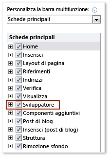

# Procedura: visualizzare la scheda Sviluppo nella barra multifunzione
  Per accedere alla scheda **Sviluppo** sulla barra multifunzione di un'applicazione Office, è necessario configurarla in modo da visualizzare la scheda che, per impostazione predefinita, non appare.  Ad esempio, è necessario visualizzare tale scheda per aggiungere un oggetto <xref:Microsoft.Office.Tools.Word.GroupContentControl> a una personalizzazione a livello di documento per Word.  
  
> [!NOTE]  
>  Queste linee guida si applicano solo alle applicazioni di Office 2010 o versioni successive.  Per visualizzare questa scheda in Microsoft Office System 2007, vedere la seguente versione di questo argomento [Procedura: Visualizzare la scheda Sviluppo nella barra multifunzione](http://msdn.microsoft.com/library/bb608625(v=vs.90).aspx).  
  
 [!INCLUDE[appliesto_ribbon](../vsto/includes/appliesto-ribbon-md.md)]  
  
> [!NOTE]  
>  Access non ha una scheda **Sviluppo**.  
  
### Per visualizzare la scheda Sviluppo  
  
1.  Avviare un'applicazione Office supportata da questo argomento.  Vedere la nota  **Si applica a** in precedenza in questo argomento.  
  
2.  Nella scheda **File** scegliere il pulsante **Opzioni**.  
  
     La figura seguente mostra la scheda **File** e il pulsante **Opzioni** in Office 2010.  
  
       
  
     La figura seguente mostra la scheda **File** in Office 2013.  
  
       
  
     La figura seguente mostra il pulsante **Opzioni** in Office 2013.  
  
       
  
3.  Nella finestra di dialogo **Opzioni di** *NomeApplicazione* scegliere il pulsante **Personalizzazione barra multifunzione**.  
  
     La figura seguente mostra la finestra di dialogo **Opzioni** e il pulsante **Personalizzazione barra multifunzione** in Excel 2010.  La posizione di questo pulsante è simile in tutte le altre applicazioni elencate nella sezione "Applica a" quasi all'inizio di questo argomento.  
  
       
  
4.  Nell'elenco di schede principali selezionare la casella di controllo **Sviluppo**.  
  
     La figura seguente mostra la casella di controllo **Sviluppo** in Word 2010 e [!INCLUDE[Word_15_short](../vsto/includes/word-15-short-md.md)].  La posizione di questa casella di controllo è simile in tutte le altre applicazioni elencate nella sezione "Si applica a" quasi all'inizio di questo argomento.  
  
       
  
5.  Scegliere **OK** per chiudere la finestra di dialogo **Opzioni**.  
  
## Vedere anche  
 [Personalizzazione dell'interfaccia utente di Office](../vsto/office-ui-customization.md)  
  
  