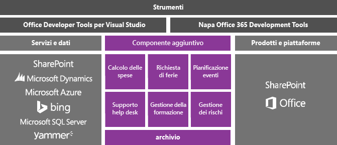
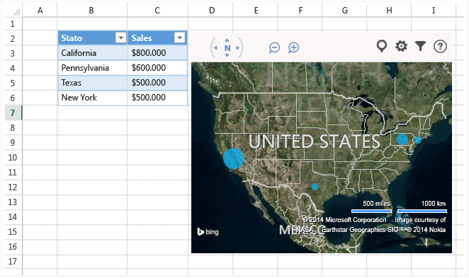

# Office and SharePoint Development in Visual Studio
  È possibile estendere Microsoft Office e SharePoint creando un'app leggera o un componente aggiuntivo che gli utenti scaricano da [Office Store](https://store.office.com/) o da un catalogo dell'organizzazione oppure creando una soluzione basata su.NET Framework che gli utenti installano in un computer.  
  
 Contenuto dell'argomento:  
  
-   [Creare componenti aggiuntivi per Office e SharePoint](#Apps)  
  
-   [Creare un componente aggiuntivo VSTO](#Add-ins)  
  
-   [Creare una soluzione di SharePoint](#Solutions)  
  
##   Creare componenti aggiuntivi per Office e SharePoint  
 Office 2013 e SharePoint 2013 introducono un nuovo modello di componente aggiuntivo che consente di creare, distribuire e monetizzare i componenti aggiuntivi che estendono Office e SharePoint.  Questi componenti aggiuntivi possono essere eseguiti in Office o SharePoint Online e gli utenti possono interagire con i componenti aggiuntivi da molti dispositivi.  
  
 Informazioni su come usare il nuovo [modello di componente aggiuntivo di Office](https://msdn.microsoft.com/library/office/jj220082.aspx) per estendere l'esperienza di Office per gli utenti.  
  
 Questi componenti aggiuntivi hanno footprint di dimensioni molto ridotte rispetto alle soluzioni e ai componenti aggiuntivi VSTO e possono essere creati con quasi tutte le tecnologie di programmazione Web come ad esempio HTML5, JavaScript, CSS3 e XML.  Per iniziare, usare Office Developer Tools in Visual Studio o lo strumento leggero basato su Web, nome in codice Napa Office 365 Development Tools, che consente di creare progetti, scrivere codice ed eseguire i componenti aggiuntivi in un browser.  
  
   
  
 **Altre informazioni**  
  
|A|Vedere|  
|-------|------------|  
|Altre informazioni su Napa Office 365 Development Tools.|[Napa Office 365 Development Tools](https://msdn.microsoft.com/library/dn974046.aspx)|  
  
### Creare un componente aggiuntivo di Office  
 Per estendere la funzionalità di Office, creare un componente aggiuntivo per Office. Si tratta in sostanza di una pagina ospitata in un'applicazione di Office come Excel, Word, Outlook e PowerPoint. L'app può aggiungere funzionalità a documenti, fogli di lavoro, messaggi di posta elettronica, appuntamenti, presentazioni e progetti.  
  
 È possibile vendere l'app in Office Store.[Office Store](https://store.office.com/) consente facilmente di monetizzare i componenti aggiuntivi, gestire gli aggiornamenti e controllare la telemetria. È anche possibile pubblicare l'app per gli utenti tramite un catalogo di app in SharePoint o in Exchange Server.  
  
 L'app seguente per Office mostra i dati del foglio di lavoro in una mappa di Bing.  
  
   
  
 **Altre informazioni**  
  
|A|Vedere|  
|-------|------------|  
|Altre informazioni sui componenti aggiuntivi per Office e sulla relativa creazione.|[Componenti aggiuntivi di Office](http://msdn.microsoft.com/office/dn448457)|  
|Confrontare i diversi modi in cui è possibile estendere Office e decidere se usare un'app o un componente aggiuntivo di Office.|[Guida di orientamento per componenti aggiuntivi di Office, VSTO e VBA](http://blogs.msdn.com/b/officeapps/archive/2013/06/18/roadmap-for-apps-for-office-vsto-and-vba.aspx)|  
|Altre informazioni su Napa Office 365 Development Tools.|[Napa Office 365 Development Tools](https://msdn.microsoft.com/library/dn974046.aspx)|  
  
### Creare un componente aggiuntivo di SharePoint  
 Per estendere SharePoint per gli utenti, creare un componente aggiuntivo per SharePoint. Si tratta in sostanza di un'applicazione autonoma di piccole dimensioni, facile da usare che risolve una necessità degli utenti o dell'azienda.  
  
 È possibile vendere l'app per SharePoint in [Office Store](https://store.office.com/). È anche possibile pubblicare il componente aggiuntivo per gli utenti tramite un catalogo di componenti aggiuntivi in SharePoint.  I proprietari del sito possono installare, aggiornare e disinstallare il componente aggiuntivo nei siti di SharePoint senza l'aiuto di un server della farm o di un amministratore della raccolta di siti.  
  
 Di seguito è riportato un esempio di un'app per SharePoint che consente agli utenti di gestire i contatti aziendali.  
  
   
  
 **Altre informazioni**  
  
|A|Vedere|  
|-------|------------|  
|Altre informazioni sui componenti aggiuntivi per SharePoint e sulla relativa creazione.|[Componenti aggiuntivi di SharePoint](https://msdn.microsoft.com/library/office/fp179930.aspx)|  
|Confrontare i componenti aggiuntivi per SharePoint con le soluzioni tradizionali di SharePoint.|[Confronto tra componenti aggiuntivi di SharePoint e soluzioni di SharePoint](http://msdn.microsoft.com/library/office/jj163114.aspx)|  
|Scegliere se creare un componente aggiuntivo di SharePoint o una soluzione di SharePoint.|[Scelta tra componenti aggiuntivi di SharePoint e soluzioni di SharePoint](https://msdn.microsoft.com/library/office/jj163114.aspx)|  
|Altre informazioni su Napa Office 365 Development Tools.|[Napa Office 365 Development Tools](https://msdn.microsoft.com/library/dn974046.aspx)|  
  
##   Creare un componente aggiuntivo VSTO  
 Creare un componente aggiuntivo VSTO per Office 2007 o Office 2010 oppure per estendere Office 2013 e Office 2016 oltre le possibilità dei componenti aggiuntivi per Office. I componenti aggiuntivi VSTO vengono eseguiti solo sul desktop. Gli utenti devono installare i componenti aggiuntivi VSTO, quindi in genere sono più difficili da distribuire e supportare.  Tuttavia, un componente aggiuntivo VSTO può essere maggiormente integrato con Office. Ad esempio, può aggiungere schede e controlli alla barra multifunzione di Office ed eseguire attività di automazione avanzate come l'unione di documenti o la modifica di grafici. È possibile sfruttare .NET Framework e usare C\# e Visual Basic per interagire con gli oggetti di Office.  
  
 Ecco un esempio di ciò che può fare un componente aggiuntivo VSTO. Questo componente aggiuntivo VSTO aggiunge alcuni controlli della barra multifunzione, un riquadro attività personalizzato e una finestra di dialogo a PowerPoint.  
  
   
  
 **Altre informazioni**  
  
|A|Lettura|  
|-------|-------------|  
|Confrontare i diversi modi in cui è possibile estendere Office e decidere se usare un componente aggiuntivo VSTO o un componente aggiuntivo di Office.|[Guida di orientamento per componenti aggiuntivi di Office, VSTO e VBA](http://blogs.msdn.com/b/officeapps/archive/2013/06/18/roadmap-for-apps-for-office-vsto-and-vba.aspx)|  
|Creare un componente aggiuntivo VSTO.|[Componenti aggiuntivi VSTO creati con Visual Studio](https://msdn.microsoft.com/library/jj620922.aspx)|  
  
##   Creare una soluzione di SharePoint  
 Creare una soluzione di SharePoint per SharePoint Foundation 2010 e SharePoint Server 2010 o per estendere SharePoint 2013 e SharePoint 2016 oltre le possibilità di un componente aggiuntivo per SharePoint.  
  
 Le soluzioni di SharePoint richiedono server della farm di SharePoint locali che devono essere installati dagli amministratori e poiché le soluzioni vengono eseguite in SharePoint, possono influenzare le prestazioni del server. Tuttavia, le soluzioni offrono un accesso più diretto agli oggetti di SharePoint. Inoltre, quando si crea una soluzione di SharePoint, è possibile sfruttare .NET Framework e usare C\# e Visual Basic per interagire con gli oggetti di SharePoint.  
  
 **Altre informazioni**  
  
|A|Vedere|  
|-------|------------|  
|Confrontare le soluzioni di SharePoint con i componenti aggiuntivi di SharePoint.|[Confronto tra componenti aggiuntivi di SharePoint e soluzioni di SharePoint](http://msdn.microsoft.com/library/office/jj163114.aspx)|  
|Creare una soluzione di SharePoint.|[Creare soluzioni di SharePoint](../sharepoint/create-sharepoint-solutions.md)|  
  
  