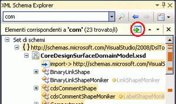

# Procedura: aggiungere nodi all&#39;area di lavoro da XML Schema Explorer
[!INCLUDE[vs2017banner](../code-quality/includes/vs2017banner.md)]

Nel presente argomento viene illustrato come aggiungere nodi all'[area di lavoro di Progettazione XML Schema](../xml-tools/xml-schema-designer-workspace.md) da XML Schema Explorer.È possibile trascinare nodi da XML Schema Explorer su una visualizzazione di Progettazione XSD o tramite il menu di scelta rapida di XML Schema Explorer.È anche possibile aggiungere nodi evidenziati come risultato di una ricerca eseguita da XML Schema Explorer.Per ulteriori informazioni, vedere [Procedura: aggiungere nodi dei risultati di ricerca del set di schemi all'area di lavoro](../xml-tools/how-to-add-schema-set-search-result-nodes-to-the-workspace.md).  
  
> [!NOTE]
>  È possibile aggiungere solo nodi globali all'[Area di lavoro di Progettazione XML Schema](../xml-tools/xml-schema-designer-workspace.md).  
  
### Per aggiungere nodi tramite il menu di scelta rapida di XML Explorer  
  
1.  Seguire la procedura indicata in [Procedura: creare e modificare un file di schema XSD](../xml-tools/how-to-create-and-edit-an-xsd-schema-file.md).  
  
2.  Fare clic con il pulsante destro del mouse sul nodo `PurchaseOrderType` in XSD Explorer.Selezionare **Mostra in visualizzazione grafico**.  
  
     Il nodo `purchaseOrderType` viene visualizzato nell'area di progettazione della visualizzazione grafico.  
  
### Per trascinare un nodo su una visualizzazione  
  
1.  Fare clic con il pulsante destro del mouse sul nodo `PurchaseOrderType` nella visualizzazione grafico.Selezionare **Mostra in XML Schema Explorer**.  
  
     Il nodo viene evidenziato in XML Schema Explorer.  
  
2.  Fare clic con il pulsante destro del mouse sul nodo `PurchaseOrderType` in XML Schema Explorer e selezionare **Mostra tutti i riferimenti**.  
  
     Il nodo `purchaseOrder` viene evidenziato.  
  
3.  Trascinare il nodo `purchaseOrder` sulla visualizzazione grafico.  
  
     I nodi `purchaseOrder` e `PurchaseOrderType` sono visualizzati uno accanto all'altro nell'area di progettazione della visualizzazione grafico.Poiché i due nodi sono correlati \(l'elemento `purchaseOrder` è di tipo `PurchaseOrderType`\), viene tracciata una freccia tra loro.  
  
### Per aggiungere nodi tramite la funzionalità di ricerca di Schema Explorer  
  
1.  Digitare "purchaseOrder" nella casella di testo di ricerca della barra degli strumenti di [XML Explorer](../xml-tools/xml-schema-explorer.md) e fare clic sul pulsante di ricerca.  
  
       
  
     I risultati della ricerca sono evidenziati in XML Schema Explorer e contrassegnati con un segno di spunta sulla barra di scorrimento verticale.  
  
2.  Aggiungere i risultati della ricerca all'area di lavoro facendo clic sul pulsante **Aggiungi nodi evidenziati all'area di lavoro** nel riquadro dei risultati di riepilogo.  
  
       
  
     I nodi `purchaseOrder` e `PurchaseOrderType` sono visualizzati uno accanto all'altro nell'area di progettazione della [visualizzazione grafico](../xml-tools/graph-view.md).Poiché i due nodi sono correlati \(l'elemento `purchaseOrder` è di tipo `PurchaseOrderType`\), viene tracciata una freccia tra loro.  
  
## Vedere anche  
 [XML Schema Explorer](../xml-tools/xml-schema-explorer.md)