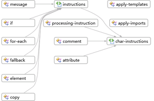

# Procedura: ottenere una panoramica di un set di schemi tramite la visualizzazione grafico
In questo argomento viene descritto come utilizzare il [visualizzazione grafico](../xml-tools/graph-view.md) per ottenere una visualizzazione di alto livello dei nodi in un set di schemi e le relazioni tra i nodi.  
  
### Per creare un nuovo file XSD e visualizzare l'elemento radice nella visualizzazione modello di contenuto  
  
1.  Creare un nuovo file XML Schema e salvare il file come Relationships.xsd.  
  
2.  Fare clic su di **usare l'Editor XML per visualizzare e modificare il file XML Schema sottostante** collegamento nella visualizzazione iniziale.  
  
3.  Copiare il codice di esempio di XML Schema da [XML Schema di esempio: relazioni](../xml-tools/sample-xsd-file-relationships.md) e incollarlo per sostituire il codice che è stato aggiunto il nuovo file XSD per impostazione predefinita.  
  
4.  Fare clic nell'Editor XML e selezionare **Visualizza finestra di progettazione**.  
  
5.  Selezionare la visualizzazione grafico dalla barra degli strumenti XSD.  
  
6.  Selezionare **Set di schemi** nodo in XML Schema Explorer e trascinare il nodo area della visualizzazione grafico di progettazione. Dovrebbero essere visualizzati i nodi globali e le frecce che collegano i nodi tra cui intercorrono relazioni.  
  
       
  
7.  Fare clic su qualsiasi nodo nell'area di progettazione e analizzare la barra di navigazione per vedere dove si trova il nodo selezionato nel set di schemi.  
  
8.  Fare clic su qualsiasi nodo di elemento nell'area di progettazione e seleziona Rick **genera XML di esempio** per visualizzare il documento di istanza XML.