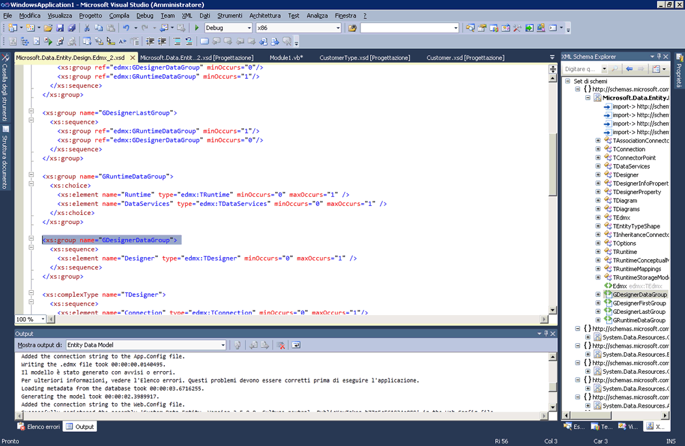

# Integrazione di valori letterali XML con XML Schema Explorer
Visual Basic supporta valori letterali XML, il che significa che è possibile incorporare i frammenti XML direttamente nel codice Visual Basic. Per ulteriori informazioni, vedere [Cenni preliminari sui valori letterali XML](http://go.microsoft.com/fwlink/?LinkId=140325).  
  
 Se un file XSD nel progetto di Visual Basic include un valore letterale XML, è possibile visualizzare il set di schemi XML in XML Schema Explorer. Per visualizzare il set di schemi associato a un valore letterale XML, fare clic su un nodo XML in un valore letterale XML o un'importazione dello spazio dei nomi XML e selezionare **Mostra in Schema Explorer**.  
  
   
  
 Ciò consente di aprire XML Schema Explorer affiancato al file di Visual Basic.  
  
 
  
## Vedere anche  
[Procedura: Usare Progettazione XML Schema con i valori letterali XML](../xml-tools/how-to-use-the-xml-schema-designer-with-xml-literals.md)